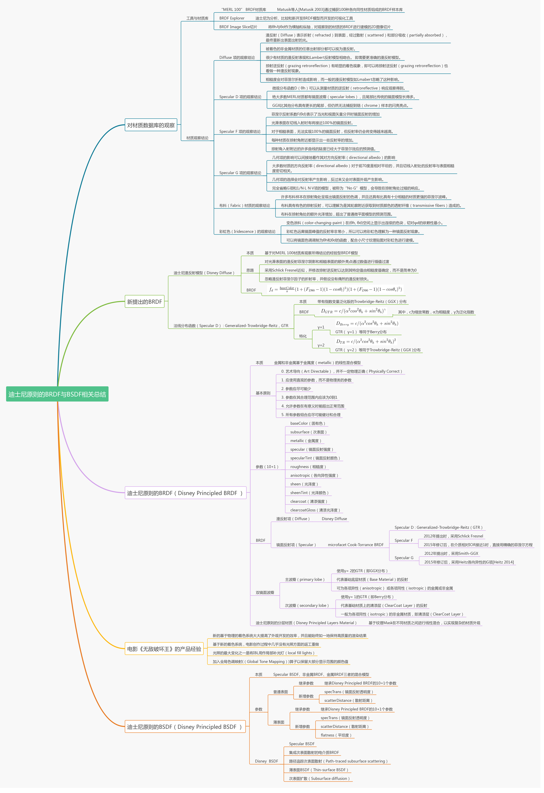

# 基于物理的渲染（PBR）白皮书 | PBR White Paper
## 目录

- **[ 【第一章】 开篇：PBR核心知识体系总结与概览](https://github.com/QianMo/PBR-White-Paper/blob/master/content/part%201/README.md)**

- **[ 【第二章】 PBR核心理论与渲染光学原理总结](https://github.com/QianMo/PBR-White-Paper/blob/master/content/part%202/README.md)**

- **[ 【第三章】 迪士尼原则的BRDF与BSDF相关总结](https://github.com/QianMo/PBR-White-Paper/blob/master/content/part%203/README.md)**

- 后续章节持续更新中

 

# PBR知识体系架构图
- **[PBR知识体系架构图1.0] 高清大图：
[【下载地址】](https://github.com/QianMo/PBR-White-Paper/raw/master/media/PBR-White-Paper-Knowledge-Architecture-1.0.png)**

 

# 常见材质F0参考速查图表PDF下载

- **常见材质F0参考速查图表PDF: [【下载地址】](https://github.com/QianMo/PBR-White-Paper/raw/master/bonus/%5BPBR-White-Paper%5D%20PBR-Material-F0-Quick-Reference-Chart.pdf)**

 

# 【第二章】PBR核心理论与渲染光学原理知识架构图
- **[PBR核心理论与渲染光学原理知识架构] 高清大图：
[【下载地址】](https://github.com/QianMo/PBR-White-Paper/raw/master/media/2-PBR-Core-Theory-and-Rendering-Principle-Knowledge-Architecture.png)**

# 【第三章】迪士尼原则的BRDF与BSDF总结架构图
- **[迪士尼原则的BRDF与BSDF总结知识架构图] 高清大图：
[【下载地址】](https://raw.githubusercontent.com/QianMo/PBR-White-Paper/master/media/3-PBR-Disney-Principled-BRDF-BSDF-Knowledge-Architecture.png)**

