# 【基于物理的渲染（PBR）白皮书】（二） PBR核心理论与渲染光学原理总结

本文的知乎专栏版本：https://zhuanlan.zhihu.com/p/56967462

 

这是【基于物理的渲染（PBR）白皮书】系列的第二篇文章。按照既定规划，本文将主要关注基于物理的渲染的核心理论与渲染的光学原理，以在整个系列中起到理论支柱的作用。

从本文内容而言，只有透过渲染现象看到光与真实世界交互的本质，才能真正理解近年来基于物理的渲染成为电影和游戏业界主流渲染解决方案背后的必然性。

首先放出本文主要内容提炼出的思维导图，即基于物理的渲染的核心理论与渲染光学原理的知识脉络：

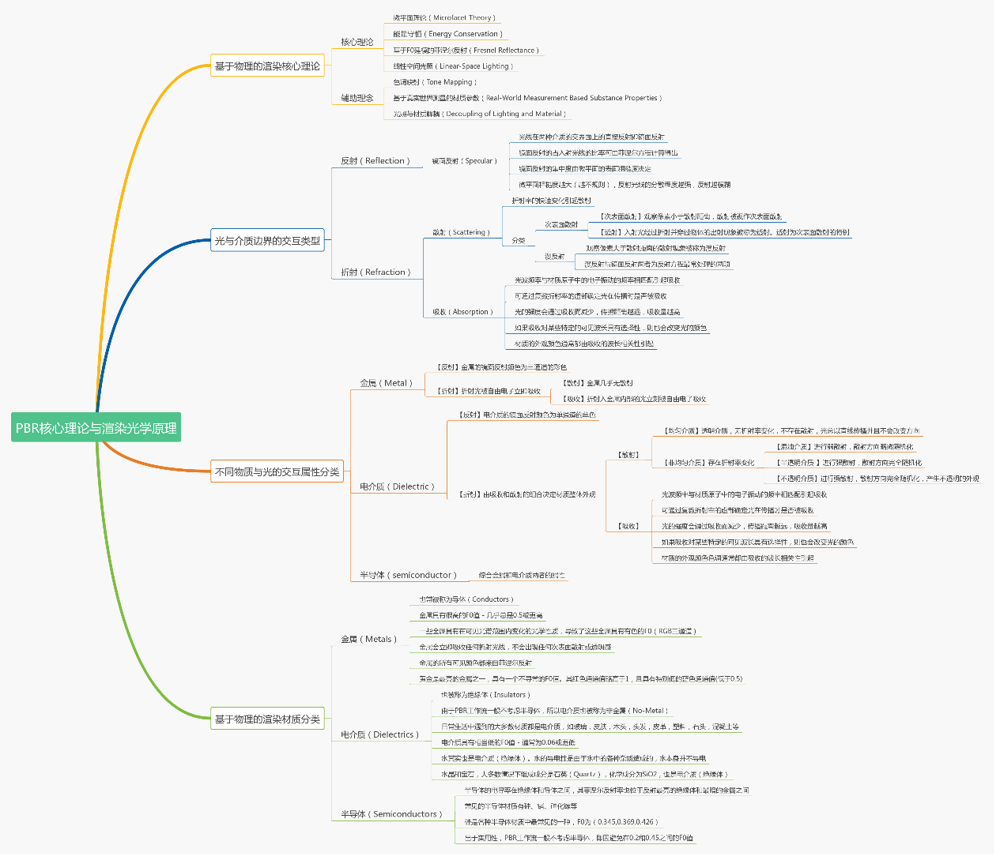

当然，本文的内容并不局限于上述思维导图。内容方面，本文将从以下几个方面，分别对PBR核心理论与渲染光学原理进行阐述：

-   基于物理的渲染的核心理论

-   渲染与人眼视觉

-   渲染与物理光学（波动光学）

-   渲染与几何光学

-   真实世界材质的渲染属性总结

首先，是基于物理的渲染核心理论的总结。

 

# 一、基于物理的渲染核心理论总结

在上篇系列内容前瞻与总结式的文章的开头中已经放出了PBR核心理念的1.0版，经过一段时间的打磨，以下是PBR核心理念的2.0版：

-   **微平面理论（Microfacet Theory）**。微平面理论是将物体表面建模成无数微观尺度上有随机朝向的理想镜面反射的小平面（microfacet）的理论。微观几何（microgeometry）的效果是在表面上的不同点处改变微平面的法线，从而改变反射和折射的光方向。出于着色的目的，通常会用统计方法处理这种微观几何现象，将表面视为具有微观结构法线的随机分布，并将宏观表面视为在每个点处多个方向上反射（和折射）光的集合。在微观尺度上，表面越粗糙，反射越模糊，表面越光滑，反射越集中。

-   **能量守恒 （Energy Conservation）**。出射光线的能量永远不能大于入射光线的能量。随着粗糙度的上升镜面反射区域的面积会增加，作为平衡，镜面反射区域的平均亮度则会下降。

-   **基于F0建模的菲涅尔反射（Fresnel Reflection）**。菲涅尔效应表示观察看到的反射光线的量与视角相关的现象，且掠射角度（90度）下反射率最大。万物皆有菲涅尔效应。在宏观层面看到的实际上是微观层面微平面菲涅尔效应的平均值，即影响菲涅尔效应的关键参数在于每个微平面的法向量和入射光线的角度，而不是宏观平面的法向量和入射光线的角度。F0即0度角入射的菲涅尔反射率。任意角度的菲涅尔反射率可由F0和入射角度计算得出。

-   **线性空间光照（Linear Space Lighting）**。线性空间渲染为光照计算提供了正确的数学运算。在线性空间中，能够还原现实世界方式的光与物质的交互的方式。所以颜色值的计算和颜色操作必须在线性空间中执行。而为了将渲染图像正确地呈现给观看者，需要将图像编码为伽马空间，所以基于物理的渲染会往往会涉及到线性空间和伽马空间之间的相互转换。

-   **色调映射（Tone Mapping）**。也称色调复制（Tone Reproduction），在图形学中，表示以感知上令人信服的方式将HDR场景的强度值转换为显示强度的过程，也可以理解为将宽范围的光照级别拟合到屏幕有限色域内的过程。通常，由于通过HDR渲染出来的亮度值会超过显示器能够显示最大亮度，所以需要结合色调映射（Tone Mapping），将光照结果从HDR转换为显示器能够正常显示的LDR。

-   **基于真实世界测量的材质参数（Real-World Measurement Based Substance Properties）** 。PBR的正统材质参数往往都基于真实世界测量。真实世界中的物质可分为三大类：绝缘体（Insulators），半导体（semiconductors）和导体（conductors）。在渲染和游戏领域，我们一般只对其中的两个感兴趣：导体（金属）和绝缘体（电解质，非金属）。菲涅尔反射率代表材质的镜面反射颜色与强度，是真实世界材质的核心测量数值。其中非金属具有非彩色的镜面反射颜色，而金属具有彩色的镜面反射颜色，即非金属的F0是一个float,金属的F0是一个float3。

-   **光照与材质解耦（Decoupling of Lighting and Material）**。基于物理的渲染的核心原则之一便是材质和光照信息的解耦，以模拟真实世界的光照现象，保证场景中所有对象之间具有视觉一致性。通过这种理念，相同的光照可以应用于所有物体和材质，无需传统光照模型所需的额外调整和hack，就能直接得到预期而自然的渲染表现，以提升美术同学的工作效率。

 

要真正理解基于物理的渲染，首先需要了解真实世界中光，材质，人眼三者之间的交互原理。下面我们从人眼视觉开始，重新认识渲染。

 

# 二、渲染与人眼视觉：我们是如何看到周围的事物的?

首先需要注意的是，我们在现实生活中看到某一物体的颜色其实并不是这个物体本身的真实颜色，而是其反射和散射得到的颜色。换句话说，**那些不能被物体吸收(Absorb)的颜色，即被反射或散射到我们人眼中的可见光波长代表的颜色，就是我们能够感知到的物体的颜色。**

例如，苹果的表面主要反射和散射红色光线。只有红色的波长能从苹果表面散射或反射回来，而其他部分则被吸收，转化为其他其他形式的能量，如下图。

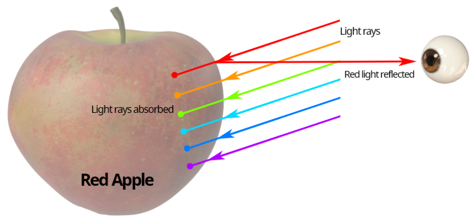

图 人眼接收到苹果反射和散射的红色光线 (图片来自Arnold Renderer Docs)

被反射或散射的光线进入人眼后，首先穿过角膜（cornea）， 然后进入瞳孔（pupil）。
随后，光被晶状体（lens）折射并撞击视网膜（retina）中的两种类型的感光细胞（photoreceptors），视锥细胞（cones）和视杆细胞（rods）。这些感光细胞从视野范围内吸收光子，然后经一系列特殊复杂的生物化学通路，根据光线中的不同的波长产生不同颜色的视觉信号，波长越高的光偏红，波长越低的光偏蓝。视觉信号通过视神经(optical
nerve)传递到视觉皮层(visual
cortex)，而视觉皮层作为处理视觉信号的大脑区域，用于产生最终的感知图像。上述负责整体人类视觉功能的完整系统被称为**人类视觉系统（Human
Visual System，HVS）**，如下图。

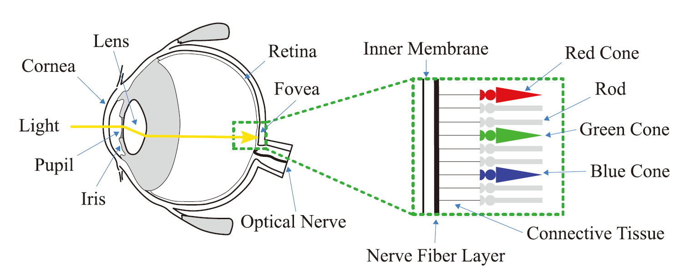

图 部分人眼视觉系统

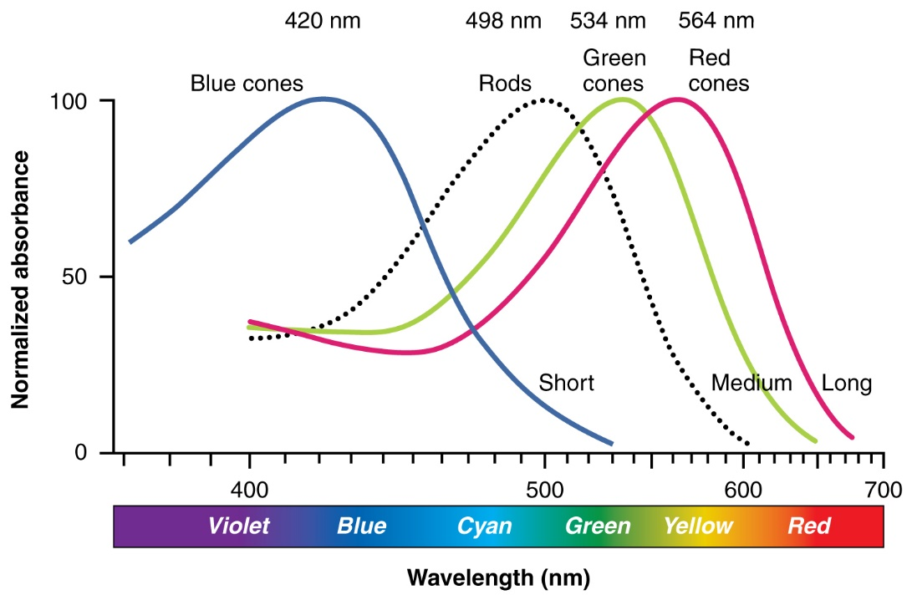

图 不同感光细胞对不同波长的感知敏感度

只有可见光才能被人眼感知并处理，而可见光仅覆盖完整电磁波谱在400nm和700nm之间非常有限的光谱区间。如下图。

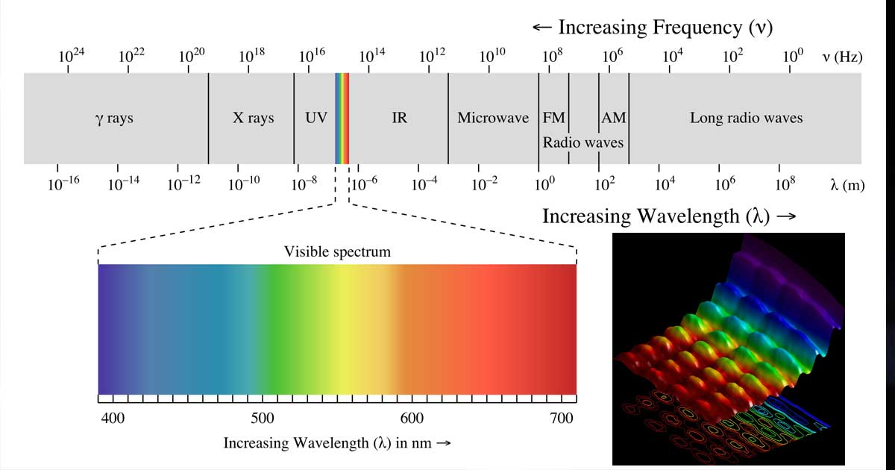

图 电磁波谱。可见光仅覆盖完整电磁波谱在400nm和700nm之间非常有限的光谱区间

如果要给可见光波长一个度量上的感知，400nm到700nm大约是单根蜘蛛丝的一半到三分之一的宽度，而单个蜘蛛丝本身不到人类头发宽度的五十分之一

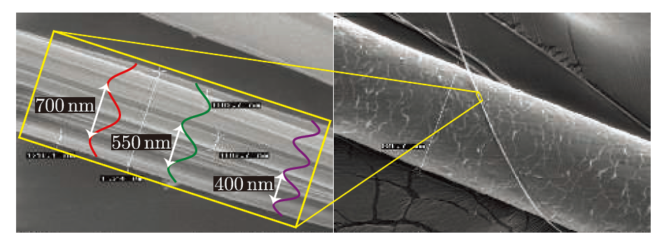

图 左侧可见光波长相对于单根蜘蛛丝线显示，单根蜘蛛丝宽度略大于1微米。
在右侧，可以看到该蜘蛛丝线大约为人类头发宽度的五十分之一（图片来自URnano/University
of Rochester）

 
 

# 三、渲染与物理光学 Rendering and Physical Optics

 

## 3.1 相速度与折射率

波动光学（wave optics）又称物理光学（physical optics）。在波动光学中，光被建模为一种电磁横波（transverse wave），即使电场和磁场垂直于其传播方向振荡的波。

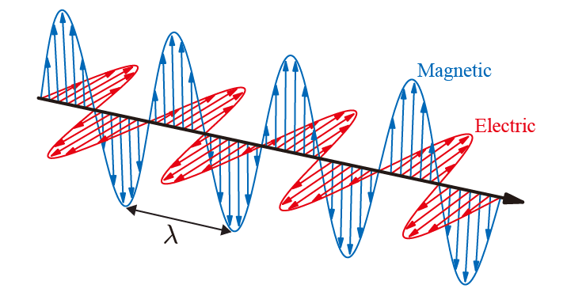

图 光是一种电磁横波。 电场和磁场矢量以90°相互振荡并同时向传播方向振荡。图中所示的波是最简单的光波。它既是单色的（具有单一波长λ）又是线性极化的（电场和磁场各自沿单向振荡）。（图片来自Real-Time Rendering 4th）

光波的磁场和电场的振荡相互耦合，且磁场矢量和电场矢量相互垂直，两者长度之比固定，该比率等于**相速度（Phase Velocity）。**

而光在传播到两种不同介质交界处时，原始光波和新的光波的相速度（Phase Velocity）的比率定义了介质的光学性质，就是**折射率（Index Of Refraction，IOR）**，由字母**n**表示。

 

## 3.2 复折射率

除了代表光的相速度的实部n之外，还用希腊字母κ（kappa）表示介质将光能转为为其他形式能量的吸收性。n和κ通常都随波长而变化，两者组合成复数n
+iκ，称为**复折射率（complex index of refraction）**。

也就是说，折射率IOR是一个复数（complex number），其分为实部和虚部两部分：

-   **折射率的实部（real part）度量了物质如何影响光速**，即相对于光在真空中传播速度减慢的度量。

-   **折射率的虚部（imaginary part）确定了光在传播时是否被吸收**，转换成其他形式的能量，通常是热能。非吸收性介质虚部为零。

其中，特定材质对光的选择性吸收是因为所选择的**光波频率与该材质原子中的电子振动的频率相匹配**。由于不同的原子和分子具有不同的固有振动频率，其将选择性地吸收不同频率的可见光。

光的吸收对视觉效果有直接影响，因为会降低光的强度，并且如果吸收对某些可见波长具有选择性，也会改变光的颜色。如下图。

图 光的吸收导致透明介质的不同颜色外观。

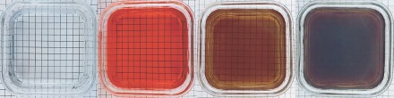

图 四个小容器的液体具有不同的吸收属性。 从左到右：清水，石榴糖浆，茶和咖啡。
（图片来自Real-Time Rendering 4th）

 

## 3.3 折射的发生条件

**光在表面的折射条件是需要在小于单一波长的距离内发生折射率的突然变化。**

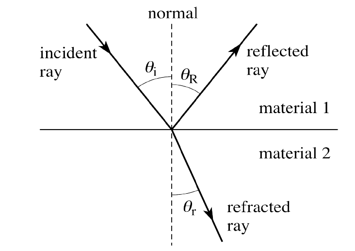

图 光的折射

**另外，折射率缓慢的逐渐变化不会导致光线的分离，而是导致其传播路径的弯曲。** 当空气密度因温度而变化时，通常可以看到这种效果，例如海市蜃楼（mirages）和热形变（heat distortion）。见下图。

图 热形变（heat distortion）图示

 

## 3.4 物质对吸收和散射的特性组合决定其外观

如上文所说到的，光与物质之间的两种相互作用模式为散射（scattering）和吸收（absorption），如下图：

图 光与物质之间的两种相互作用模式：吸收absorption（左），散射 scattering（右）
（图片来自Hoffman N. Background: Physics and Math of Shading）

其中：

-   **散射（scattering）决定介质的浑浊程度。** 大多数情况下，固体和液体介质中的颗粒都比光的波长更大，并且倾向于均匀地散射所有可见波长的光。高散射会产生不透明的外观。

-   **吸收（absorption）决定材质的外观颜色。** 几乎任何材质的外观颜色通常都是由其吸收的波长相关性引起的。

而每种介质的外观是散射和吸收两种现象的综合结果：

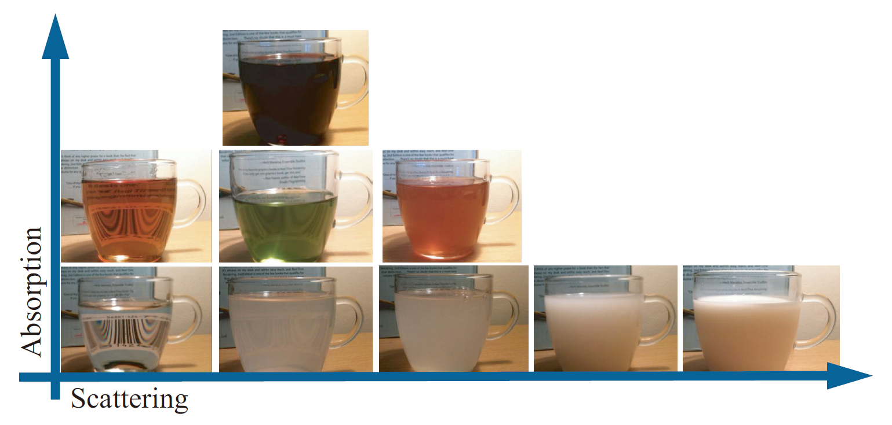

图：具有不同光的吸收量和散射量的介质。 外观取决于散射和吸收两个属性;
例如，白色外观（右下）是高散射和低吸收的结果。（图片来自Hoffman N. Background:
Physics and Math of Shading）

图 具有不同吸收和散射组合的液体容器 （图片来自Real-Time Rendering 4th）

当然，除了折射的光线，材质的外观还与反射有关，所以，可以理解为材质的最终外观由镜面反射以及物质对折射光线的吸收和散射的特性组合综合决定。

 

## 3.5 散射和吸收现象与观察尺度有关

另外， 散射（Scattering）和吸收（absorption）都与观察尺度有关。
在小场景中不产生任何明显散射的介质在较大尺度上可能具有非常明显的散射。
例如，当观察房间中的一杯水时，在空气中的光的散射和在光在水中的吸收都是不可见的。
但是，在宽阔的环境中，两种效果都很重要，如下图所示。

图 水在数米的距离内对光线进行吸收，特别是对于红色波长对应的光的吸收非常强烈。

图 在多英里的空气中有明显的光的散射，即使在没有重污染或雾的情况下也是如此。

 

 

# 四、渲染与几何光学 Rendering and Geometrical Optics

关于光与非光学平坦表面的交互原理，在这个系列的第一篇文章中已经有相关总结，本文不应再赘述。这一节中，将首先对“光与介质边界的交互类型”和“不同物质与光的交互”分别做出提炼总结。然后仅重提一下PBR理论中最核心的微平面理论，随后便主要于关注菲涅尔反射相关的讨论。

 

## 4.1 光与介质边界的交互类型总结

为了便于下面总结的理解，先提供一张经典的光与表面的交互图示。

图 光与物体表面的交互图示。（来自GDC 2016，An End-to-End Approach to Physically
Based Rendering）

当一束光线入射到物体表面时，由于物体表面与空气两种介质之间折射率的快速变化，光线会发生反射和折射：

-   **反射（Reflection）。**光线在两种介质交界处的直接反射即**镜面反射（Specular）**。金属的镜面反射颜色为三通道的彩色，而非金属的镜面反射颜色为单通道的单色。

-   **折射（Refraction）。**从表面折射入介质的光，会发生吸收（absorption）和散射（scattering），而介质的整体外观由其散射和吸收特性的组合决定，其中：

    -   **散射（Scattering）。**折射率的快速变化引起散射，光的方向会改变（分裂成多个方向），但是光的总量或光谱分布不会改变。散射最终被视作的类型与观察尺度有关：

        -   **次表面散射（Subsurface
            Scattering）。**观察像素小于散射距离，散射被视作次表面散射**。**

        -   **漫反射（Diffuse）。**观察像素大于散射距离，散射被视作漫反射**。**

        -   **透射（Transmission）**。入射光经过折射穿过物体后的出射现象。透射为次表面散射的特例。

-   **吸收（Absorption）。**具有复折射率的物质区域会引起吸收，具体原理是光波频率与该材质原子中的电子振动的频率相匹配。复折射率（complex
    number）的虚部（imaginary
    part）确定了光在传播时是否被吸收（转换成其他形式的能量）。发生吸收的介质的光量会随传播的距离而减小（如果吸收优先发生于某些波长，则可能也会改变光的颜色），而光的方向不会因为吸收而改变。任何颜色色调通常都是由吸收的波长相关性引起的。

如下是光与介质边界的交互类型思维导图版的总结：

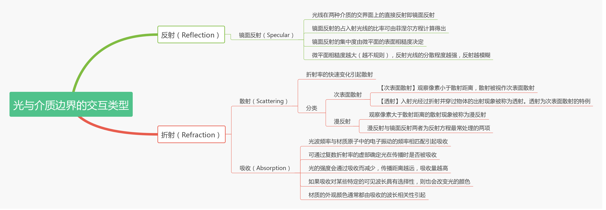

 

## 4.2 不同物质与光的交互总结

上文已经提到，光线入射到两种介质之间平面边界时，会发生反射和折射，而根据材质光学性质的不同，具有不同的行为表现，从而得到不同的材质外观。可以将材质根据光学特性，分为金属和非金属两大类，具体行为可以总结如下：

-   **金属（Metal）**。金属的外观主要取决于光线在两种介质的交界面上的直接反射（即镜面反射）。金属的镜面反射颜色为三通道的彩色，R、G、B各不相同。而折射入金属内部的光线几乎立即全部被自由电子吸收，且折射入金属的光不存在散射。

-   **非金属（No-Metal）**。非金属即电介质，其的整体外观主要由其吸收和散射的特性组合决定。同样，非金属与光的交互分为反射和折射两部分。而折射按介质类型的散射和吸收特性，分为多类：

    -   **反射（Reflection）**。非金属的镜面反射颜色为单通道单色，即R=G=B。

    -   **折射（Refraction）**。光从表面折射入非金属介质，则介质的整体外观由其散射和吸收的特性组合决定。不同的介质类型的散射和吸收特性不一：

        -   **均匀介质（Homogeneous Media）**。主要为透明介质，无折射率变化。不存在散射，光总以直线传播并且不会改变方向。存在吸收，光的强度会通过吸收减少，传播距离越远，吸收量越高。

        -   **非均匀介质（Nonhomogeneous Media）**。通常可以建模为具有嵌入散射粒子的均匀介质。具有折射率变化，分为几类。

            -   **混浊介质（Cloudy Media）**。混浊介质具有弱散射，散射方向略微随机化。根据组成的不同，具有复数折射率的物质区域引起吸收。

            -   **半透明介质（Translucent Media）**。半透明介质具有强散射，散射方向完全随机化。根据组成的不同，具有复数折射率的物质区域引起吸收。

            -   **不透明介质（Opaque Media）**。不透明介质和半透明介质一致。具有强散射，散射方向完全随机化。根据组成的不同，具有复数折射率的物质区域引起吸收。

如下是不同物质与光的交互类型思维导图版的总结：

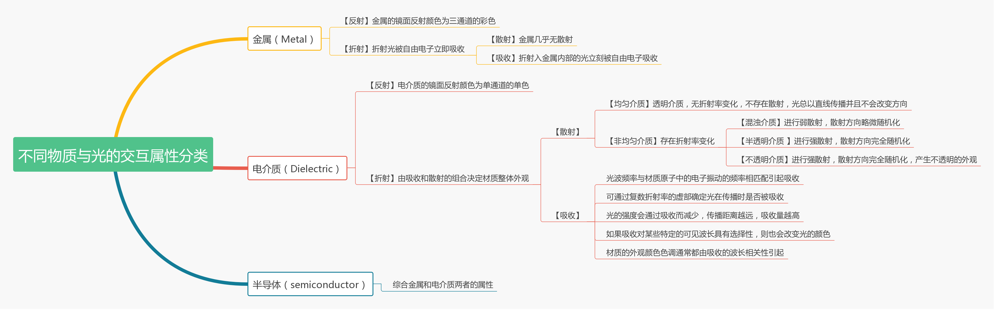

 

## 4.3 微平面理论 Microfacet Theory

大多数真实世界的表面不是光学上光滑的，但是具有比光波长大得多但比像素小的尺度的不规则性。
这种微观几何（microgeometry）变化导致每个表面点反射（和折射）不同方向的光：材质的部分外观组成是这些反射和折射方向的聚合结果。

图 微平面理论（图片来自The PBR Guide by allegorithmic- Vol. 1）

光在与非光学平坦表面（Non-Optically-Flat
Surfaces）的交互时，非光学平坦表面表现得像一个微小的光学平面表面的大集合。表面上的每个点都会以略微不同的方向对入射光反射，而最终的表面外观是许多具有不同表面取向的点的聚合结果。

图 来自非光学平坦表面的可见光反射是来自具有不同方向的许多表面点的反射的总体结果

在微观尺度上，表面越粗糙，反射越模糊，因为表面取向与整个宏观表面取向的偏离更强。（图片来自Real-Time Rendering 4th）

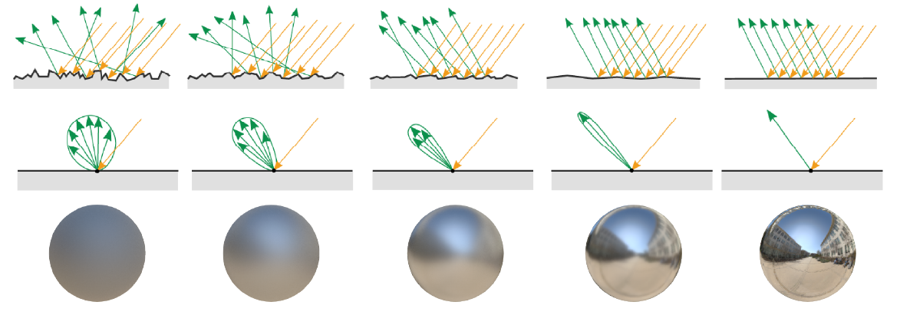

图 微平面粗糙度对材质外观的影响。（图片来自Moving Frostbite to PBR，SIGGRAPH 2014）

图 微平面粗糙度对材质外观的影响，从左到右粗糙度越来越大 (图片来自Arnold Renderer
Docs)
 

## 4.4 菲涅尔反射 Fresnel Reflectance

 

### 4.4.1 菲涅尔效应 Fresnel Effect

菲涅尔效应（Fresnel effect）作为基于物理的渲染理念中的核心理念之一，表示的是看到的光线的反射率与视角相关的现象，由法国物理学家奥古斯丁.菲涅尔率先发现。其具体表现是在掠射角（与法线呈接近90度）下光的反射率会增加。而上述的反射率，便被称为菲涅尔反射率。如下图。

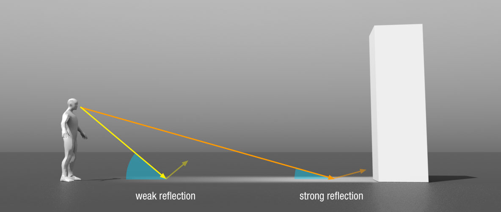

图 菲涅尔效应图示

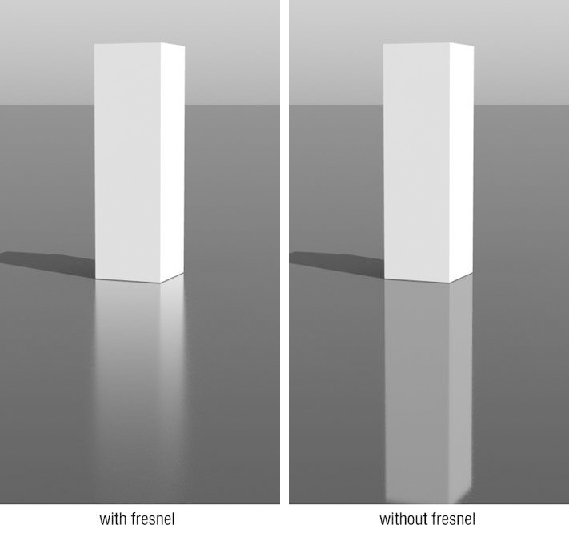

图 菲涅尔效应图示

简单来说，菲涅尔效应即描述视线垂直于表面时反射较弱，而当视线非垂直表面时，夹角越小，反射越明显的一种现象。比如说，当我们站在湖边低头看脚下的湖水，会发现水是透明的，反射不会特别强烈；而如果我们看远处的湖面时，会发现水并不透明，而且反射非常强烈。

图 菲涅尔效应图示

需要注意的是，**我们在宏观层面看到的菲涅尔效应实际上是微观层面微平面菲涅尔效应的平均值。**

也就是说，影响菲涅尔效应的关键参数在于每个微平面的法向量和入射光线的角度，而不是宏观平面的法向量和入射光线的角度。即：

-   当从接近平行于表面的视线方向进行观察，所有光滑表面都会变得100%的反射性。

-   对于粗糙表面来说，在接近平行方向的高光反射也会增强，但不够达到100%的强度。

不同材质的菲涅尔效应的强弱是不同的，导体(如金属)的菲涅尔效应一般很弱，主要是因为导体本身的反射率就已经很强。就拿铝来说，其反射率在所有角度下几乎都保持86%以上，随角度变化很小，而绝缘体材质的菲涅尔效应就很明显，比如折射率为1.5的玻璃，在表面法向量方向的反射率仅为4%，但当视线与表面法向量夹角很大的时候，反射率可以接近100%，这一现象也导致了金属与非金属外观上的不同。

 

### 4.4.2 菲涅尔方程 Fresnel Equations

菲涅尔方程（Fresnel
Equations），同样是法国物理学家奥古斯丁·菲涅耳最先推导出，用来描述光在不同折射率的介质之间的行为的方程。菲涅尔方程描述的光的反射现象便被称之为菲涅尔反射。菲涅尔方程能解释反射光的强度、折射光的强度、相位与入射光的强度的关系。

另外，菲涅尔方程其实和**麦克斯韦方程组（Maxwell’s equations）**有很深的渊源。

根据物理学，麦克斯韦方程组可以在折射率变化时计算光的行为。对于空气中通常的物体表面而言，物体的表面便是空气折射率和物体折射率的交界面，对此特殊的折射率交界面而言，麦克斯韦方程组的解被我们称为菲涅尔方程（Fresnel equations）**。**

即**菲涅尔反射的方程可以通过麦克斯韦电磁学方程组推导出来**，因为本质上讲菲涅尔反射其实是使用的波动理论来解释光的反射现象。

完整的菲涅尔方程有点复杂，至少可以说艺术家所需的材质参数（在可见光谱上密集采样的复折射率）并不方便，随后的文章会专门讨论。

而通过完整的菲涅尔方程，我们可以拟合出更简化的近似表达式（如Schlick[1994]的Fresnel近似），以及抽象出描述物体表面属性的菲涅尔反射率F0。先观察下图。

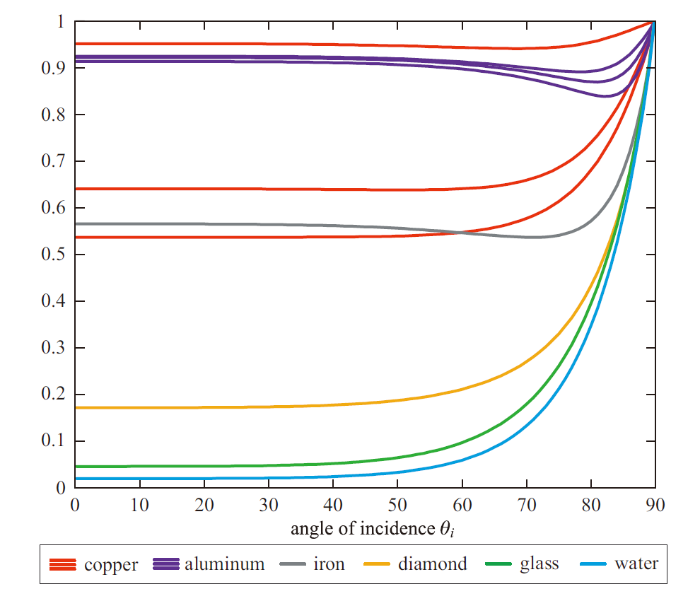

图 各种物质的菲涅尔反射率（y轴）作为入射角（x轴）的函数。
由于铜和铝在可见光谱上的反射率有明显变化，因此它们的反射率显示为R，G和B的三条独立曲线。铜的R曲线最高，其次是G，最后是B（因此它的红色）。铝的B曲线最高，其次是G，最后是R。上图选择的材质代表了各种各样的材质。 尽管如此，可以看到一些共同的地方。对于0°和45°之间的入射角，反射率几乎是恒定的。在45°和75°之间，反射率变化更为显着（通常但不总是有所增加）。最后，在75°和90°之间，反射率总是迅速变为1（白色，如果被视为一种颜色）。（图片来自Hoffman
N. Background: Physics and Math of Shading）

由此，我们可以将F0，即0度角入射时的菲涅尔反射率，作为材质的特征反射率，帮助我们对该材质的反射属性进行建模。

 

### 4.4.3 F0 : 0度角入射时的菲涅尔反射率

上文已经提到，当光线垂直（以0度角）撞击表面时，该光线被反射（Reflected）为镜面反射光的比率被称为F0。即F0为0度角入射时的菲涅尔反射率。而折射（refracted）到表面中的光量则为为1-F0。如下图。

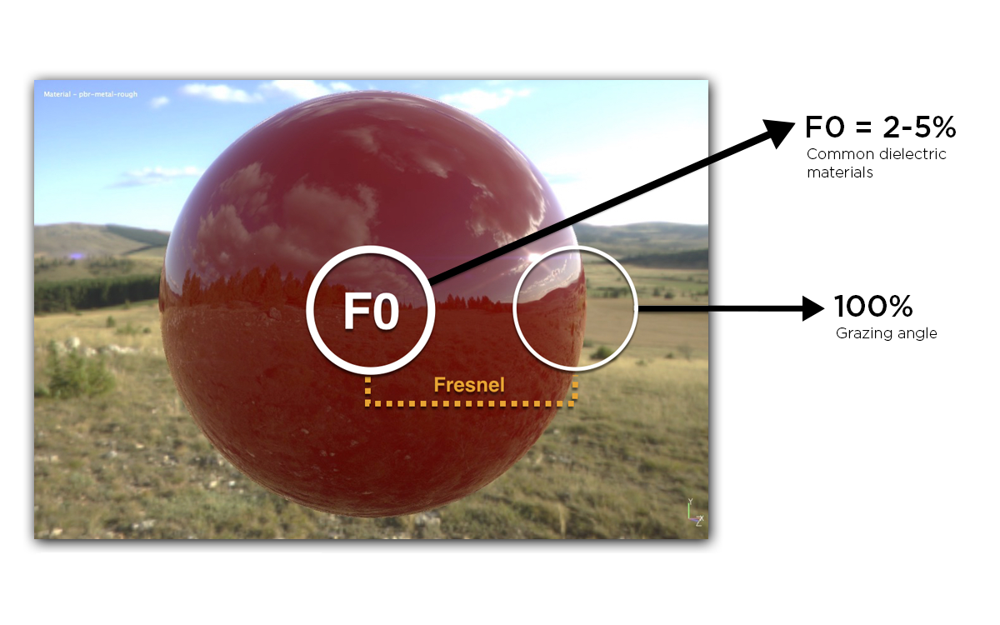

图 对于光滑的电介质表面，在0度角入射（F0）将反射2-5％的光，在掠射角入射下将反射100％的光（图片来自The PBR Guide by allegorithmic- Vol. 1）

大多数常见电介质的F0范围为0.02-0.05（线性值）。 对于导体，F0范围为0.5-1.0。

关于常见物质F0的相关内容下文会对做一个更系统的讨论，这里我们先了解F0与折射率的关系。

 

### 4.4.4 从折射率求解F0

通用的折射率与F0的关系式如下：

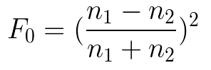

其中，n1和n2分别为两种介质的折射率。通常假设n1=1近似于空气的折射率，并用n替换n2，于是，上式可以简化为：

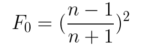

这就是我们通常看到的F0和折射率之间的转换公式。

另外，这里有一个各种物质实数折射率数值的查询汇总表：

<https://pixelandpoly.com/ior.html>，对于一般仅有实数折射率的非金属而言，可以通过查询到的物质的折射率和上面的公式，计算出F0。

在有些渲染器中，会直接采用折射率IOR来表示材质的属性，以下是一张渲染器中实数折射率、粗糙度二维材质的渲染对照图：

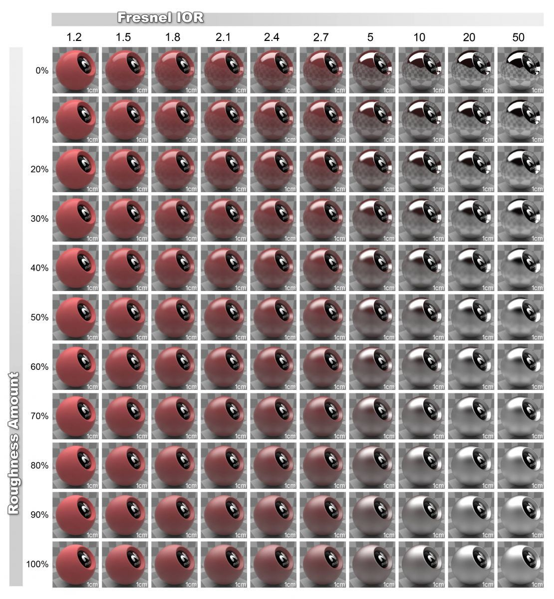

图 实数折射率、粗糙度二维材质对照图

 

 

# 五、真实世界材质的渲染属性总结

基于物理的渲染的核心理念之一是采用基于真实世界测量的材质光学参数。

由于光由电磁波组成，因此，物质的光学特性与其导电特性密切相关。我们通常把导电性较差的材质，如煤、人工晶体、琥珀、陶瓷等称为绝缘体。而把导电性比较好的金属如金、银、铜、铁、锡、铝等称为导体。以及将导电性质介于导体和绝缘体之间的材质称为半导体。

即根据导电特性，可将现实生活中的物质分为三个主要光学类别：

-   **电介质（dielectrics）**，又称绝缘体（Insulators），非金属（no-metal）

-   **半导体（semiconductors）**

-   **金属（metals）**，又称导体（conductors）

这里，也放出基于物理的渲染材质分类的思维导图：

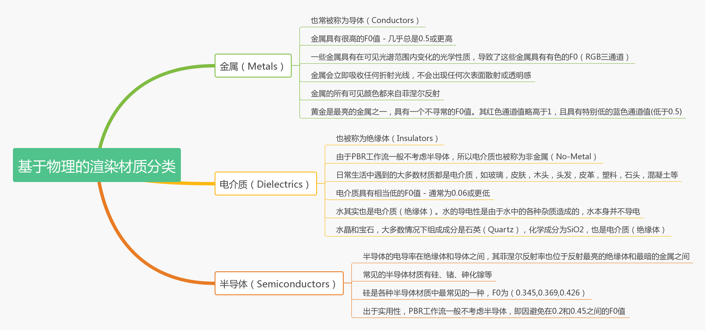

 

## 5.1 常见材质F0参考速查图表

本文在创作期间，参考了《Real-Time Rendering 4th》等文献，总结和制作了如下的PBR材质F0反射率速查图表，其中分别对常见材质的线性值，sRGB值和参考颜色进行了列举，以方便PBR材质的创作：

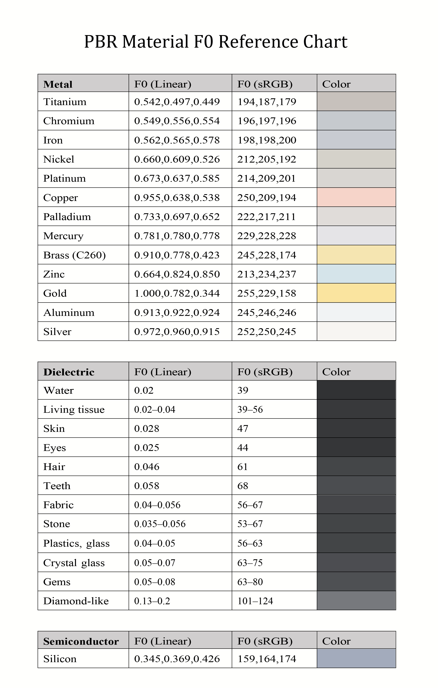

图 【PBR白皮书】常见材质F0参考速查图表

另外，上述的PBR材质F0反射率速查表本文还提供了单页的PDF。有需要此文字版PDF的朋友，可以从这里下载：

**[【PBR白皮书】[PBR Material F0 Quick Reference Chart.PDF] 下载](https://github.com/QianMo/PBR-White-Paper/raw/master/bonus/%5BPBR-White-Paper%5D%20PBR-Material-F0-Quick-Reference-Chart.pdf)**

需要注意，我们一般使用的F0，都是空气对于材质的F0。假如材质位于水中或其他折射率不等于1的介质中，F0会发生变化，则需要使用本文第四部分的公式通过折射率重新计算F0。

接着是对于金属，电介质和半导体的相关特性的分类总结。

 

## 5.2 金属 Metal

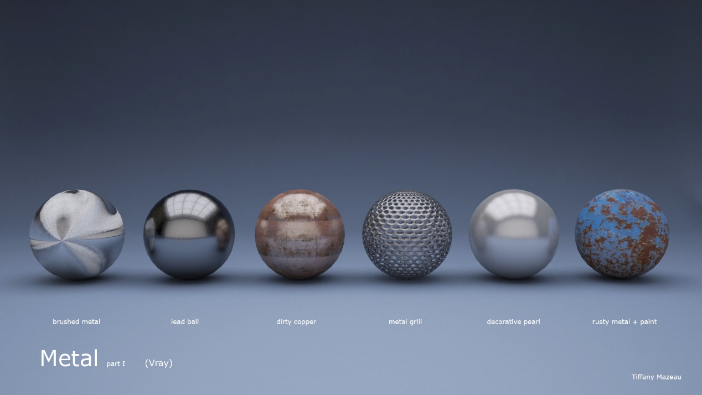

图 金属渲染图 @Vray

-   金属具有高的F0值 - 几乎总是0.5或更高。一些金属具有在可见光谱范围内变化的光学性质，导致了这些金属有色的菲涅尔反射率。

-   黄金有一个不寻常的F0值，是最亮的金属之一。其红色通道值略高于1，而且具有特别低的蓝色通道值（低于0.5）。黄金的明亮和强烈的颜色反射可能有助于其历史上独特的文化和经济意义。

-   金属会立即吸收任何透射光，因此它们不会出现任何次表面散射或透明感。

-   金属的所有可见颜色都来自F0。

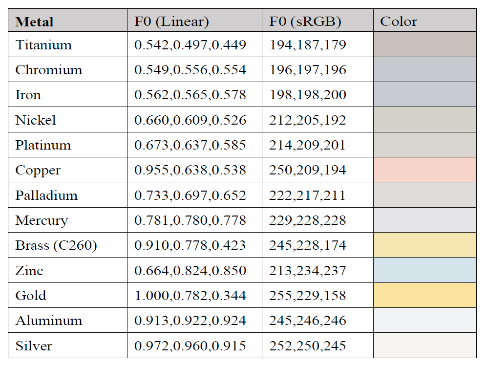

图 常见金属F0速查表

 

# 5.3 电介质 Dielectrics

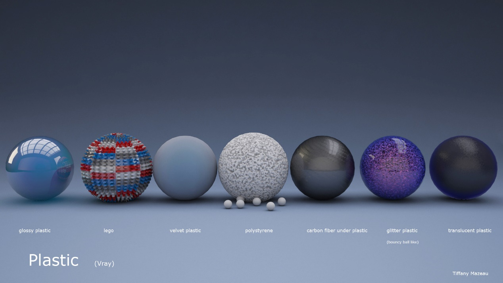

图 电介质：塑料渲染图示 @Vray

-   日常生活中遇到的大多数材质都是电介质 -玻璃，皮肤，木头，头发，皮革，塑料，石头和混凝土（concrete）等等。

-   **水其实也是电介质（绝缘体）。**水是绝缘体这个事实可能会令人惊讶，因为在日常生活中众所周知，水是导电的。但其实，水的导电性是由于水中的各种杂质造成的，水本身并不导电。

-   电介质具有相当低的F0值 - 通常为0.06或更低。在垂直入射时的这种低反射率使得菲涅尔效应对于电介质尤其明显。电介质的光学性质在可见光谱上很少变化很大，导致无色反射率值。

-   另外需要注意的是，生活中看到的各种水晶和宝石，其实大多数情况下组成成分是石英（Quartz），而石英的主要化学成分为SiO2，也是电介质（绝缘体）。石英根据颜色，可以分为：紫水晶、黄水晶、粉晶、烟水晶、乳石英、白水晶等。这边一个是紫水晶的材质特性拆解：

图 紫水晶的材质特性拆解

另外，为方便查阅，这里也附上常见电介质的F0速查表

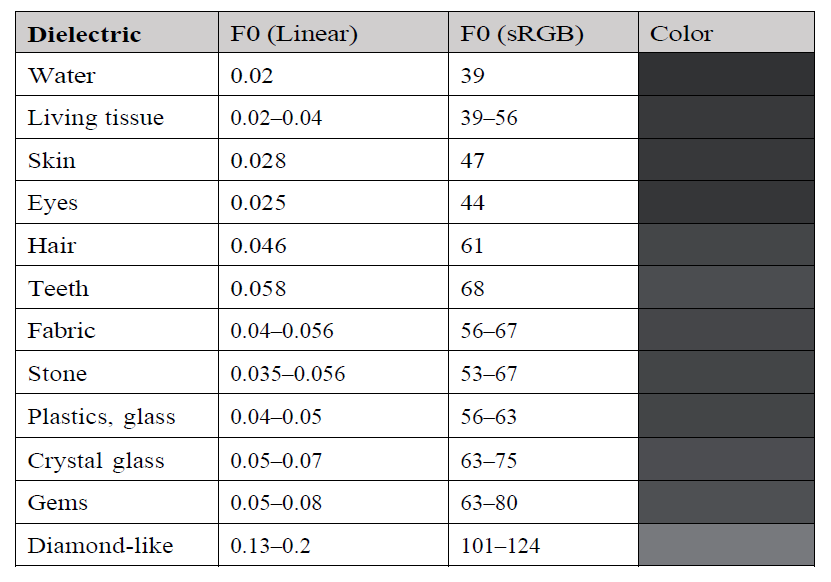

图 常见电介质F0速查表

 

## 5.4 半导体 Semiconductor

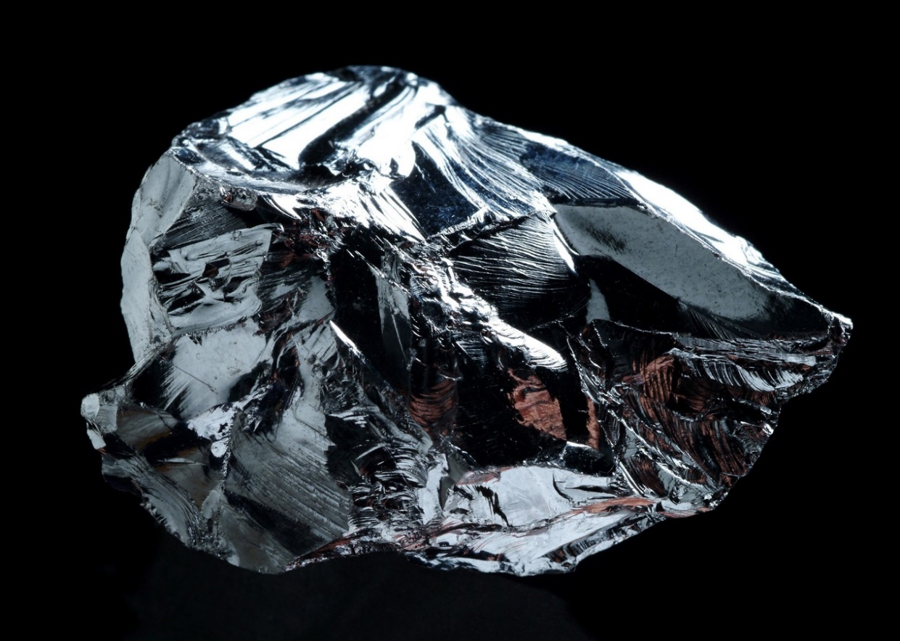

图 最常见的半导体：硅

-   半导体（Semiconductor）的电导率在绝缘体和导体之间。常见的半导体材质有硅、锗、砷化镓等，而硅是各种半导体材质中，在商业应用上最具有影响力的一种。

-   正如半导体电导率位于绝缘体至导体之间一样，其F0值也位于最亮的电介质和最暗的金属之间。

-   即是是最常见的半导体硅，在大多数场景渲染中也十分少见。出于实用性，PBR工作流一般不考虑半导体，即因避免在0.2和0.45之间的F0值。当然，故意尝试非真实感材质或外星场景中的材质时是例外。

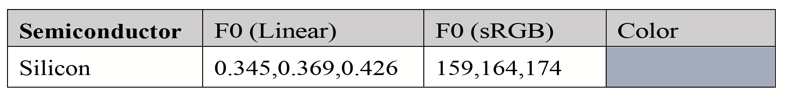

图 常见半导体F0速查表

 

 

# 六、本文内容要点总结

正文到这里已经结束。以下是本文具有代表性知识点的提炼总结：

-   麦克斯韦方程组在材质表面处的特殊解就是菲涅尔方程。

-   影响菲涅尔效应的关键参数在于每个微平面的法向量和入射光线的角度。

-   折射率是一个复数（complex number），实部（real part）度量了物质如何影响光速，虚部（imaginary part）确定了光在传播时是否被吸收。

-   具有复数折射率的物质区域引起吸收 - 光量随距离减小（并且如果吸收对某些可见波长具有选择性，则也会改变光的颜色），但光的方向不会改变。

-   折射率的快速变化引起散射。散射最终被视作的类型与观察尺度有关：次表面散射。观察像素小于散射距离，散射被视作次表面散射（Subsurface Scattering）。观察像素大于散射距离，散射被视作漫反射（Diffuse）。

-   物质对折射光线的吸收和散射的特性组合，以及对光线的反射特性共同决定了该材质的整体外观。

其余的总结性的内容包括4.1节的“光与介质边界的交互类型总结”、4.2节的“不同物质与光的交互总结”，这边就不再赘述。

作为全文的最终总结，自然也需要再次贴出文章开头已经贴出的，本文主要内容提炼出的思维导图：

另外，本文本来也会聊到线性空间渲染与Tone Mapping的更多内容，但加上后篇幅已经远远超出了字数限制。没事，我们不妨在随后的文章中再聊。

以上。

 

 

# Reference

[1] Akenine-Moller T, Haines E, Hoffman N. Real-time rendering 4th[M]. AKPeters/CRC Press, 2018.

[2] Hoffman N. Background: Physics and Math of Shading[J].

[3] Lagarde S, De Rousiers C. Moving Frostbite to PBR[J]. Proc. Physically Based Shading Theory Practice, 2014.

[4] <https://learnopengl.com/#!Lighting/Colors>

[5] <https://www.dorian-iten.com/fresnel/>

[6] <https://academy.allegorithmic.com/courses/the-pbr-guide-part-1>

[7] <https://academy.allegorithmic.com/courses/the-pbr-guide-part-2>

[8] <https://docs.arnoldrenderer.com/display/A5AFMUG/Understanding+Physically+Based+Rendering+in+Arnold>

[9] <https://www.behance.net/gallery/35636521/Material-Studies-Metals>

[10] <https://www.physicsclassroom.com/class/light/Lesson-2/Light-Absorption,-Reflection,-and-Transmission>

[11] <https://www.cnblogs.com/starfallen/p/4019350.html>

[12] <https://en.wikipedia.org/wiki/Photoreceptor_cell>

[13] Ratković J. Physically based rendering[D]. Fakultet elektrotehnike iračunarstva, Sveučilište u Zagrebu, 2017.

[14] 题图来自FarCry 5

