# 【基于物理的渲染（PBR）白皮书】迪士尼原则的BRDF与BSDF相关总结

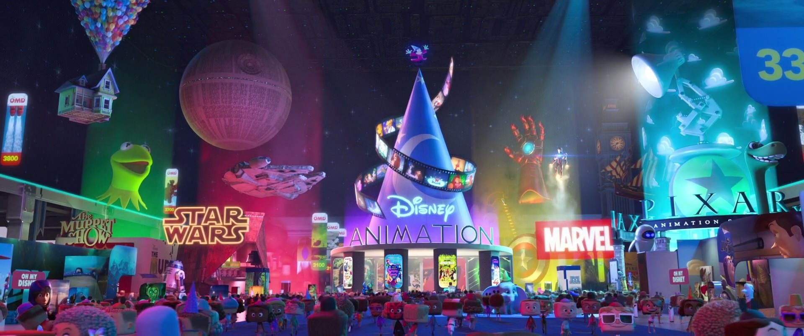

基于物理的渲染（Physically Based Rendering , PBR）技术，自迪士尼在SIGGRAPH 2012上提出了著名的“迪士尼原则的BRDF（Disney Principled BRDF）”之后，由于其高度的易用性以及方便的工作流，已经被电影和游戏业界广泛使用，并成为了次时代高品质渲染技术的代名词。

本文的主要内容，便是对推动了这次基于物理的渲染革命的“迪士尼原则的BRDF（Disney Principled BRDF）”，以及随后2015年提出的“迪士尼BSDF（Disney BSDF）”进行深入的探讨、总结与提炼。

全文主要内容脉络如下：

-   迪士尼与基于物理的渲染的发展

-   迪士尼采用的BRDF可视化方案与工具

-   迪士尼对测量材质数据库的观察结论

    -   Diffuse项的观察结论

    -   Specular D 项的观察结论

    -   Specular F 项的观察结论

    -   Specular G 项的观察结论

    -   布料（Fabric）材质的观察结论

    -   彩虹色（Iridescence）的观察结论

-   迪士尼原则的BRDF（Disney Principled BRDF）

    -   Disney Principled BRDF的理念

    -   Disney Principled BRDF的参数

    -   Disney Principled BRDF的着色模型

        -   核心BRDF模型

        -   漫反射项（Diffuse）：Disney Diffuse

        -   法线分布项（Specular D）：GTR

        -   菲涅尔项（Specular F）：Schlick Fresnel

        -   几何项（Specular G）：Smith-GGX

-   迪士尼原则的分层材质（Disney Principled Layers Material）

-   Disney Principled BRDF的实现代码

-   迪士尼BSDF（Disney BSDF）

在文章开头，依然是首先放出总结了本文核心内容脉络的两张思维导图：

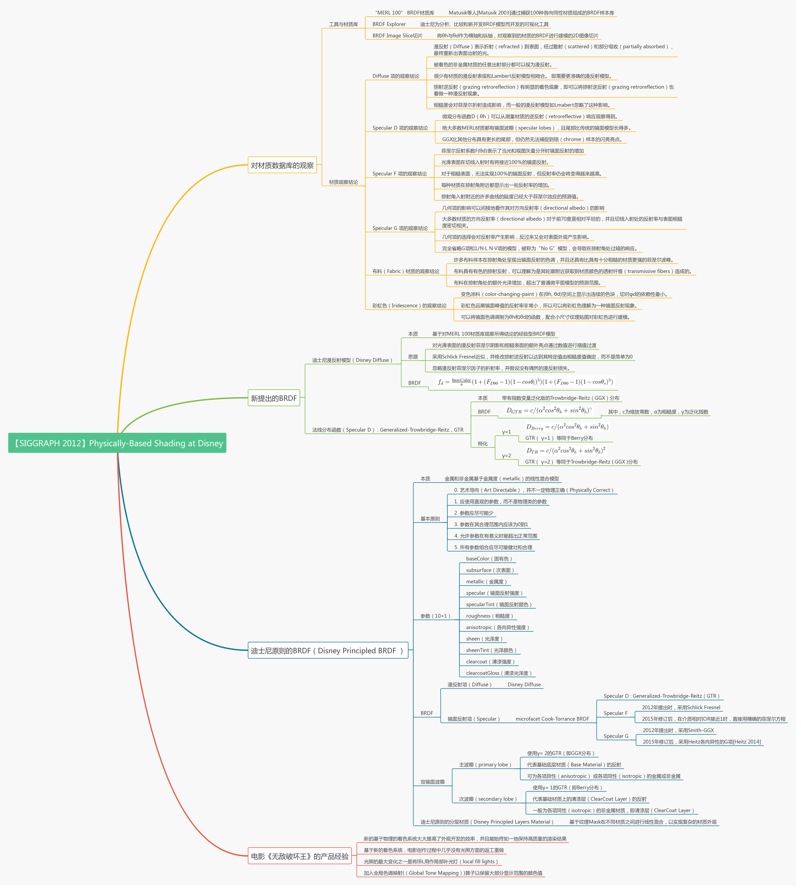

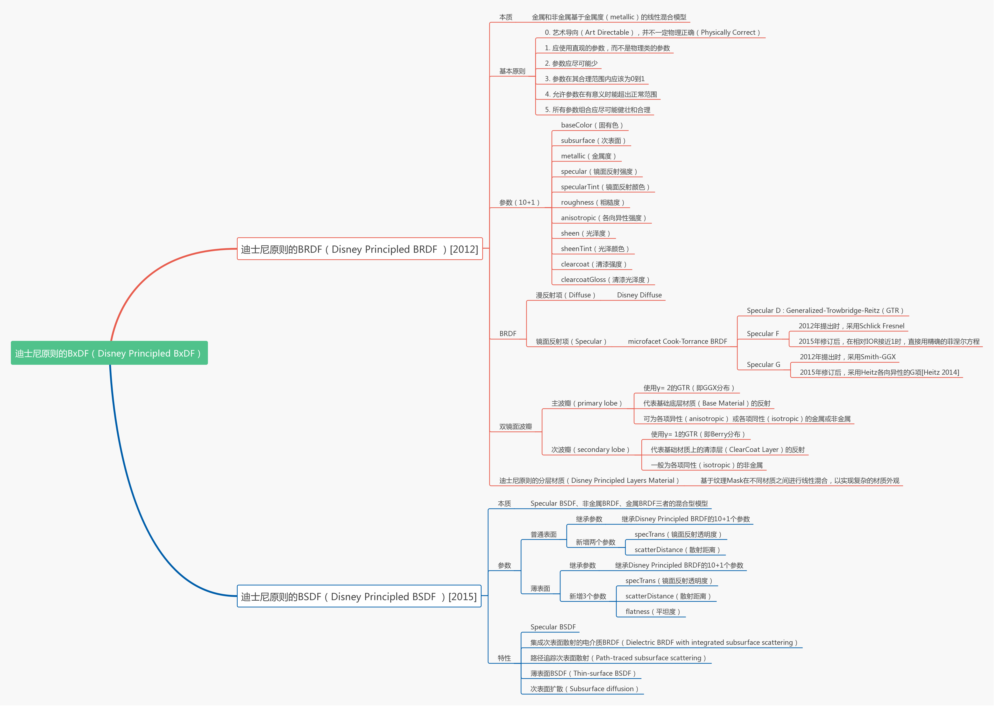

OK，让我们直接开始正文。

 

# 一、迪士尼与基于物理的渲染的发展

正如这个系列前文已经提到的，基于物理的渲染其实早在20世纪就已经在图形学业界有了一些萌芽，2010年在SIGGRAPH上就已经有公开讨论的Course《SIGGRAPH 2010 Course: Physically-Based Shading Models in Film and Game Production》，而直到2012~2013年，才正式进入大众的视野，渐渐被电影和游戏业界广泛使用。

究其原因，一方面是因为硬件性能的限制，另一方面，则是因为早期的基于物理的渲染模型包含大量复杂而晦涩的物理参数，不利于美术人员的理解、使用和快速产出。

迪士尼则是这次PBR革命的重要推动者。在创作电影《无敌破坏王（Wreck-It
Ralph）》期间，迪士尼动画工作室对基于物理的渲染进行了系统的研究，最终开发出了一种几乎可以用于电影的每个表面新的BRDF模型（头发除外），即迪士尼原则的BRDF（Disney
Principled BRDF）。

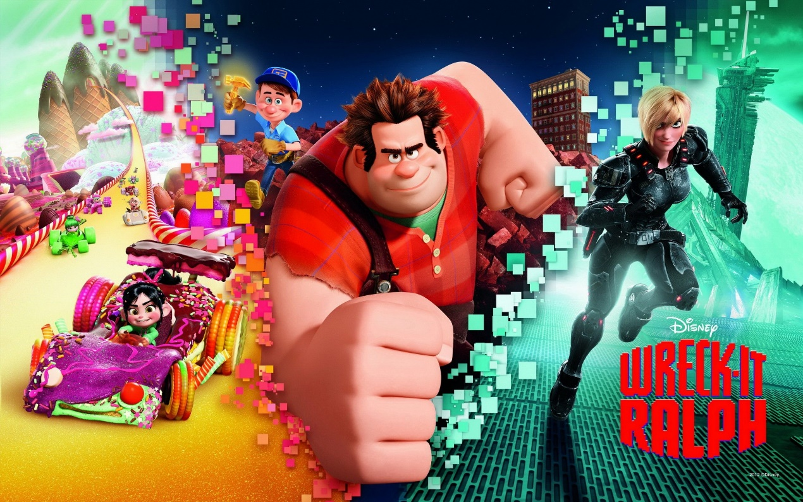

图 迪士尼动画电影《无敌破坏王》（2012）

随后，迪士尼动画工作室的Brent Burley于SIGGRAPH 2012上进行了著名的talk《Physically-based shading at Disney》，正式提出了迪士尼原则的BRDF（Disney Principled BRDF），由于其高度的通用性，将材质复杂的物理属性，用非常直观的少量变量表达了出来（如金属度metallic和粗糙度roughness），在电影业界和游戏业界引起了不小的轰动。从此，基于物理的渲染正式进入大众的视野。

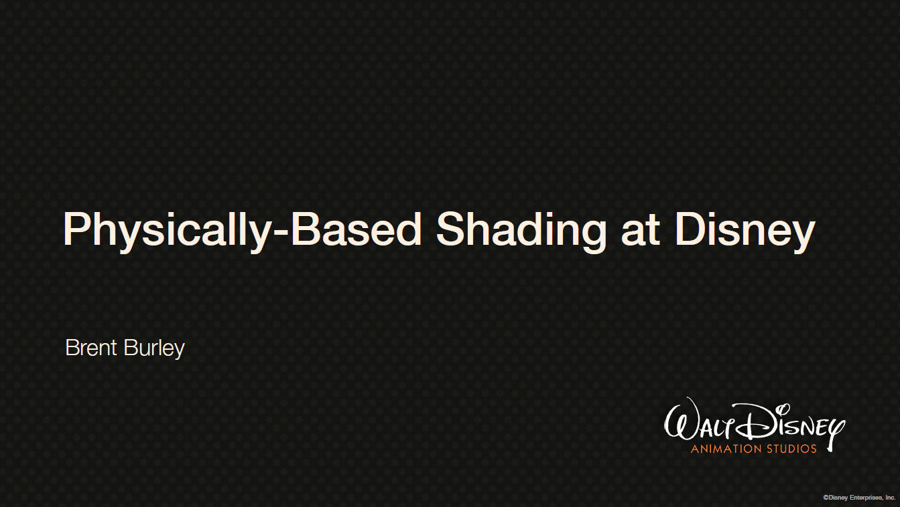

图 SIGGRAPH 2012《Physically-based shading at Disney》

在2012年受到Disney Principled BRDF的启发后，主流游戏引擎都开始从传统的渲染工作流转移到基于物理的渲染工作流。

以下是主流游戏引擎转移到基于物理的渲染的时间节点：

-   【SIGGRAPH 2013】 UE4 ：《Real Shading in Unreal Engine 4》

-   【SIGGRAPH 2014】 Frostbite（寒霜）： 《Moving Frostbite to PBR》

-   【GDC 2014】 Unity：《Physically Based Shading in Unity》

下面，让我们正式开始分析、提炼和总结SIGGRAPH 2012上迪士尼进行的talk《Physically-based shading at Disney》，深入了解其能让基于物理的渲染技术普及于游戏和电影工业的背后原因。

 

# 二、迪士尼采用的BRDF可视化方案与工具

在BRDF可视化方面，迪士尼在分享中提出了三个方面的工具与资源，可以总结如下：

-   **MERL 100 BRDF材质库**。Matusik等人[Matusik et al.2003]捕获的一组100个各向同性BRDF材质样本库。涵盖了各种材质，包括油漆，木材，金属，织物，石材，橡胶，塑料和其他合成材质。对学术与研究免费授权。

    -   MERL BRDF主站 ：<http://merl.com/brdf>

    -   Database地址：<https://people.csail.mit.edu/wojciech/BRDFDatabase/>

-   **BRDF Explorer**。迪士尼为分析、比较和新开发BRDF模型而开发的可视化工具。该工具在分析测量材质，比较现有模型，以及开发新模型方面具有无可估量的价值。

    -   官方主页：<https://www.disneyanimation.com/technology/brdf.html>

    -   GitHub地址： <https://github.com/wdas/brdf>

-   **BRDF Image Slice切片**。将θh与θd作为横轴和纵轴，对观察到的材质的BRDF进行建模的2D图像切片。

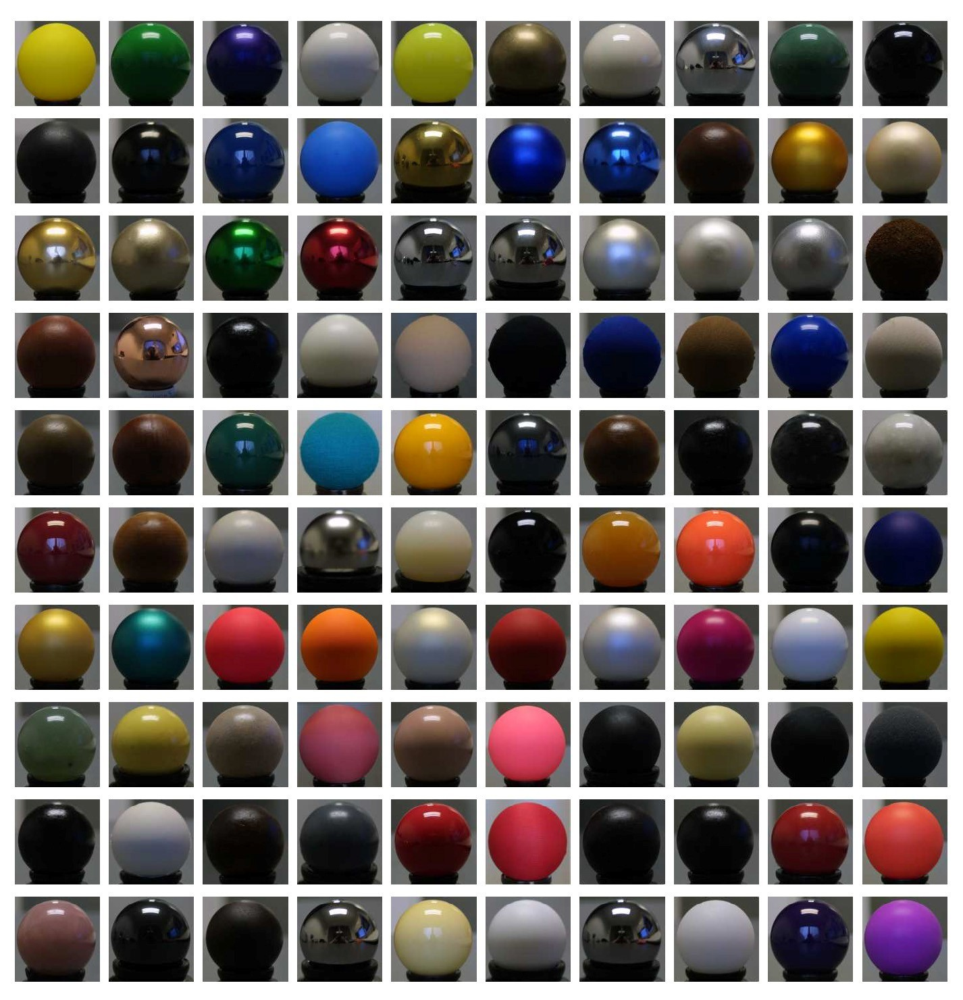

图 “MERL 100”BRDF数据库

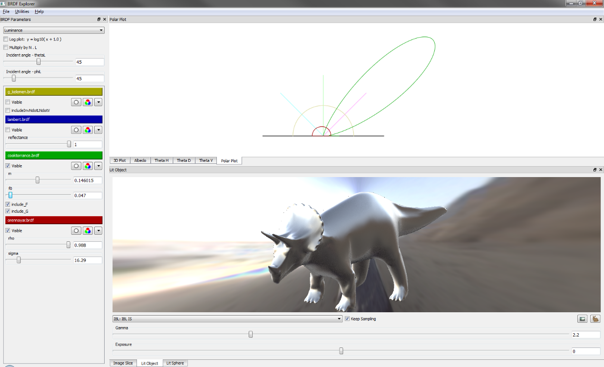

图 BRDF Explorer

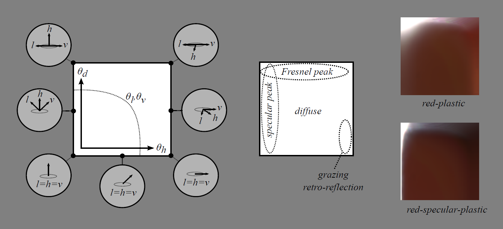

图：红色塑料（red-plastic）和镜面红色塑料（specular-red-plastic）的BRDF图像切片以及“切片空间（Slice Space）”示意图。

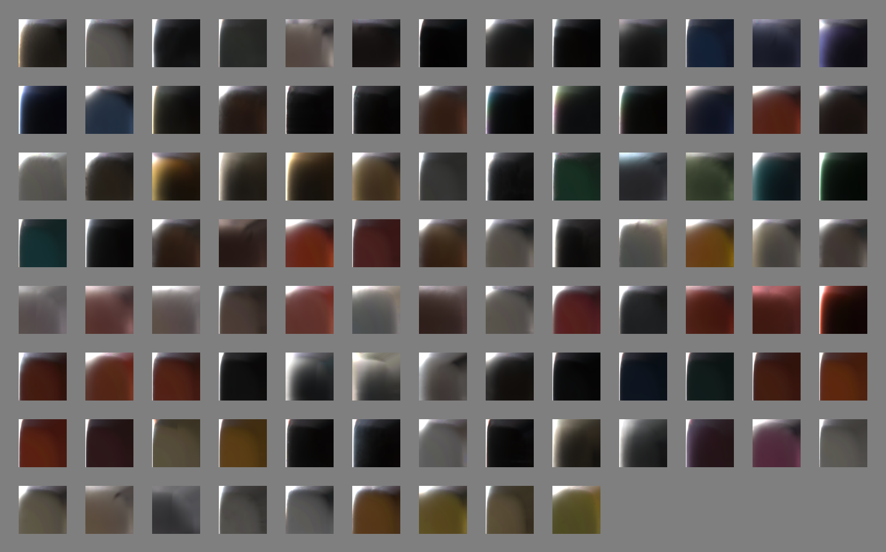

图 MERL 100 BRDF数据库的图像切片（Image Slice）

 

# 三、迪士尼对MERL材质数据库的观察结论

在提出Disney Principled
BRDF之前，Disney已经做了大量的前置工作，其中，最主要的工作便是对材质数据库的观察与进行理论分析。按照不同项的分类，可以总结为如下6个部分：

-   Diffuse项的观察结论

-   Specular D 项的观察结论

-   Specular F 项的观察结论

-   Specular G 项的观察结论

-   布料（Fabric）材质的观察结论

-   彩虹色（Iridescence）的观察结论

下文将对其分别进行相关总结。

 

## 3.1 Diffuse项的观察结论

-   漫反射（Diffuse）表示折射（refracted）到表面，经过散射（scattered）和部分吸收（partially absorbed），最终重新出表面出射的光。

-   被着色的非金属材质的任意出射部分都可以视为漫反射。

-   通过观察得出，很少有材质的漫反射表现和Lambert反射模型相吻合。即需要更准确的漫反射模型。

-   通过观察得出掠射逆反射（grazing retroreflection）有明显的着色现象，即可以将掠射逆反射（grazing retroreflection）也看做一种漫反射现象。

-   粗糙度会对菲涅尔折射造成影响，而一般的漫反射模型如Lmabert忽略了这种影响。

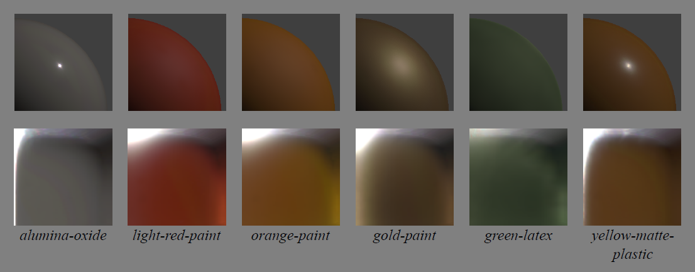

图 表现出漫反射颜色变化的材质。 上：渲染球体上的点光源响应; 下：BRDF图像切片。

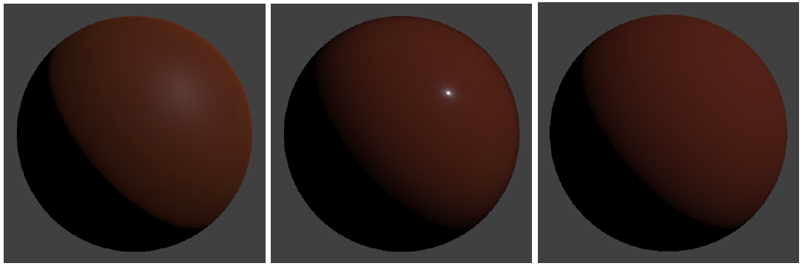

图 红色塑料，镜面红色塑料和Lambert漫反射的点光源响应

-   Oren-Nayar模型（1995）预测粗糙漫反射表面逆向反射的增加会使漫反射形状变平。然而，其逆向反射波峰不像测量数据那样强，并且粗糙测量的材质通常不显示漫反射的平坦化。

-   Hanrahan-Krueger模型（1993），源自次表面散射理论，也预测了漫反射形状的平坦化，但在边缘处没有足够强的峰值。与Oren-Nayar相比，该模型呈现出完美光滑的表面。下图中比较了Oren-Nayar、Hanrahan-Krueger和Lambert模型。

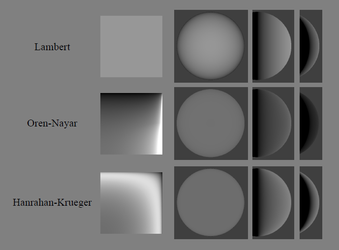

图 Lambert，Oren-Nayar和Hanrahan-Krueger漫反射模型的BRDF切片和点光源响应。

 

## 3.2 Specular D 项的观察结论

-   微观分布函数D（θh）可以从测量材质的逆反射（retroreflective）响应观察得到。

-   绝大多数MERL材质都有镜面波瓣（specular lobes），且尾部比传统的镜面模型长得多。 即反射分布项需要更宽的尾部。

-   GGX比其他分布具有更长的尾部，但仍然无法捕捉到铬金属（chrome）样本的闪亮亮点。

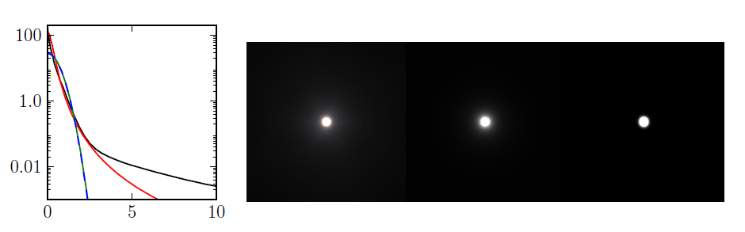

图 MERL 铬金属（chrome）与几个镜面分布的比较。 左：镜面波峰的对数比例图）; 黑色曲线表示MERL 铬金属（chrome），红色曲线表示 GGX分布（*α*= 0.006），绿色曲线表示Beckmann分布（*m* = 0.013），蓝色曲线表示 Blinn Phong（*n* = 12000），其中，绿色曲线和蓝色曲线基本重合。 右： chrome 、GGX和Beckmann分布的点光源响应。

 

## 3.3 Specular F 项的观察结论

-   菲涅尔反射系数F(θd)表示了当光和视图矢量分开时镜面反射的增加。

-   光滑表面在切线入射时有将接近100％的镜面反射。

-   对于粗糙表面，无法实现100％的镜面反射，但反射率仍会将变得越来越高。

-   每种材质在掠射角附近都显示出一些反射率的增加。

-   掠射角入射附近的许多曲线的陡度已经大于菲涅尔效应的预测值。

 

## 3.4 Specular G 项的观察结论

-   几何项的影响可以间接地看作其对方向反射率（directional albedo）的影响

-   大多数材质的方向反射率（directional albedo）对于前70度是相对平坦的，并且切线入射处的反射率与表面粗糙度密切相关。

-   几何项的选择会对反射率产生影响，反过来又会对表面外观产生影响。

-   完全省略G项和1/cosθl cosθv项的模型，被称为“No G”模型，会导致在掠射角处过暗的响应。

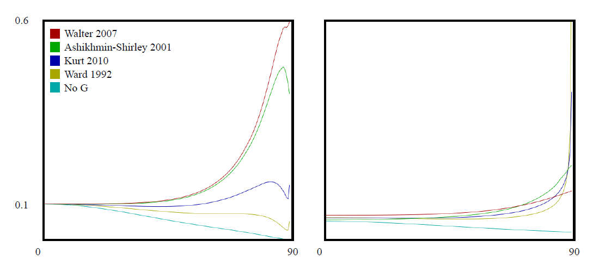

图 几种镜面反射几何模型的反射率图示。 所有图中都使用相同的D（GGX / TR）项和F项。 左图：光滑表面（α= 0.02）; 右图：粗糙表面（α= 0.5）。 其中，“No G”模型已去除G和1/cosθl cosθv项的计算。

 

## 3.5 布料（Fabric）材质的观察结论

-   许多布料样本在掠射角处呈现出镜面反射的色调，并且还具有比具有十分粗糙的材质更强的菲涅尔波峰。

-   布料具有有色的掠射反射，可以理解为是其轮廓附近获取到材质颜色的透射纤维（transmissive fibers）造成的。

-   布料在掠射角处的额外光泽增加，超出了普通微平面模型的预测范围。

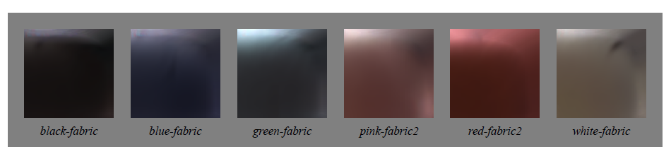

图 各种布料样本的BRDF图像切片

 

## 3.6 彩虹色（Iridescence）的观察结论

-   变色涂料（color-changing-paint）在(θh,θd)空间上显示出连续的色块，切对φd的依赖性最小。

-   彩虹色远离镜面峰值的反射率非常小，所以可以将彩虹色理解为一种镜面反射现象。

-   可以将镜面色调调制为θh和θd的函数，配合小尺寸纹理贴图对彩虹色进行建模。

图 3种变色涂料（color-changing-paint）的BRDF图像切片。上图：原始数据; 下图：通过每像素缩放1/ max(r, g, b)生成的相应色度图像。

 

# 四、迪士尼原则的BRDF（Disney Principled BRDF）

## 4.1 Disney Principled BRDF的理念

在2012年迪士尼原则的BRDF被提出之前，基于物理的渲染都需要大量复杂而不直观的参数，此时PBR的优势，并没有那么明显。

在2012年迪士尼提出，他们的着色模型是艺术导向（Art Directable）的，而不一定要是完全物理正确(physically correct) 的，并且对微平面BRDF的各项都进行了严谨的调查，并提出了清晰明确而简单的解决方案。

迪士尼的理念是开发一种“原则性”的易用模型，而不是严格的物理模型。正因为这种艺术导向的易用性，能让美术同学用非常直观的少量参数，以及非常标准化的工作流，就能快速实现涉及大量不同材质的真实感的渲染工作。而这对于传统的着色模型来说，是不可能完成的任务。

迪士尼原则的BRDF（Disney Principled BRDF）核心理念如下：

- 应使用直观的参数，而不是物理类的晦涩参数。

- 参数应尽可能少。

- 参数在其合理范围内应该为0到1。

- 允许参数在有意义时超出正常的合理范围。

- 所有参数组合应尽可能健壮和合理。

 

而从本质上而言，Disney Principled BRDF模型是金属和非金属的混合型模型，最终结果是基于金属度（metallice）在金属BRDF和非金属BRDF之间进行线性插值。

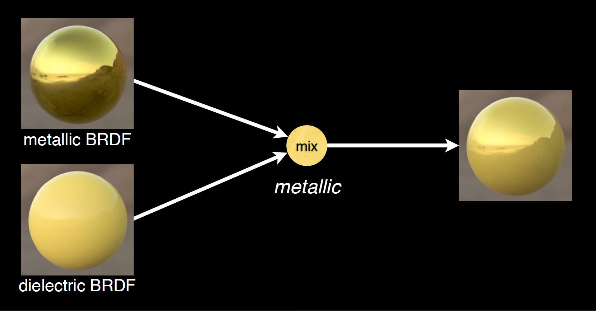

图 Disney BRDF模型是金属和非金属基于金属度（metallic）的线性混合模型

正因为这套新的渲染理念统一了金属和非金属的材质表述，可以仅通过少量的参数来涵盖自然界中绝大多数的材质，并可以得到非常逼真的渲染品质。

也正因如此，在PBR的金属/粗糙度工作流中，固有色（baseColor）贴图才会同时包含金属和非金属的材质数据：

-   金属的反射率值

-   非金属的漫反射颜色

 

## 4.2 Disney Principled BRDF的参数

以上述理念为基础，迪士尼动画工作室对每个参数的添加进行了把关，最终得到了一个颜色参数（baseColor）和下面描述的十个标量参数：

-   baseColor（固有色）：表面颜色，通常由纹理贴图提供。

-   subsurface（次表面）：使用次表面近似控制漫反射形状。

-   metallic（金属度）：金属（0 = 电介质，1 =金属）。这是两种不同模型之间的线性混合。金属模型没有漫反射成分，并且还具有等于基础色的着色入射镜面反射。

-   specular（镜面反射强度）：入射镜面反射量。用于取代折射率。

-   specularTint（镜面反射颜色）：对美术控制的让步，用于对基础色（basecolor）的入射镜面反射进行颜色控制。掠射镜面反射仍然是非彩色的。

-   roughness（粗糙度）：表面粗糙度，控制漫反射和镜面反射。

-   anisotropic（各向异性强度）：各向异性程度。用于控制镜面反射高光的纵横比。（0 =各向同性，1 =最大各向异性。）

-   sheen（光泽度）：一种额外的掠射分量（grazing component），主要用于布料。

-   sheenTint（光泽颜色）：对sheen（光泽度）的颜色控制。

-   clearcoat（清漆强度）：有特殊用途的第二个镜面波瓣（specular lobe）。

-   clearcoatGloss（清漆光泽度）：控制透明涂层光泽度，0 = “缎面（satin）”外观，1 = “光泽（gloss）”外观。

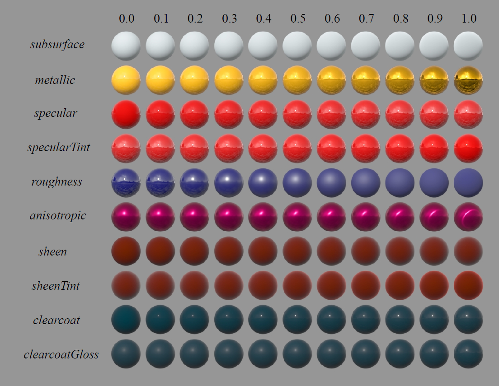

图 Disney Principled BRDF的参数

 

## 4.3 Disney Principled BRDF的着色模型

### 4.3.1 核心BRDF 模型

核心BRDF模型方面，Disney采用了通用的microfacet Cook-Torrance BRDF着色模型：

其中：

-   Diffuse为漫反射项

- 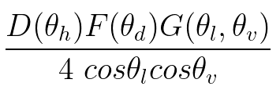为镜面反射项，其中：

    -   D为微平面分布函数，主要负责镜面反射波峰（specular peak）的形状。

    -   F为菲涅尔反射系数（Fresnel reflection coefficient）

    -   G为几何衰减（geometric attenuation）/ 阴影项（shadowing factor）。

下面对这些项分别进行说明。

 

### 4.3.2 漫反射项（Diffuse）：Disney Diffuse

Disney表示，Lambert漫反射模型在边缘上通常太暗，而通过尝试添加菲涅尔因子以使其在物理上更合理，但会导致其更暗。

所以，根据对Merl 100材质库的观察，Disney开发了一种用于漫反射的新的经验模型，以在光滑表面的漫反射菲涅尔阴影和粗糙表面之间进行平滑过渡。

思路方面，Disney使用了Schlick Fresnel近似，并修改掠射逆反射（grazing retroreflection response）以达到其特定值由粗糙度值确定，而不是简单为0。

Disney Diffuse漫反射模型的公式为：

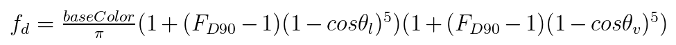

其中，

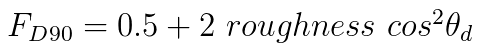

以下为上述Disney Diffuse的Shader实现代码：

        // [Burley 2012, "Physically-Based Shading at Disney"]
        float3 Diffuse_Burley_Disney( float3 DiffuseColor, float Roughness, float NoV, float NoL, float VoH )
        {
                float FD90 = 0.5 + 2 * VoH * VoH * Roughness;
                float FdV = 1 + (FD90 - 1) * Pow5( 1 - NoV );
                float FdL = 1 + (FD90 - 1) * Pow5( 1 - NoL );
                return DiffuseColor * ( (1 / PI) * FdV * FdL );
        }

 

### 4.3.3 法线分布项（Specular D）：GTR

在流行的模型中，GGX拥有最长的尾部。而GGX其实与Blinn (1977)推崇的Trowbridge-Reitz（TR）（1975）分布等同。然而，对于许多材质而言，即便是GGX分布，仍然没有足够长的尾部。

Trowbridge-Reitz（TR）的公式为：

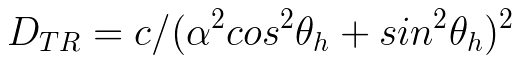

其中：

-   c为缩放常数（scaling constant）

-   α为粗糙度参数（roughness parameter），其值在0和1之间;α=0产生完全平滑的分布（即*θh* = 0时的delta函数），α=1产生完全粗糙或均匀的分布。

来自Berry(1923)的分布函数和Trowbridge-Reitz分布具有非常相似的形式，但指数为1而不是2，从而导致了更长的尾部：

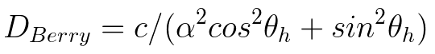

通过，Trowbridge-Reitz和Berry的形式的对比，Disney发现其具有相似的形式，只是幂次不同，于是，Disney将Trowbridge-Reitz进行了N次幂的推广，并将其取名为Generalized-Trowbridge-Reitz，GTR：

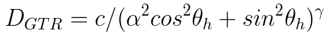

可以发现，上式中：

-   γ=1时，GTR即Berry分布

-   γ=2时，GTR即Trowbridge-Reitz分布

以下为各种γ值的GTR分布曲线与θh的关系图示：

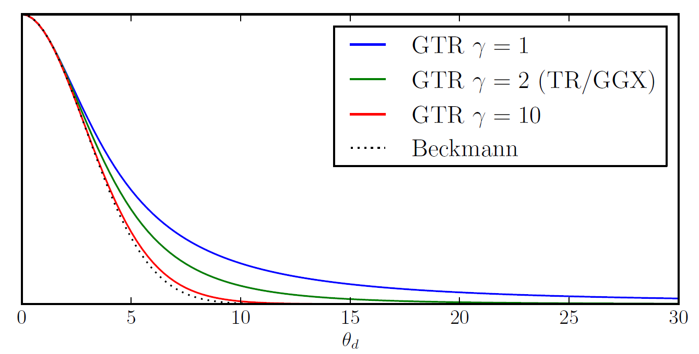

图 各种γ值的GTR分布曲线与*θh*的关系

另外，Disney Principled BRDF中使用了两个固定的镜面反射波瓣（specular lobe），且都使用GTR模型，可以总结如下：

-   主波瓣（primary lobe）

    -   使用γ= 2的GTR（即GGX分布）

    -   代表基础底层材质（Base Material）的反射

    -   可为各项异性（anisotropic） 或各项同性（isotropic）的金属或非金属

-   次级波瓣（secondary lobe）

    -   使用γ= 1的GTR（即Berry分布）

    -   代表基础材质上的清漆层（ClearCoat Layer）的反射

    -   一般为各项同性（isotropic）的非金属材质，即清漆层（ClearCoat Layer）

以下是γ= 1和γ= 2时GTR分布的Shader实现代码：

	// Generalized-Trowbridge-Reitz distribution
	float D_GTR1(float alpha, float dotNH)
	{
		float a2 = alpha * alpha;
		float cos2th = dotNH * dotNH;
		float den = (1.0 + (a2 - 1.0) * cos2th);
		
		return (a2 - 1.0) / (PI * log(a2) * den);
	}
	
	float D_GTR2(float alpha, float dotNH)
	{
		float a2 = alpha * alpha;
		float cos2th = dotNH * dotNH;
		float den = (1.0 + (a2 - 1.0) * cos2th);
		
		return a2 / (PI * den * den);
	}

以及各项异性的版本：

        float D_GTR2_aniso(float dotHX, float dotHY, float dotNH, float ax, float ay)
        {
                float deno = dotHX * dotHX / (ax * ax) + dotHY * dotHY / (ay * ay) + dotNH * dotNH;
                return 1.0 / (PI * ax * ay * deno * deno);
        }

 

### 4.3.4 菲涅尔项（Specular F）：Schlick Fresnel

菲涅尔项（Specular F）方面，Disney表示Schlick Fresnel近似已经足够精确，且比完整的菲涅尔方程简单得多; 而由于其他因素，Schlick Fresne近似引入的误差明显小于其他因素产生的误差。Schlick Fresnel 近似公式如下：

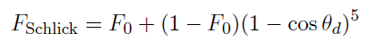

其中：

-   常数F0表示垂直入射时的镜面反射率。

-   θd为半矢量h和视线矢量v之间的夹角

以下为Schlick Fresnel的Shader实现代码：

        // [Schlick 1994, "An Inexpensive BRDF Model for Physically-Based Rendering"]
        float3 F_Schlick(float HdotV, float3 F0)
        {
                return F0 + (1 - F0) * pow(1 - HdotV , 5.0));
        }

一般建议实现一个自定义的Pow5工具函数替换pow(xx, 5.0)的调用，以省去pow函数带来的稍昂贵的性能开销。

Pow5函数实现很简单，如下所示：

        half Pow5(half v)
        {
                return v * v * v * v * v;
        }

另外，Disney在SIGGRAPH 2015上对此项进行了修订，提出在介质间相对IOR接近1时，Schlick近似误差较大，这时可以直接用精确的菲涅尔方程：

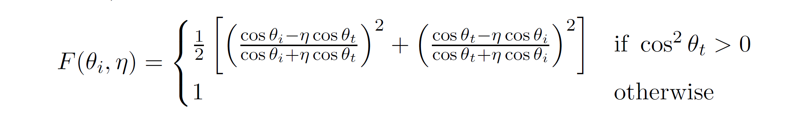

 

### 4.3.5 几何项（Specular G）：Smith-GGX

几何项（Specular G）方面，对于主镜面波瓣（primary specular lobe），Disney参考了 Walter的近似方法，使用Smith GGX导出的G项，并将粗糙度参数进行重映射以减少光泽表面的极端增益，即将α 从[0, 1]重映射到[0.5, 1]，α的值为(0.5 + roughness/2)^2。从而使几何项的粗糙度变化更加平滑，更便于美术人员的使用。

以下为Smith GGX的几何项的表达式：

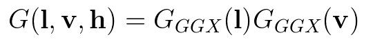

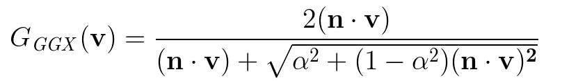

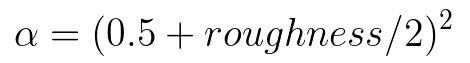

另外，对于对清漆层进行处理的次级波瓣（secondary lobe），Disney没有使用Smith G推导，而是直接使用固定粗糙度为0.25的GGX的 G项，便可以得到合理且很好的视觉效果。

几何项的Shader实现代码如下：

        // Smith GGX G项，各项同性版本
        float smithG_GGX(float NdotV, float alphaG)
        {
                float a = alphaG * alphaG;
                float b = NdotV * NdotV;
                return 1 / (NdotV + sqrt(a + b - a * b));
        }

        // Smith GGX G项，各项异性版本
        // Derived G function for GGX
        float smithG_GGX_aniso(float dotVN, float dotVX, float dotVY, float ax, float ay)
        {
                return 1.0 / (dotVN + sqrt(pow(dotVX * ax, 2.0) + pow(dotVY * ay, 2.0) + pow(dotVN, 2.0)));
        }

        // GGX清漆几何项
        // G GGX function for clearcoat
        float G_GGX(float dotVN, float alphag)
        {
                float a = alphag * alphag;
                float b = dotVN * dotVN;
                return 1.0 / (dotVN + sqrt(a + b - a * b));
        }

同样，Disney在SIGGRAPH 2015上也对G项进行了修订，他们基于Heitz的分析[Heitz 2014]，淘汰了对于主镜面波瓣的Smith G粗糙度的特殊重映射，采用了Heitz各向异性的G，后文会对这次修订做更深入的探讨。

 

# 五、迪士尼原则的分层材质（Disney Principled Layers Material）

迪士尼原则的分层材质（Disney Principled Layers Material）的核心设计原则是，所有参数需允许健壮地插值，以基于纹理Mask在不同材质之间进行线性混合，实现复杂的材质外观。

这样的好处是使所有参数是归一化的并且至少是感知线性的，材质通常以非常直观的方式插值。如下图，所有10个参数都是线性插值的。

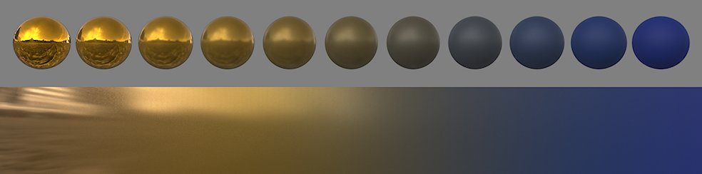

图 使用Disney Principled Shading Model在闪亮的金属金色和蓝色橡胶之间线性插值

在创作过程中，美术人员通常会从一个材质预设列表中进行选择，然后使用纹理遮罩简单地在其之间进行混合。实时证明，这套方案非常成功的，大大简化了工作流程，提高了材质的一致性，并使着色器计算非常高效。迪士尼使用的对应的分层着色器的UI如下图所示。

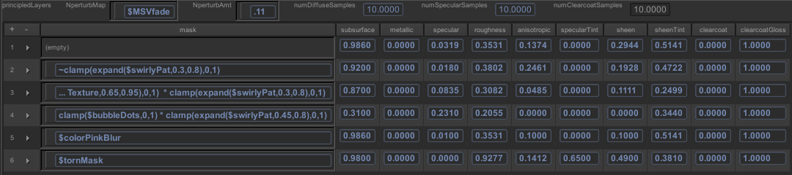

图 显示材质图层的着色器编辑器的屏幕截图。mask表达式中的变量指的是空间变化的着色器模块，通常是mask纹理贴图。

 

# 六、Disney Principled BRDF的实现代码

Disney在2012年Disney Principled BRDF提出时，已经在GitHub上开源了BRDF Explorer，以及Disney Principled BRDF的实现源码，其GitHub链接为：

<https://github.com/wdas/brdf/blob/master/src/brdfs/disney.brdf>

需要注意的是，这段源码使用的是特有的着色语言，但其实和一般的CG着色语言非常相似。

为了配合与本文内容结合阅读与理解，这里也将这段经典的Shader代码引用到本文中来：

        ::begin parameters
        color baseColor .82 .67 .16
        float metallic 0 1 0
        float subsurface 0 1 0
        float specular 0 1 .5
        float roughness 0 1 .5
        float specularTint 0 1 0
        float anisotropic 0 1 0
        float sheen 0 1 0
        float sheenTint 0 1 .5
        float clearcoat 0 1 0
        float clearcoatGloss 0 1 1
        ::end parameters

        ::begin shader

        const float PI = 3.14159265358979323846;

        float sqr(float x) { return x*x; }

        float SchlickFresnel(float u)
        {
                float m = clamp(1-u, 0, 1);
                float m2 = m*m;
                return m2*m2*m; // pow(m,5)
        }

        float GTR1(float NdotH, float a)
        {
                if (a >= 1) return 1/PI;
                float a2 = a*a;
                float t = 1 + (a2-1)*NdotH*NdotH;
                return (a2-1) / (PI*log(a2)*t);
        }

        float GTR2(float NdotH, float a)
        {
                float a2 = a*a;
                float t = 1 + (a2-1)*NdotH*NdotH;
                return a2 / (PI * t*t);
        }

        float GTR2_aniso(float NdotH, float HdotX, float HdotY, float ax, float ay)
        {
                return 1 / (PI * ax*ay * sqr( sqr(HdotX/ax) + sqr(HdotY/ay) + NdotH*NdotH ));
        }

        float smithG_GGX(float NdotV, float alphaG)
        {
                float a = alphaG*alphaG;
                float b = NdotV*NdotV;
                return 1 / (NdotV + sqrt(a + b - a*b));
        }

        float smithG_GGX_aniso(float NdotV, float VdotX, float VdotY, float ax, float ay)
        {
                return 1 / (NdotV + sqrt( sqr(VdotX*ax) + sqr(VdotY*ay) + sqr(NdotV) ));
        }

        vec3 mon2lin(vec3 x)
        {
                return vec3(pow(x[0], 2.2), pow(x[1], 2.2), pow(x[2], 2.2));
        }

        vec3 BRDF( vec3 L, vec3 V, vec3 N, vec3 X, vec3 Y )
        {
                float NdotL = dot(N,L);
                float NdotV = dot(N,V);
                if (NdotL < 0 || NdotV < 0) return vec3(0);

                vec3 H = normalize(L+V);
                float NdotH = dot(N,H);
                float LdotH = dot(L,H);

                vec3 Cdlin = mon2lin(baseColor);
                float Cdlum = .3*Cdlin[0] + .6*Cdlin[1]  + .1*Cdlin[2]; // luminance approx.

                vec3 Ctint = Cdlum > 0 ? Cdlin/Cdlum : vec3(1); // normalize lum. to isolate hue+sat
                vec3 Cspec0 = mix(specular*.08*mix(vec3(1), Ctint, specularTint), Cdlin, metallic);
                vec3 Csheen = mix(vec3(1), Ctint, sheenTint);

                // Diffuse fresnel - go from 1 at normal incidence to .5 at grazing
                // and mix in diffuse retro-reflection based on roughness
                float FL = SchlickFresnel(NdotL), FV = SchlickFresnel(NdotV);
                float Fd90 = 0.5 + 2 * LdotH*LdotH * roughness;
                float Fd = mix(1.0, Fd90, FL) * mix(1.0, Fd90, FV);

                // Based on Hanrahan-Krueger brdf approximation of isotropic bssrdf
                // 1.25 scale is used to (roughly) preserve albedo
                // Fss90 used to "flatten" retroreflection based on roughness
                float Fss90 = LdotH*LdotH*roughness;
                float Fss = mix(1.0, Fss90, FL) * mix(1.0, Fss90, FV);
                float ss = 1.25 * (Fss * (1 / (NdotL + NdotV) - .5) + .5);

                // specular
                float aspect = sqrt(1-anisotropic*.9);
                float ax = max(.001, sqr(roughness)/aspect);
                float ay = max(.001, sqr(roughness)*aspect);
                float Ds = GTR2_aniso(NdotH, dot(H, X), dot(H, Y), ax, ay);
                float FH = SchlickFresnel(LdotH);
                vec3 Fs = mix(Cspec0, vec3(1), FH);
                float Gs;
                Gs  = smithG_GGX_aniso(NdotL, dot(L, X), dot(L, Y), ax, ay);
                Gs *= smithG_GGX_aniso(NdotV, dot(V, X), dot(V, Y), ax, ay);

                // sheen
                vec3 Fsheen = FH * sheen * Csheen;

                // clearcoat (ior = 1.5 -> F0 = 0.04)
                float Dr = GTR1(NdotH, mix(.1,.001,clearcoatGloss));
                float Fr = mix(.04, 1.0, FH);
                float Gr = smithG_GGX(NdotL, .25) * smithG_GGX(NdotV, .25);

                return ((1/PI) * mix(Fd, ss, subsurface)*Cdlin + Fsheen)
                        * (1-metallic)
                        + Gs*Fs*Ds + .25*clearcoat*Gr*Fr*Dr;
        }

        ::end shader

 

# 七、迪士尼BSDF（Disney BSDF）

PS: 由于Disney BSDF天生适合离线渲染器使用，对游戏引擎和实时渲染的参考意义比较有限，加上篇幅原因，所以这里仅对Disney BSDF做一个大致的总结，后续有机会再展开进行进一步分析。

 

在2013年上映的动画电影《冰雪奇缘》中，迪士尼继续沿用了之前开发的Disney Principled BRDF基于物理的着色系统，但对于折射和次表面散射等效果而言，需要与BRDF分开计算，且间接光照使用点云（point clouds）进行了近似。

而从2014年的《超能陆战队（Big Hero 6）》开始，迪士尼开始采用路径追踪全局光照（path-traced global illumination）进行新电影的制作。所以，原本的BRDF模型已经无法满足需求，于是迪士尼在之前的Disney Principled BRDF的基础上进行了改进，新开发出了Disney BSDF，并于SIGGPRAPH 2015上，通过talk《Extending the Disney BRDF to a BSDF with Integrated Subsurface Scattering》正式提出。

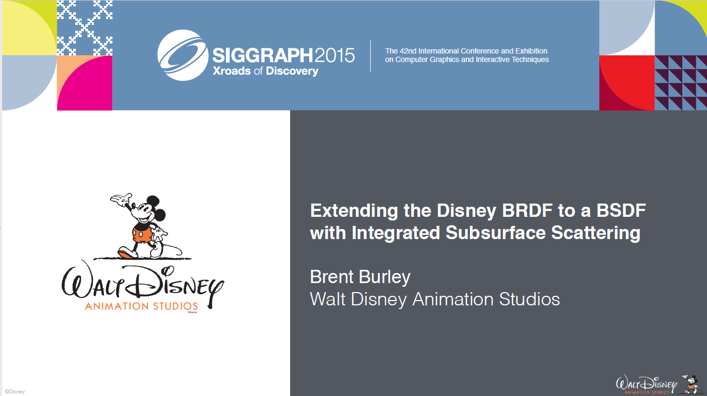

图 SIGGPRAPH 2015《Extending the Disney BRDF to a BSDF with Integrated Subsurface Scattering》

图 迪士尼动画电影《超能陆战队（Big Hero 6）》

图 基于Disney BSDF的渲染的示例

前文提到，Disney BRDF模型本质上是金属和非金属的混合型模型，对于Disney BSDF，Disney仍然延续了之前的设计理念，采用了混合的方式并结合已有的Disney BRDF模型进行实现。如下图，Disney新增了⼀个参数specTrans（镜面反射透明度）来控制BRDF 和BSDF的混合。基于specTrans完成混合后，再使用和Disney BRDF类似的方式，基于metallic再进行一次混合。

即Disney BRDF模型的本质是金属BRDF、非金属BRDF、与Specular BSDF三者的混合型模型。

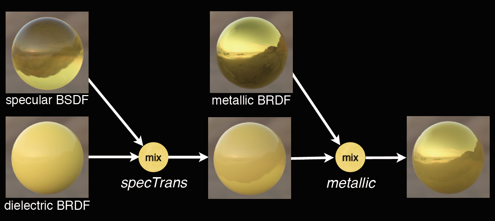

图 Disney BSDF设计思路

参数方面，Disney BSDF按普通表面和薄表面各有不同：

-   对于普通表面，Disney BSDF在Disney BRDF的基础上新增specTrans（镜面反射透明度）和scatterDistance（散射距离）两个参数，共12个。

-   对于薄表面（Thin-surface），Disney BSDF在Disney BRDF的基础上新增specTrans（镜面反射透明度）、scatterDistance（散射距离）和flatness（平坦度）三个参数，共13个。

以下是开源三维动画软件Blender实现的Disney
BSDF的图示（根据实际使用情况，Blender对Disney BSDF的实现有相应的修改）：

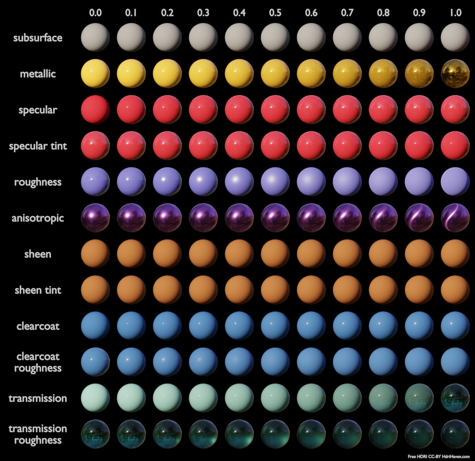

图 Disney Principled BSDF @Blender

除了新增的Specular BSDF模型，Disney还提出了新的次表面散射模型，以及针对超薄表面的折射处理，可以总结如下：

-   **在Disney BRDF中加入次表面散射模型**。具体思路是首先将漫射波瓣重构为两部分：方向性的微表面效应（microsurface effect），主要为逆反射（retroreflection）；非方向性的次表面效应（subsurface effect），即Lambertian。然后，用散射模型（diffusion model）或体积散射模型（volumetric scattering model）替换漫反射波瓣中的Lambert部分。这样，便能保留微表面效应（microsurface effect），让散射模型在散射距离较小时收敛到与漫反射BRDF相同的结果。

-   **提出基于两个指数项总和的次表⾯漫射（Subsurface diffusion）模拟模型。** 次表⾯漫射（Subsurface diffusion）。Disney通过蒙特卡洛模拟（Monte Carlo simulation），观察到对于典型的散射参数，包括单次散射的扩散剖面（diffusion profile），使用两个指数项的总和（a sum of two exponentials）便可以很好地进行模拟，且得到了比偶极子剖面（dipole diffusion）更好的渲染结果。如下图所示。

-   **薄表⾯BSDF（Thin-surface BSDF）**。对于薄的半透明表⾯，Disney选择在单个着色点处模拟入射和出射散射事件，作为镜面反射和漫反射传输的组合，由specTrans和diffTrans参数控制，并用各向同性的波瓣近似薄表面漫反射传输。如下图所示。

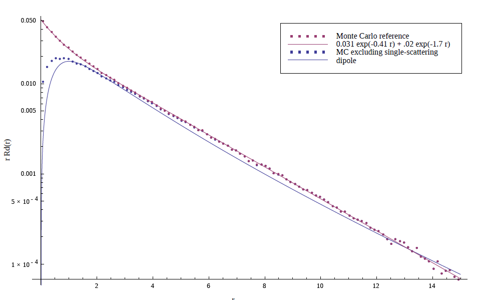

图 蒙特卡洛散射（Monte Carlo diffusion）模拟，指数拟合与偶极子数据的对比。

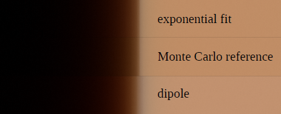

图 以阴影边界处的蒙特卡洛散射（Monte Carlo diffusion）渲染作为参考，与指数拟合（exponential fit），以及偶极子剖面（dipole diffusion）的对比。指数拟合与蒙特卡罗散射的参考看不出区别，而偶极子模型有明显的模糊，还有青色条带，这两种现象都是美术人员经常会抱怨的。

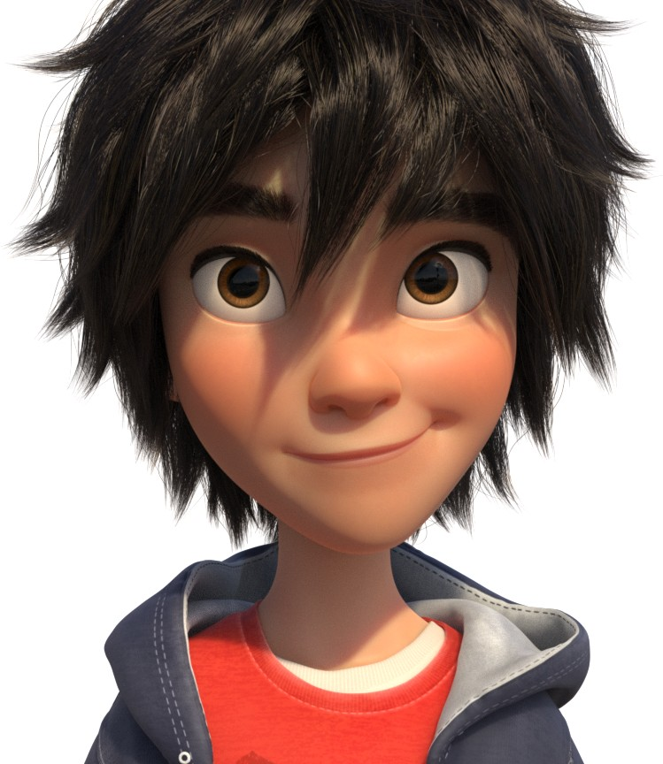

图 使用归一化扩散次表面（normalized diffusion subsurface）模型渲染出的《超能陆战队》人物图片。

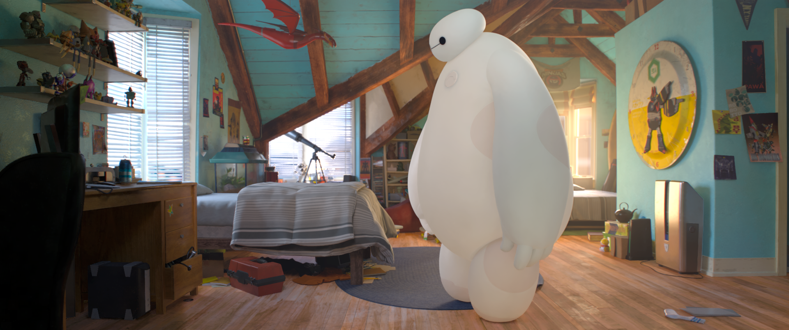

图 《超能陆战队》中基于超薄表面（Thin-surface）渲染技术渲染出的Baybax

八、本文内容要点总结
====================

正文到这里已经结束。不妨使用本文主要内容提炼出的思维导图作为全文的内容总结：

# Reference

[1] Burley B, Studios W D A. Physically-based shading at disney[C]//ACM
SIGGRAPH. 2012, 2012: 1-7.

[2] Burley B. Extending the Disney BRDF to a BSDF with integrated subsurface
scattering[J]. the Physically Based Shading in Theory and Practice SIGGRAPH
Course, 2015.

[3] Matusik W, Pfister H, Brand M, et al. Efficient isotropic BRDF
measurement[J]. 2003.

[4] Heitz E. Understanding the masking-shadowing function in microfacet-based
BRDFs[J]. Journal of Computer Graphics Techniques, 2014, 3(2): 32-91.

[5] 题图来自迪士尼电影《无敌破坏王2:大闹互联网》
