# 【基于物理的渲染（PBR）白皮书】（四）法线分布函数相关总结

本文的知乎专栏版本：https://zhuanlan.zhihu.com/p/69380665


作为基于物理的渲染（PBR）技术中材质高光质感的决定因素，更先进的法线分布函数（Normal
Distribution Function，NDF）的问世和发展，是PBR能够在游戏和电影工业日益普及的重要推动力之一。

从法线分布函数和微平面理论（Microfacet Theory）的视角来看，基于物理的渲染代表着一种从宏观表现到微观细节的渲染理念的进化，从而对材质有了亚像素级更精细的把控和更科学的定量表示，从而推动了游戏和电影业界渲染品质的提升，以及工作流的升级。


图 基于PBR渲染的《雷神3：诸神黄昏》 @Arnold Renderer


图 基于PBR渲染的《银河护卫队2》@Arnold Renderer


图 基于PBR渲染的真实感枪械 @ArtSation，linus scheffel


图 基于PBR渲染的Agent 327@ Blender Animation Studio


图 基于PBR渲染的场景 @BattleField V

历史上主流的法线分布函数，按提出时间进行排序，可以总结为：

-   Berry [1923]

-   Beckmann [1963]

-   Phong [1973]

-   Blinn-Phong [1977]

-   ABC [1989]

-   GGX [2007] / Trowbridge-Reitz [1975]

-   Shifted Gamma Distribution，SGD [2012]

-   Trowbridge-Reitz（GTR）[2012]

-   Student’s T-Distribution , STD [2017]

-   Exponential Power Distribution , EPD [2017]

而在如今的PBR时代，业界主流的法线分布函数已从传统的Blinn-Phong等分布，迁移到更接近真实材质外观表现，具备能量守恒，具有更宽尾部和更高峰值的GGX分布，而且在朝着多高光波瓣（multiple specular lobes）的方向发展。

本文将从以下几个方面，对基于物理的渲染中法线分布函数（Normal Distribution Function，NDF）相关内容进行一个系统的总结：

-   基于物理的渲染理念：从宏观表现到微观细节

-   法线分布函数与微平面理论

-   法线分布函数的基本性质

-   各项同性NDF相关总结

-   法线分布函数的形状不变性

-   各向异性NDF相关总结

-   NDF的性能优化

-   多高光波瓣（multiple specular lobes）

-   PBR中的高光抗锯齿

-   主流NDF的局限性和发展趋势

按照惯例，开始正文前，先放出本文内容总结的思维导图：


OK，让我们从第一部分开始。

<br>
<br>
<br>

# 一、基于物理的渲染理念：从宏观表现到微观细节


关于基于物理的渲染理念，其实跟图形学中对几何体的建模尺度有一定关联。图形学中，对几何体外观的建模，总会假设一定的建模尺度和观察尺度：

-   **宏观尺度（Macroscale），** 几何体通过三角形网格进行建模, 由顶点法线（Vertex Normal）提供每顶点法线信息

-   **中尺度（Mesoscale），** 几何体通过纹理进行建模，由法线贴图（Normal Map）提供每像素法线信息

-   **微观尺度（Microscale），** 几何体通过BRDF进行建模，由粗糙度贴图（Roughness Map）配合法线分布函数，提供每亚像素（subpixel）法线信息

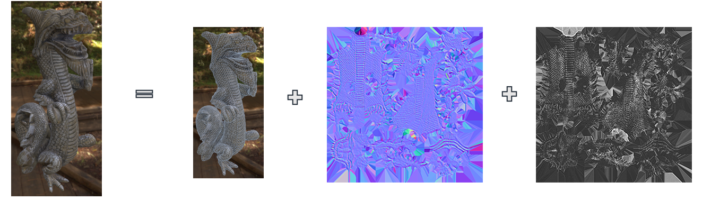

  图 PBR物体的渲染建模。从左到右：渲染后物体，几何体三角形网格，法线贴图，粗糙度贴图。（图片来自Sébastien  Lagarde ，Physically-Based Material, where are we，SIGGRAPH 2017）

传统光照模型中，一般只将几何体建模到中尺度的法线贴图（Normal Map）层面。虽说Blinn-Phong等分布也是基于微平面理论推导而来，但并没有配套粗糙度贴图（Roughness Map）为其提供亚像素级精度的细节，而且传统的NDF一般都没有经过归一化，不满足能量守恒，容易出现失真。

而在基于物理的渲染工作流中，通过将粗糙度贴图（Roughness Map）与微平面归一化的法线分布函数结合使用，将需渲染的几何体的建模尺度细化到了微观尺度（Microscale）的亚像素层面，对材质的微观表现更加定量，所以能够带来更加接近真实的渲染质量和更全面的材质外观质感把控。如下图。

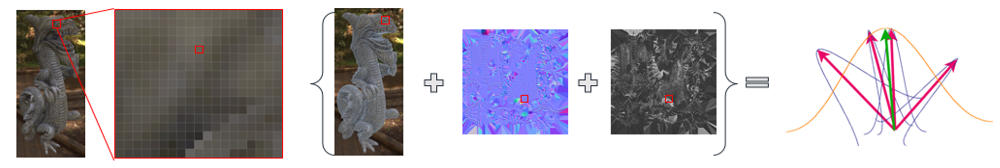

图 多尺度的几何建模表示（图片来自Sébastien Lagarde ，Physically-Based Material, where are we，SIGGRAPH 2017）

<br>
<br>
<br>


# 二、法线分布函数与微平面理论

-   微平面理论（microfacet theory）作为一种研究微观几何（microgeometry）对反射率影响的数学分析方法，基于将微观几何（microgeometry）建模为微平面（microfacets）的集合的思想。其最初由光学物理领域开发，用于研究统计表面上的散射[Beckmann Spizzichino 1963]。在图形社区中，我们使用它来推导基于物理的BRDF。

-   微平面模型的一个重要特性是微平面法线**m**的统计分布（statistical distribution）。 此分布由曲面的法线分布函数（Normal Distribution Function，NDF）定义。

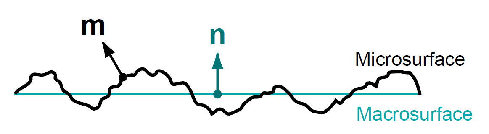

图 微观表面（Micro Surface）与宏观表面（Macro Surface）法线方向（图片来自[Walter 2007]）

-   法线分布函数（Normal Distribution Function，NDF）在一些文献中也用Specular D进行表示。

-   微平面的法线分布函数**D(m)**描述了微观表面上的表面法线**m**的统计分布。给定以**m**为中心的无穷小立体角**dωm**和无穷小宏观表面区域dA，则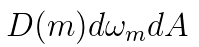是相应微表面部分的总面积，其法线位于指定的立体角内。因此NDF的本质是一个密度函数，单位为1/球面度（1/steradians）。

-   从直觉上来说，NDF就像是微平面法线分布的直方图（histogram）。 它在微平面法线更可能指向的方向上具有更高的值。大多数表面都具有在宏观表面法线**n**处显示出很强的法线分布峰值。

-   若以函数输入和输出的角度来看NDF，则其输入为微表面粗糙度（微表面法线集中程度）和宏观法线与视线的中间矢量（微表面法线方向），输出为此方向上的微表面法线强度。

-   一般我们用宏观表面的半矢量**h**来表示微观表面法线**m**，因为仅**m = h**的表面点的朝向才会将光线**l**反射到视线**v**的方向，其他朝向的表面点对BRDF没有贡献（正负相互抵消）。


图 仅**m = h**的表面点的朝向才会将光线l反射到视线v的方向，其他表面点对BRDF没有贡献（图片来自《Real-Time
Rendering 4th》）

-   目前业界广泛采用的Microfacet Cook-Torrance BRDF形式如下：

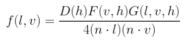

-   其中 **D(h)** 即法线分布函数 （Normal Distribution Function），描述了平面法线分布的概率，即具有正确朝向的微表面法线浓度。即具有正确朝向，能够将来自l的光反射到v的表面点的相对于表面面积的浓度。**D(h)**常被直接写作**D(m)。**

-   可以将法线分布函数 **D(m)** 理解为微观几何表面区域上的微平面表面法线的统计分布。 对 **D(m)** 在整个微平面法线上积分，会得到微表面的面积。更有用的是对*D*(**m**)(**n** *·* **m**)进行积分，即将 **D(m)** 的投影到宏观表面平面上，会得到宏观表面片元（patch）的面积，其被约定等于1，如下图所示：

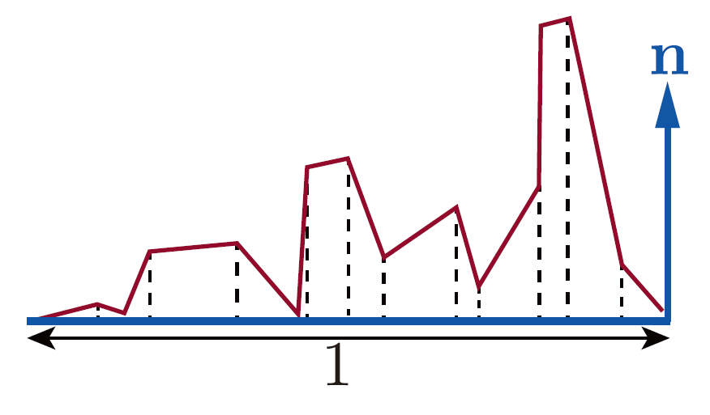

图 微表面的侧视图。积分*D*(**m**)(**n** *·* **m**)，得到投影到宏观表面平面上的微平面区域，等于宏观表面的面积，被约定为1。（图片来自《Real-Time
Rendering 4th》）

-   换句话说，投影*D*(**m**)(**n** *·* **m**)是被归一化的：

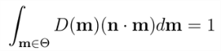


-   上式在积分时用到了Θ符号，表示在在整个球体上积分。而在以**n**为中心的半球上积分时，一般用Ω表示。实际上，图形学中使用的大多数微结构模型都是高度场（heightfields），这意味着对于Ω外的所有方向，**D(m)**
    = 0。 但是，上式也适用于非高度场微观结构。

-   更一般地，微观表面（microsurface）和宏观表面（macrosurface）在垂直于任何视图方向**v**的平面上的投影是相等的：

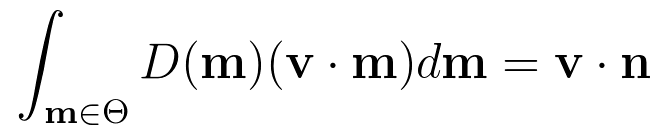


-   上面两个积分公式定义了成为一个合法的基于物理的法线分布函数必须服从的约束。

-   另外，上面两个积分公式中的点积不用被约束为大于等于0，因为投影会产生正负抵消，如下图所示。

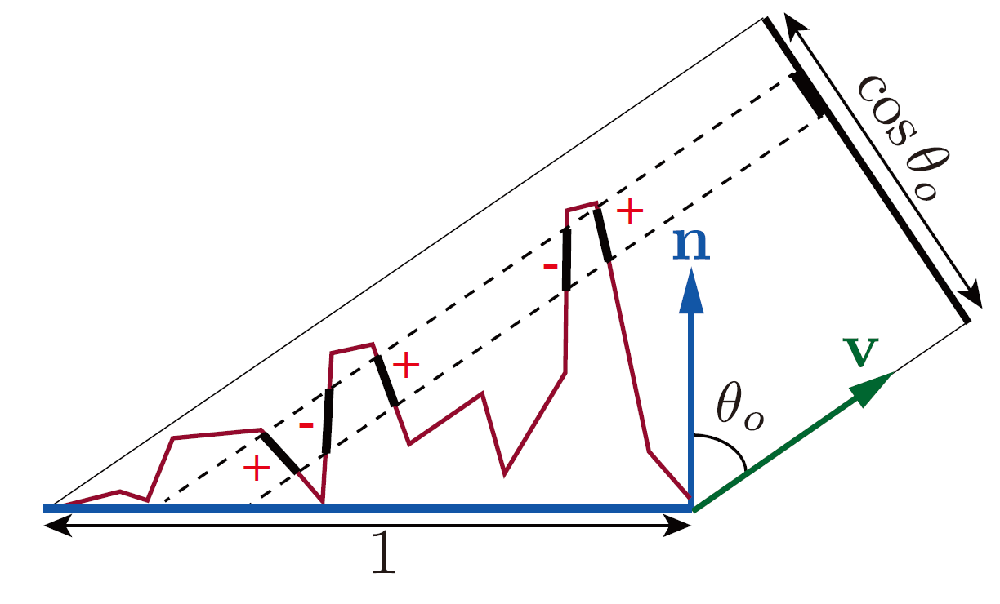

图 对*D*(**m**)(**v** *·* **m**)进行积分，微平面区域投影到垂直于v的平面（图中黑色的cos
*θo*线段），产生宏观表面到该平面的投影，即cos *θo*或(**v·n**)。当多个微平面的投影重叠时，背向（backfacing）微平面的负投影区域抵消了“额外的”前向（frontfacing）微平面。（图片来自《Real-Time
Rendering 4th》）

可以发现，尽管存在许多具有重叠（overlapping）投影的微平面，但用于最终渲染而言，我们仅关注可见的微平面，即在每个重叠集合中最接近相机的微平面。
这一事实表明了将投影的微观区域与投影的宏观几何区域相关联的另一种方法：可见微平面的投影面积之和等于宏观表面的投影面积。
我们可以通过定义遮蔽函数（masking function）G1(**m,v**)来对其进行数学表达，其给出了沿着视图向量v可见的具有法线m的微平面的比率。G1(**m,v**)D(**m**)
在球体上的积分给出投影到垂直于v的平面上的宏观表面的面积(其中*x*+
表示为被约束为大于等于0)：

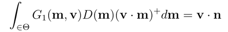


图
对可见微平面的投影区域（亮红色）进行积分，得到宏观表面在垂直于v的平面上的投影面积

-   上式中，通过x+的表示方法表达将**v · m**限制为大于等于0。
    背面微平面不可见，因此在这种情况下不计算它们。 乘积*G*1(**m**,**v**)*D*(**m**)则表示了**可见法线的分布**。

-   上式对*G*1(**m**,**v**)施加约束，但并不能唯一地确定它。有无数个函数满足给定微平面法线分布*D*(**m**)的约束。
    这是因为*D*(**m**)没有完全指定微表面（microsurface）。
    它仅告诉我们有多少百分比的微平面（microfacets）的法线指向了某些方向，而没有告诉我们这些法线是如何进行排列。

本文的重点是法线分布函数D，遮蔽阴影函数G相关的讨论暂时就不继续展开，下篇文章将对遮蔽阴影函数G做更详细的探讨。

<br>
<br>
<br>


# 三、法线分布函数的基本性质

一个基于物理的的微平面法线分布的基本性质，可以总结如下：

 **1. 微平面法线密度始终为非负值:**


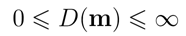


**2. 微表面的总面积始终不小于宏观表面总面积:**

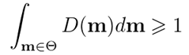


**3. 任何方向上微观表面投影面积始终与宏观表面投影面积相同:**


**4. 若观察方向为法线方向，则其积分可以归一化。即v = n时，有**：


<br>
<br>
<br>


# 四、各项同性NDF相关总结

最常见的法线分布函数是各向同性（isotropic）的，它们围绕由宏观表面法线**n**定义的轴旋转对称（rotationally
symmetrical）。常见的各项同性法线分布函数按出现时间进行排序，可以总结如下：

-   Berry [1923]

-   Beckmann [1963]

-   Phong [1973]

-   Blinn-Phong [1977]

-   ABC [1989]

-   GGX [2007] / Trowbridge-Reitz [1975]

-   Shifted Gamma Distribution，SGD [2012]

-   Trowbridge-Reitz（GTR）[2012]

-   Student’s T-Distribution , STD [2017]

-   Exponential Power Distribution , EPD [2017]

-   等

本文将对其中在历史上使用和讨论较为广泛的几种法线分布函数，Blinn-Phong、Beckmann、GGX(Trowbridge-Reitz)和GTR进行总结。


## 4.1 Blinn-Phong分布

-   Blinn-Phong分布的前身Phong分布是计算机图形学文献中提出的最早的着色方程之一。

-   Blinn-Phong法线分布函数由Blinn推导出，作为（非基于物理的）Phong着色模型的改进，以更好地拟合微平面BRDF的结构。

-   Blinn-Phong 分布不具备形状不变性（shape-invariant）。

-   虽然Blinn在提出Blinn-Phong分布时没有指定归一化因子，但很容易计算，关于Blinn-Phong的归一化的讨论，可以参见（<http://www.thetenthplanet.de/archives/255>）。下式是较为主流的归一化的Blinn-Phong（Normalized
    Blinn-Phong）的形式：

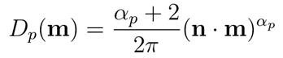


-   其中，幂αp是Blinn-Phong NDF的“粗糙度参数”;高值表示光滑表面，低值表示粗糙表面。对于非常光滑的曲面，值可以任意高（一个完美的镜面αp=∞），并且通过将αp设置为0可以实现最大随机曲面（均匀NDF）。

-   αp参数不便于艺术家操纵或直接绘制，因为它带来的视觉变化非常不均匀。出于这个原因，经常让美术师们操纵“界面值”，即通过非线性函数从中导出αp。例如：**αp=ms**，其中s是0到1之间的艺术家操纵值，**m**是给定的电影或游戏中αp的上限。这种映射被多款游戏使用，包括《使命召唤：黑色行动（Call
    of Duty: Black Ops）》，其中**m**被设置为值8192。

-   UE4中，则采用映射 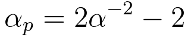,那么得到的Blinn-Phong的形式为：


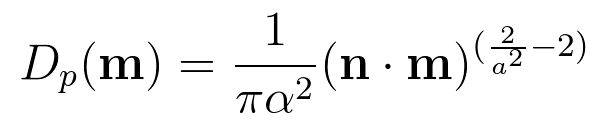


-   UE4中对Blinn-Phong的实现代码如下：

```
// [Blinn 1977, "Models of light reflection for computer synthesized pictures"]
float D_Blinn( float a2, float NoH )
{
        float n = 2 / a2 - 2;
        return (n+2) / (2*PI) * PhongShadingPow( NoH, n );		// 1 mad, 1 exp, 1 mul, 1 log
}
```


## 4.2 Beckmann分布

-   Beckmann分布是光学业界开发的第一批微平面模型中使用的法线分布。[Beckmann
    1963]，也是Cook-Torrance BRDF在提出时选择的NDF [Cook 1981] [Cook 1982]。

-   Beckmann NDF具备形状不变性（shape-invariant）

-   正确归一化后，Beckmann分布具有以下形式：

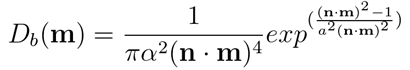


-   Beckmann分布在某些方面与Phong分布非常相似。 两种法线分布的参数可以使用关系式 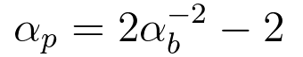进行等效。

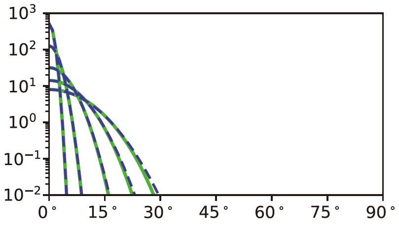

图 Blinn-Phong（蓝色虚线）和Beckmann（绿色）分布，*αb*值在0.025到0.2之间（使用参数关系）。（图片来自《Real-Time Rendering
4th》）

UE4中对Beckmann分布的实现代码如下：

```
// [Beckmann 1963, "The scattering of electromagnetic waves from rough surfaces"]
float D_Beckmann( float a2, float NoH )
{
	float NoH2 = NoH * NoH;
	return exp( (NoH2 - 1) / (a2 * NoH2) ) / ( PI * a2 * NoH2 * NoH2 );
}
```

## 4.3 GGX（Trowbridge-Reitz）分布

-   GGX即Trowbridge-Reitz分布，最初由Trowbridge和Reitz [Trowbridge 1975]推导出，在Blinn 1977年的论文 [Blinn
    1977]中也有推荐此分布函数，但一直没有受到图形学界的太多关注。30多年后，Trowbridge-Reitz分布被Walter等人独立重新发现[Walter 2007]，并将其命名为GGX分布。

-   在[Walter 2007]重新发现并提出GGX分布之后，GGX分布采用风潮开始在电影 [Burley 2012]和游戏 [Karis 2013][Lagarde 2014]行业中广泛传播，成为了如今游戏行业和电影行业中最常用的法线分布函数。

-   GGX分布的公式为：

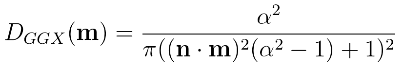


-   在流行的模型中，GGX拥有最长的尾部。这是GGX能够日益普及的主要原因：

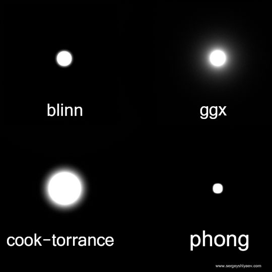

图 主流法线分布函数高光长尾对比

-   **GGX分布具备形状不变性（shape-invariant），而与其对标的GTR等分布不具备形状不变性，这是GGX能普及的深层次原因。**

-   在迪士尼原理着色模型（Disney principled shading
    model）中，Burley推荐将粗糙度控制以α=
    r2暴露给用户，其中r是0到1之间的用户界面粗糙度参数值，以让分布以更线性的方式变化。这种方式实用性较好，不少使用GGX分布的引擎与游戏都采用了这种映射，如UE4和Unity。

```
// GGX / Trowbridge-Reitz
// [Walter et al. 2007, "Microfacet models for refraction through rough surfaces"]
float D_GGX( float a2, float NoH )
{
	float d = ( NoH * a2 - NoH ) * NoH + 1;	// 2 mad
	return a2 / ( PI*d*d );			// 4 mul, 1 rcp
}
```


## 4.4 Generalized-Trowbridge-Reitz（GTR）分布

-   Burley [ Burley 2012]根据对Berry，GGX等分布的观察，提出了广义的Trowbridge-Reitz（Generalized-Trowbridge-Reitz，GTR）法线分布函数，其目标是允许更多地控制NDF的形状，特别是分布的尾部：

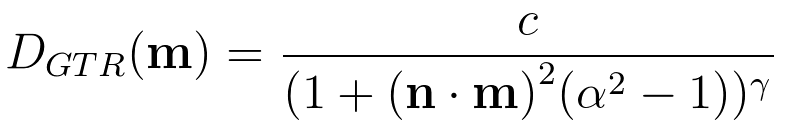


-   其中，γ参数用于控制尾部形状。 当γ= 2时，GTR等同于GGX。
    随着γ的值减小，分布的尾部变得更长。而随着γ值的增加，分布的尾部变得更短。上式中：

-   γ=1时，GTR即Berry分布

-   γ=2时，GTR即GGX（Trowbridge-Reitz）分布

以下为各种γ值的GTR分布曲线与θh的关系图示：


图 各种γ值的GTR分布曲线与*θh*的关系

-   GTR分布不具备形状不变性（shape-invariant），导致其发布以来，无法被广泛使用。

以下是γ= 1和γ= 2时GTR分布的Shader实现代码：

```
// Generalized-Trowbridge-Reitz distribution
float D_GTR1(float alpha, float dotNH)
{
    float a2 = alpha * alpha;
    float cos2th = dotNH * dotNH;
    float den = (1.0 + (a2 - 1.0) * cos2th);

    return (a2 - 1.0) / (PI * log(a2) * den);
}

float D_GTR2(float alpha, float dotNH)
{
    float a2 = alpha * alpha;
    float cos2th = dotNH * dotNH;
    float den = (1.0 + (a2 - 1.0) * cos2th);

    return a2 / (PI * den * den);
}
```

## 4.5 其他分布

2017年以来新发布的学生T-分布（Student’s T-Distribution , STD） [ Ribardière 2017]和指数幂分布（exponential power distribution ,EPD）[ Holzschuch 2017] NDF包括形状控制参数。两者都具有形状不变性，但由于发布时间较新，实用性尚不明朗，目前很少有听说有实际使用。


# 五、法线分布函数的形状不变性

-   形状不变性（shape-invariant）是一个合格的法线分布函数需要具备的重要性质。具有形状不变性（shape-invariant）的法线分布函数，可以用于推导该函数的归一化的各向异性版本，并且可以很方便地推导出对应的遮蔽阴影项G。

-   若一个各向同性的NDF可以改写成以下形式，则这个NDF具有形状不变性（shape-invariant）：


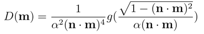


还有一种等价的写法是：

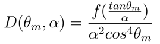


-   对于形状不变的NDF，缩放粗糙度参数相当于通过倒数拉伸微观几何,如下图所示。

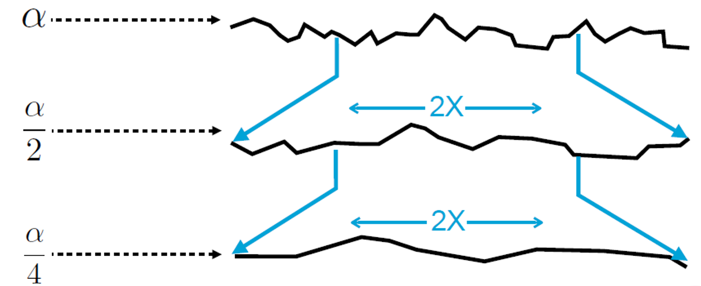

图 对于形状不变的NDF，缩放粗糙度参数相当于通过倒数拉伸微观几何(图片来自Naty Hoffman, Recent Advances in Physically Based Shading, SIGGRAPH 2016)

-   为了更容易理解形状不变性，可以将NDF视为P22，即一个2D斜率的分布。原始的NDF是一个3D的矢量分布。然后我们可以发现，对于具有形状不变形式的分布，线性缩放粗糙度α会导致斜率空间中的分布线性拉伸。

-   2D斜率的分布P22和法线分布函数的关系以及变换式可写作：

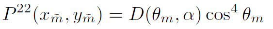

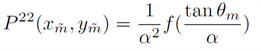

-   关于形状不变性的好处，可以总结为：

    -   方便推导出该NDF归一化的各向异性版本

    -   方便推导出遮蔽阴影项 Smith G（）

    -   方便基于NDF或可见法线分布推导其重要性采样

        -   对于Smith G（），可用低维函数或表格处理所有粗糙度和各向异性

-   对于常见的法线分布函数的旋转不变性的分类：

    -   具备形状不变性的常用法线分布函数为：

        -   GGX

        -   Beckmann

    -   不具备形状不变性的常用法线分布函数为：

        -   Phong

        -   Blinn-Phong

        -   GTR

-   下图显示了如何通过拉伸表面（stretching the surface）将各向同性的形状不变分布转换为各向异性分布。相反，任何具有各向异性分布的配置都可以转换回具有各向同性分布的配置。

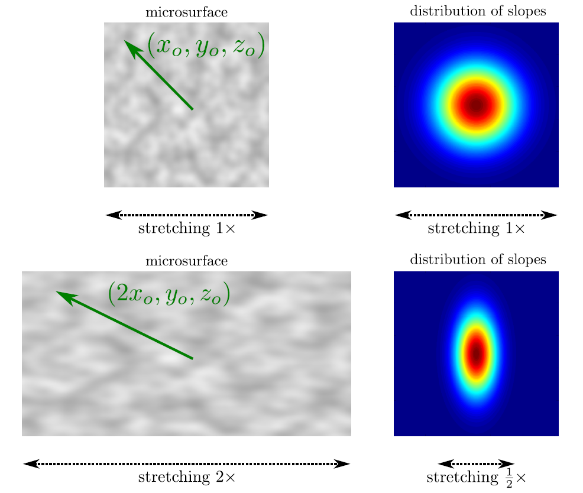

图 通过拉伸表面，可以将各向同性具备形状不变性的分布，转换为各向异性分布。（图片来自[Heitz
2014]）

通过使用这种方法，我们可以推导出Beckmann和GGX分布的各向异性形式。


# 六、各向异性NDF相关总结

现实世界中，大多数材质具有各向同性的表面外观，但有些特殊材质的微观结构具有显著的各向异性(Anisotropy)，从而显著影响其外观。

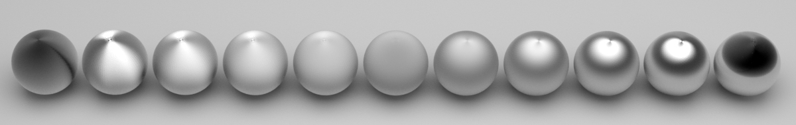

图 各向异性(Anisotropy)材质渲染表现 @Arnold Renderer

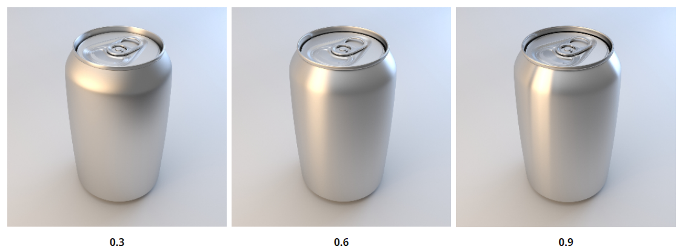

图 各向异性(Anisotropy)材质渲染表现 @Arnold Renderer

创建各向异性NDF的常用方法是基于现有各向同性NDF进行推导。而推导所使用的方法是通用的，可以应用于任何形状不变的（shape-invariant）各向同性NDF，这便是GGX等形状不变的NDF能更加普及的另一个原因。

如上文所述，若一个各向同性（isotropic）的NDF具备形状不变性（shape-invariant），则其可以用以下形式写出：


其中g代表一个表示了NDF形状的一维函数。而通过此形式，可得到各向异性的（anisotropic）版本：

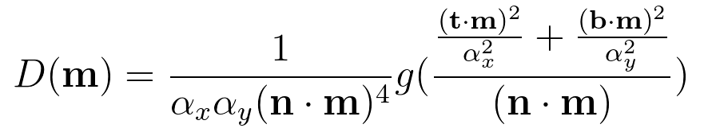


-   其中，参数**αx**和**αy**分别表示沿切线（tangent）方向**t**和副法线（binormal）方向**b**的粗糙度。若**αx = αy**，则上式缩减回各向同性形式。

-   需要注意的是，一般的shader写法，会将切线方向**t**写作X，副法线（binormal）**b**方向写作Y。

## 6.1 Anisotropic Beckmann Distribution

各项异性的Beckmann分布形式如下：

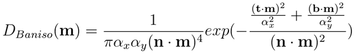


-   其中，**m**为微表面法线（可以理解为half半矢量），**n**为宏观表面法线，**t**为切线方向，**b**为副法线方向。

以下为UE4中Anisotropic Beckmann分布的Shader实现代码：


```
// Anisotropic Beckmann
float D_Beckmann_aniso( float ax, float ay, float NoH, float3 H, float3 X, float3 Y )
{
	float XoH = dot( X, H );
	float YoH = dot( Y, H );
	float d = - (XoH*XoH / (ax*ax) + YoH*YoH / (ay*ay)) / NoH*NoH;
	return exp(d) / ( PI * ax*ay * NoH * NoH * NoH * NoH );
}
```


## 6.2 Anisotropic GGX Distribution

各项异性的GGX分布形式如下：

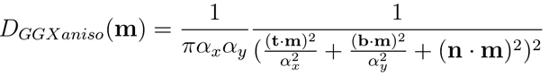


以下为UE4中Anisotropic GGX分布的Shader实现代码：
```
// Anisotropic GGX
// [Burley 2012, "Physically-Based Shading at Disney"]
float D_GGXaniso( float ax, float ay, float NoH, float3 H, float3 X, float3 Y )
{
	float XoH = dot( X, H );
	float YoH = dot( Y, H );
	float d = XoH*XoH / (ax*ax) + YoH*YoH / (ay*ay) + NoH*NoH;
	return 1 / ( PI * ax*ay * d*d );
}
```


-   其中，X为tangent，t切线方向，Y为binormal，b，副法线方向

-   需要注意的是，将法线贴图与各向异性BRDF组合时，重要的是要确保法线贴图扰动（perturbs）切线和副切线矢量以及法线。


## 6.3 其他各项异性参数化方法

-   虽然参数化各向异性NDF的最直接的方法是使用各向同性粗糙度进行两次参数化，一次用于*αx*，一次用于*αy*，有时也使用其他参数化。
    在迪士尼原理着色模型中，各向同性粗糙度参数*r*与第二标量参数*k*aniso组合，范围为[0,1]。
    因此，从这些参数计算*αx*和*αy*的值：

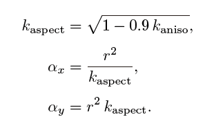

-   其中，上式中的因子0.9将纵横比限制为10：1。

-   Sony Imageworks 则使用了一种不同的参数化，允许任意程度的各向异性：

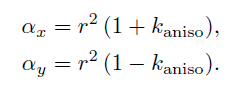

<br>
<br>
<br>


# 七、NDF的性能优化

## 7.1 Blinn-Phong不一定比GGX更省性能

需要注意的是，Normalized Blinn-Phong不一定比GGX更省，要具体看GPU架构。让我们从指令数对两者的计算量进行量化。两者的计算Shader代码如下：

```
// [Blinn 1977, "Models of light reflection for computer synthesized pictures"]
float D_Blinn( float a2, float NoH )
{
	float n = 2 / a2 - 2;
	return (n+2) / (2*PI) * PhongShadingPow( NoH, n );	// 1 mad, 1 exp, 1 mul, 1 log
}

// GGX / Trowbridge-Reitz
// [Walter et al. 2007, "Microfacet models for refraction through rough surfaces"]
float D_GGX( float a2, float NoH )
{
	float d = ( NoH * a2 - NoH ) * NoH + 1;	// 2 mad
	return a2 / ( PI*d*d );			// 4 mul, 1 rcp
}
```

若统计一下两种分布函数的计算指令，可以得到：

-   标准的GGX计算指令为两次mad，4次mul，一次rcp。共7次运算。

-   标准的Blinn-Phong计算指令为1次mad, 1次exp, 1次mul, 1次log。共4次运算。

不难发现，Blinn-Phong虽然比GGX的总运算次数少3次，但具有exp、log等稍复杂的运算。两者的性能差异主要还是要看GPU架构，对某些架构的GPU而言，
GGX可能会更快。


## 7.2 GGX分布的移动端性能优化

标准的GGX的公式和一般Shader实现如下：

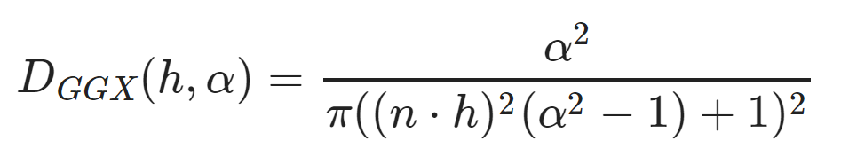

```
// GGX / Trowbridge-Reitz
// [Walter et al. 2007, "Microfacet models for refraction through rough surfaces"]
float D_GGX( float a2, float NoH )
{
	float d = ( NoH * a2 - NoH ) * NoH + 1;	// 2 mad
	return a2 / ( PI*d*d );			// 4 mul, 1 rcp
}
```

在上述实现中，用float进行数据的存储与计算。其实我们可以通过使用半精度浮点数(half precision floats)来对此实现进行改进。这种优化需要改变原始方程，因为在半浮点数half（即mediump）中计算1-（n·h）^2时存在两个问题：

-   问题一：当1.0 -NoH^2接近1时（即高亮部分），NoH^2的计算会出现浮点数取消（floating point cancellation）现象，关于此现象，具体可以参考<https://en.wikipedia.org/wiki/Floating_point#Addition_and_subtraction> 和 <https://scicomp.stackexchange.com/questions/5253/cancellation-problem-in-float-point-numbers>

-   问题二： NoH在1.0左右没有足够的精度。可以通过拉格朗日恒等式（Lagrange's identity）解决此问题，格朗日恒等式即：

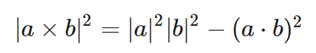

由于n和h都是单位矢量，那么| n×h |^ 2 = 1-（n·h）^2。

于是，我们可以通过使用简单的叉积| n×h |^2来直接计算半精度浮点数下的1-（n·h）^2。

总的来说，此优化方案会带来更好的性能，并保持所有计算都在half（mediump）内进行。


UE4对GGX的移动端优化的Shader实现代码如下：

```
#ifndef MOBILE_GGX_USE_FP16
	#define MOBILE_GGX_USE_FP16 1
#endif

#define MEDIUMP_FLT_MAX    65504.0
#define MEDIUMP_FLT_MIN    0.00006103515625

#if MOBILE_GGX_USE_FP16
	#define saturateMediump(x) min(x, MEDIUMP_FLT_MAX)
#else
	#define saturateMediump(x) (x)
#endif

half GGX_Mobile(half Roughness, half NoH, half3 H, half3 N)
{

#if MOBILE_GGX_USE_FP16
	float3 NxH = cross(N, H);
	float OneMinusNoHSqr = dot(NxH, NxH);
#else
    float OneMinusNoHSqr = 1.0 - NoH * NoH;
#endif

	half a = Roughness * Roughness;
	float n = NoH * a;
	float p = a / (OneMinusNoHSqr + n * n);
	float d = p * p;
	return saturateMediump(d);
}
```

更多关于NDF性能优化的讨论，由于篇幅原因，这边就不一一展开了。这里列举一些其他的法线分布函数优化相关的材料供大家参考：

-   <http://filmicworlds.com/blog/optimizing-ggx-shaders-with-dotlh/>

-   <http://filmicworlds.com/blog/optimizing-ggx-update/>

-   SIGGRAPH 2015，Optimizing PBR for Mobile，Renaldas Zioma(<https://community.arm.com/cfs-file/__key/communityserver-blogs-components-weblogfiles/00-00-00-26-50/siggraph2015_2D00_mmg_2D00_renaldas_2D00_notes.pdf>


<br>
<br>
<br>

# 八、多高光波瓣（multiple specular lobes）

-   即便是GGX的高光长尾，仍然不足以媲美真实世界材质中的高光表现。在不增加NDF本身的复杂性的前提下，更好地匹配测量材质的替代解决方案是使用多个高光波瓣（multiple
    specular lobes）。

-   Cook 和Torrance [Cook Torrance1981]首先提出了这个想法。之后 [Ngan 2005]进行了实验测试，他发现对于大部分材质来说，添加第二个高光波瓣确实显着改善了贴合性。

-   皮克斯PxrSurface材质具有“粗糙镜面反射（rough specular）”波瓣，旨在用于此目的（与主镜面波瓣一起使用）。附加波瓣是一个完整的镜面微平面BRDF，包含所有相关的参数与项。

-   Sony Imageworks使用更外部的方法，使用两个GGX NDF的混合作为扩展的NDF暴露给用户，而不是整个单独的镜面BRDF项。在这种情况下，所需的唯一附加参数是第二粗糙度值和混合量。

-   Disney Principled BRDF也使用了两个固定的高光波瓣（specular lobe），且都使用GTR分布。 主波瓣（primary lobe）使用γ=2的GTR（即GGX分布），代表基础底层材质（Base Material）的反射，可为各项异性（anisotropic）或各项同性（isotropic）的金属或非金属。次级波瓣（secondary lobe）使用γ=1的GTR（即Berry分布），代表基础材质上的清漆层（ClearCoat Layer）的反射，一般为各项同性（isotropic）的非金属材质，即清漆层（ClearCoat Layer）

-   另外，多高光波瓣（multiple specular lobes）常与Layered mixture model结合使用。

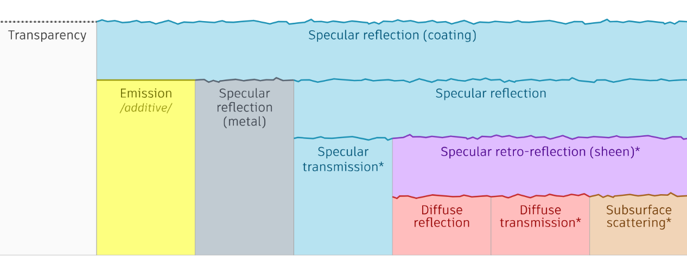

图 离线渲染器的多层混合建模（Layered mixture model）。 @ Autodesk Standard
Surface

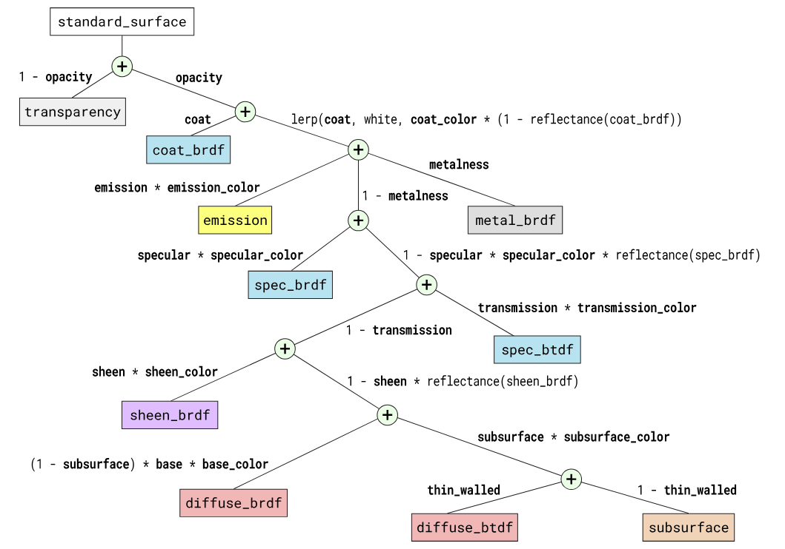

图：Autodesk Standard Surface多层建模的multiple specular
lobes材质。整体框架为“原子”闭包的加权和，每个闭包的重量是沿着从其相应叶节点到根节点的路径的边缘重量的乘积。shader参数权重以粗体显示。@
Autodesk Standard Surface


图 通过组合clearcoat层和标准层的多高光波瓣（multiple specular
lobes）架构，可以实现各种效果。
从左到右：铝花（flakes），表面水滴（raindrops），碳纤维（carbon
fiber）。@Arnold Renderer

<br>
<br>
<br>

# 九、PBR中的高光抗锯齿

-   锯齿（Aliasing）是实时渲染和图形学中经常会面对的问题。而PBR由于使用了标准化的法线分布函数（normalized
    NDF），以及无处不在的反射现象，加上实时渲染中较少的采样率，让其高光的锯齿问题更加明显。这导致了基于物理的渲染中，高光锯齿是实践中经常会遇到的问题。

-   模型精度越高、工作流越倾向于全PBR方式、光照计算精确程度越高，则反射的高光锯齿问题就越明显。

-   以下是带高光锯齿的PBR渲染图和经过TAA处理锯齿后的对比图：

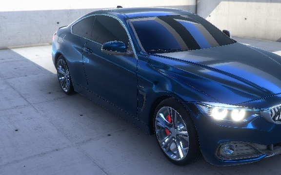

图 PBR赛车渲染（未经过抗锯齿处理） @CTAA , Unity AssetStore


图 PBR赛车渲染（基于TAA（Temporal Anti-Aliasing，时域抗锯齿）处理）@CTAA , Unity AssetStore

-   出现高光锯齿的原因可以总结为： 法线分布函数作为亚像素表面结构（subpixel surface structure）的统计描述。
    当相机和表面之间的距离增加时，先前覆盖多个像素的表面结构会减小到亚像素（subpixel）大小，从而从法线贴图的领域移动到法线分布函数的亚像素领域。在亚像素领域，纹理的mipmap一般以平均的方式进行处理，会丢失原有的细节，从而让该像素处的法线分布过于狭窄和集中，于是便会出现高光在像素级别的不连续性，以闪烁高光（flickering highlights）形式引起锯齿。

-   关于高光锯齿，业界的解决方案分为两大流派：屏幕空间抗锯齿（Anti-Aliasing）和预过滤（Pre-Filtering），下面分别进行总结：

-   **屏幕空间抗锯齿（Anti-Aliasing）。** MSAA（MultiSample Anti-Aliasing，多采样抗锯齿），SSAA（SuperSample Anti-Aliasing，超采样抗锯齿）, FXAA（Fast Approximate Anti-Aliasing，快速近似抗锯齿）和TAA（Temporal Anti-Aliasing，时域抗锯齿）等抗锯齿技术可以求解单像素上多个点的入射光，找出其中小的变化点，从而减少可见的锯齿。其中目前较为有效的PBR高光抗锯齿的技术，当属TAA（Temporal Anti-Aliasing，时域抗锯齿）。有关TAA技术的更多详细信息，可以参考UE4在SIGGPRACH 2014中的分享：<http://advances.realtimerendering.com/s2014/epic/TemporalAA.pptx>

-   **预过滤（Pre-Filtering）。** 类似Toksvig，LEAN Mapping、CLEAN Mapping和LEADR Mapping等技术方案，按照像素覆盖区域，将宏观几何（macro-
    geometric）（曲率）和中观几何（meso-geometric）（法线贴图，位移贴图）的变化，转移到材质属性的微观几何变化，来保持采样数量较少。这种变换可以更容易和更快地求解像素覆盖区域内发生的所有交互。其中，Toksvig和LEAN Mapping专注于法线贴图的过滤，LEAN映射的简单变体CLEAN Mapping需要较少的存储，代价是失去各向异性支持，而LEADR Mapping则用于位移贴图的过滤。而其他技术则通过将曲率转换为材质属性来近似宏观的几何过滤。Stephen
    Hill的blog文章（<https://blog.selfshadow.com/2011/07/22/specular-showdown/>）对此内方案进行了结合改进，而这边是一个对应的WebGL实现demo：<http://www.selfshadow.com/sandbox/gloss.html>


<br>
<br>
<br>

# 十、主流NDF的局限性和发展趋势

当前主流NDF的局限性可以主要总结为如下三点：

-   缺少更好的形状控制NDF

-   无法表示粗粒度微观结构

-   单次散射建模的局限性

下面分别进行说明。


## 9.1 缺少更好的形状控制NDF

-   现有的主流NDF缺少更好的形状不变性（Shape Invariance）+形状控制（Shape
    Control）的结合。对此，Naty Hoffman在SIGGRAPH
    2016上提出，广义Beckmann分布（Generalized
    Beckmann）和超柯西分布（Hyper-Cauchy）可以作为实践中的选择。

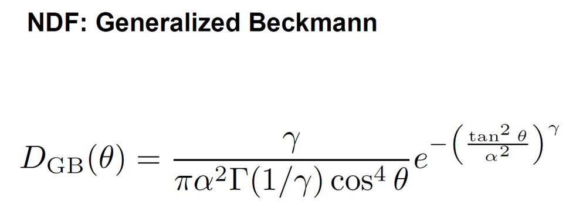

图 广义Beckmann分布（Generalized Beckmann）（图片来自Naty Hoffman, Recent Advances in Physically Based Shading, SIGGRAPH 2016）

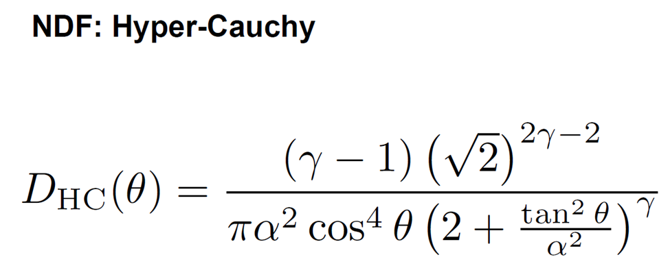

图 超柯西分布（Hyper-Cauchy）（图片来自Naty Hoffman, Recent Advances in Physically Based Shading, SIGGRAPH 2016）


## 9.2 现有NDF无法表示粗粒度微观结构

-   当今使用的NDF从外观而言都很平滑，如下图中左边的NDF。这种NDF每个像素覆盖了数万个表面细节，是对细粒度的微观几何的一种良好表示形式。

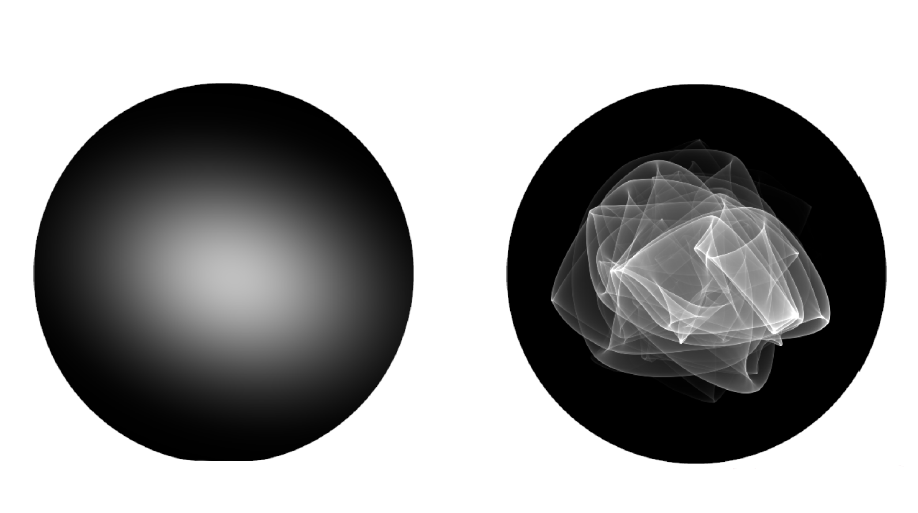

图 细粒度的NDF vs 粗粒度的NDF（图片来自Naty Hoffman, Recent Advances in Physically Based Shading, SIGGRAPH 2016）

-   但其实真实世界中的许多表面材质，具有粗粒度的微观结构，像素仅覆盖了几十个表面元素。在这种情况下，法线分布的表现更像是如如上图的右边所示，表面有一个复杂而闪烁外观，而不仅仅的各项异性这么简单。目前提出的模型都无法表示出这种类型的法线分布。期待未来有更多能解决此问题的法线分布函数的问世。

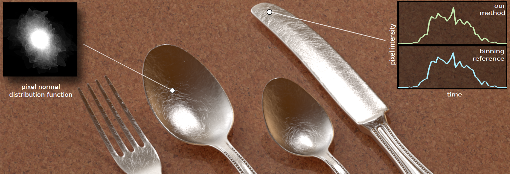
图 真实世界中的法线分布（图片来自[Yan 2014]）


## 9.3 单次散射建模的局限性和发展趋势

-   目前渲染领域广泛采用的Cook-Torrance microfacet BRDF微平面模型，实际上是人们可以想到的最简单的模型，它仅对几何光学系统中的单层微表面上的单次散射进行建模。没有考虑多次散射，没有考虑衍射，也没有考虑波动光学。其假设所有遮挡的光线都被丢失，会导致与现实行为相比的能量损失。

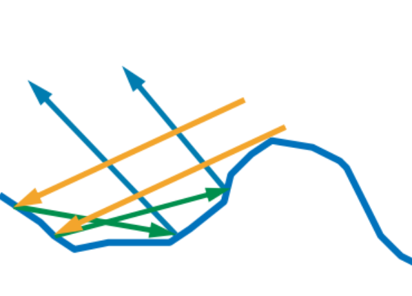

图 现有Microfacet建模未考虑图中蓝色部分的multiple surface bounce反射（图片来自Naty Hoffman, Recent Advances in Physically Based Shading, SIGGRAPH 2016）

-   对此，一些论文提出，可以采用非基于物理的修正因子（corrective factors）来尝试对缺失的能量进行补偿。例如迪士尼模型中的的“Sheen”光泽项。


-   另外，近年不少渲染器也开始结合multiple-scattering BSDF使用多次散射进行建模，如cycles renderer的 Multiscatter GGX（<https://developer.blender.org/D2002>）。但目前的multiple-scattering BSDF方案主要为随机求解，所以不适用于实时渲染和游戏领域。

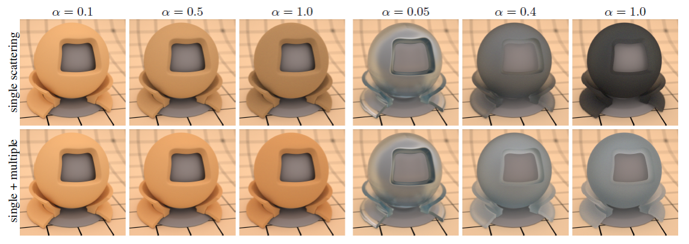

图 cycles renderer Multiscatter GGX @ cycles renderer

虽然Multiscatter GGX等方案离实时渲染还有很长一段路。这边也列举一些相关资料，感兴趣的同学不妨根据需要深入研究。

-   【Multiple-Scattering Microfacet BSDF】<https://www.google.com/search?newwindow=1&hl=zh-CN&q=MUTISCATTER%20GGX&cad=h>

-   【Multiple-Scattering Microfacet BSDFs with the Smith Model】<https://eheitzresearch.wordpress.com/240-2/>

-   【Symmetric GGX (SGGX) 】<https://dl.acm.org/citation.cfm?id=2766988>

-   【The SGGX Microflake Distribution】<https://research.nvidia.com/sites/default/files/pubs/2015-08_The-SGGX-microflake//sggx.pdf>

<br>
<br>
<br>

# 十一、本文内容要点总结


正文到这里已经结束。不妨使用本文主要内容提炼出的思维导图作为全文的内容总结：


<br>
<br>
<br>

# Reference


[1] Akenine-Moller T, Haines E, Hoffman N. Real-Time Rendering 4th[M]. AK Peters CRC Press, 2018

[2] Blinn, James F., "Models of Light Reflection for Computer Synthesized Pictures," ACM Computer Graphics (SIGGRAPH '77 Proceedings), vol. 11, no. 2, pp. 192-198, July 1977. http://citeseerx.ist.psu.edu/viewdoc/download?doi=10.1.1.131.7741&rep=rep1&type=pdf

[3] Walter, Bruce, Stephen R. Marschner, Hongsong Li, and Kenneth E. Torrance, "Microfacet Models for Refraction through Rough Surfaces," Rendering Techniques 2007, Eurographics Association, pp. 195-206, June 2007.https://www.cs.cornell.edu/\~srm/publications/EGSR07-btdf.pdf

[4] https://lesterbanks.com/2014/01/v-ray-new-ggx-shader-offers-better-microfacet-distribution-over-blinn-or-phong/

[5] Ribardière, Mickaël, Benjamin Bringier, Daniel Meneveaux, and Lionel Simonot, "STD: Student's t-Distribution of Slopes for Microfacet Based BSDFs," Computer Graphics Forum, vol. 36, no. 2, pp. 421-429, 2017. https://mribar03.bitbucket.io/projects/eg_2017/

[6] Holzschuch, Nicolas, and Romain Pacanowski, "A Two-Scale Microfacet Reflectance Model Combining Reflection and Diffraction," ACM Transactions on Graphics (SIGGRAPH 2017), vol. 36, no. 4, pp. 66:1-66:12, July 2017. https://hal.inria.fr/hal-01515948

[7] Hoffman N. Background: physics and math of shading[J]. Physically Based Shading in Theory and Practice, 2013

[8] Cook, Robert L., and Kenneth E. Torrance, "A Reflectance Model for Computer Graphics," Computer Graphics (SIGGRAPH '81 Proceedings),vol. 15, no. 3, pp. 307-316, Aug. 1981. http://www.irisa.fr/prive/kadi/Lopez/p307-cook.pdf

[9] Sébastien Lagarde , Physically Based Material Where Are We , SIGGRAPH 2017

[10] Heitz E. Understanding the masking-shadowing function in microfacet-based BRDFs[J]. Journal of Computer Graphics Techniques, 2014

[11] https://stackoverflow.com/questions/4414041/what-is-the-precision-of-highp-floats-in-glsl-es-2-0-for-iphone-ipod-touch-ipad

[12] https://en.wikipedia.org/wiki/Floating_point\#Addition_and_subtraction

[13] Dupuy, Jonathan, "Antialiasing Physically Based Shading with LEADR Mapping," SIGGRAPH Physically Based Shading in Theory and Practice course, Aug. 2014.

https://blog.selfshadow.com/publications/s2014-shading-course/dupuy/s2014_pbs_leadr_slides.pdf

[14] Beckmann, Petr, and André Spizzichino, "The Scattering of Electromagnetic Waves from Rough Surfaces", Pergamon Press, 1963. http://www.gbv.de/dms/ilmenau/toc/017290422.PDF

[15] Blinn, James F., "Models of Light Reflection for Computer Synthesized Pictures," ACM Computer Graphics (SIGGRAPH '77 Proceedings), vol. 11, no. 2, pp. 192-198, July 1977.http://citeseerx.ist.psu.edu/viewdoc/download?doi=10.1.1.131.7741&rep=rep1&type=pdf

[16] Phong,BuiTuong, “Illumination for Computer Generated Pictures,” Communications of the ACM, vol. 18, no. 6, pp. 311–317, June 1975. Cited on p. 118, 340, 416 http://users.cs.northwestern.edu/\~ago820/cs395/Papers/Phong_1975.pdf

[17] Trowbridge, T. S., and K. P. Reitz, "Average Irregularity Representation of a Roughened Surface for Ray Reflection," Journal of the Optical Society of America, vol. 65, no. 5, pp. 531-536, May 1975.

[18] Walter, Bruce, Stephen R. Marschner, Hongsong Li, and Kenneth E. Torrance, "Microfacet Models for Refraction through Rough Surfaces," Rendering Techniques 2007, Eurographics Association, pp. 195-206, June 2007. https://www.cs.cornell.edu/\~srm/publications/EGSR07-btdf.pdf

[19] Church, Eugene L., Peter Z. Takacs, and Thomas A. Leonard. "The prediction of BRDFs from surface profile measurements." Scatter from Optical Components. Vol. 1165. International Society for Optics and Photonics, 1990.

[20] Bagher, Mahdi M., Cyril Soler, Nicolas Holzschuch, “Accurate Fitting of Measured Reflectances using a Shifted Gamma Microfacet Distribution,” Eurographics Symposium on Rendering (2012), 1509–1518, June 2012. http://hal.inria.fr/hal-00702304/en

[21] Burley, Brent, "Physically Based Shading at Disney," SIGGRAPH Practical Physically Based Shading in Film and Game Production course, Aug. 2012.https://blog.selfshadow.com/publications/s2012-shading-course/burley/s2012_pbs_disney_brdf_notes_v3.pdf

[22] https://www.arnoldrenderer.com/gallery/

[23] https://scicomp.stackexchange.com/questions/5253/cancellation-problem-in-float-point-numbers

[24] https://github.com/EpicGames/UnrealEngine

[25] https://blender.stackexchange.com/questions/93790/is-the-roughness-setting-is-based-on-a-standard-measuring-unit

[26] https://learnopengl.com/PBR/Theory

[27] https://80.lv/articles/the-future-of-real-time-rendering-with-lumberyard/

[28]
https://assetstore.unity.com/packages/vfx/shaders/ctaa-cinematic-temporal-anti-aliasing-pc-vr-106995

[29] http://advances.realtimerendering.com/s2014/epic/TemporalAA.pptx

[30] M. Toksvig. “Mipmapping Normal Maps”. In: Journal of Graphics, GPU, and Game Tools 10.3 (2005), pp. 65–71. doi: 10.1080/2151237X.2005.10129203. http://www.nvidia.com/object/mipmapping_normal_maps.html

[31] Olano, Marc, and Dan Baker, “LEAN Mapping,” in Proceedings of the 2010 ACM SIGGRAPH Symposium on Interactive 3D Graphics and Games, ACM, pp. 181–188, 2010. Cited on p. 370 http://www.csee.umbc.edu/\~olano/papers/lean/

[32] Baker, Dan, "Spectacular Specular--LEAN and CLEAN Specular Highlights,"
Game Developers Conference, Mar. 2011.http://twvideo01.ubm-us.net/o1/vault/gdc2011/slides/Dan_Baker_SpectacularSpecular.ppt

[33] 题图来自《刺客信条：奥德赛》
