# 【基于物理的渲染（PBR）白皮书】（五）几何函数相关总结


在基于物理的渲染中，几何函数（Geometry Function）是保证Microfacet BRDF理论上能量守恒，逻辑上自洽的重要一环。其描述了微平面自阴影的属性，表示具有半矢量法线的微平面（microfacet）中，同时被入射方向和反射方向可见（没有被遮挡的）的比例，即未被遮挡的m
= h微表面的百分比。

在Microfacet Specular
BRDF的D,G,F三项中，如果说法线分布函数是最核心的一项，那么几何函数则是核心的辅助项，而且是三项中最复杂的一项。

历史上主流的几何函数建模，按提出或归纳的时间进行排序，可以总结为：

-   Smith [1967]

-   V-cavity（Cook-Torrance）[1982]

-   Schlick-Smith [1994]

-   Neumann [1999]

-   Kelemen [2001]

-   Implicit [2010]

其中，Smith遮蔽函数（Smith masking
function）是现在业界所采用的主流遮蔽函数，Eric Heitz在2014年[Heitz
2014]将其拓展为Smith联合遮蔽阴影函数（Smith Joint Masking-Shadowing
Function），该函数具有四种形式：

-   分离遮蔽阴影型（Separable Masking and Shadowing）

-   高度相关遮蔽阴影型（Height-Correlated Masking and Shadowing）

-   方向相关遮蔽阴影型（Direction-Correlated Masking and Shadowing）

-   高度-方向相关遮蔽阴影型（Height-Direction-Correlated Masking and Shadowing）

其中，高度相关遮蔽阴影型（Height-Correlated Masking and
Shadowing），以及其近似，是目前业界采用的主流遮蔽阴影函数。

<br>

# 核心要点与思维导图


本文将从如下方面，对基于物理的渲染中几何函数（Geometry
Function）的相关内容进行一个系统的总结：

-   一、几何函数的定义与要点总结

    -   1.1 几何函数的定义与主要属性

    -   1.2 几何函数的两种主要形式：G1和G2

    -   1.3 几何函数与法线分布函数的联系

    -   1.4 业界对几何函数模型的选择

-   二、从微平面理论到遮蔽阴影函数

    -   2.1 从微平面理论引出几何函数

    -   2.2 选择合适的微表面轮廓（microsurface profile）

    -   2.3 Smith遮蔽函数的性质

    -   2.4 Smith联合遮蔽-阴影函数

        -   2.4.1 分离的遮蔽阴影函数（Separable Masking and Shadowing Function）

        -   2.4.2 高度相关的遮蔽阴影函数（Height-Correlated Masking and Shadowing Function）

        -   2.4.3 方向相关的遮蔽阴影函数（Direction-Correlated Masking and Shadowing Function）

        -   2.4.4 高度方向相关的遮蔽阴影函数（Height-Direction-Correlated Masking and Shadowing Function）

    -   2.5 多重散射微平面BRDF

-   三、几何函数的基本性质

    -   3.1 标量性

    -   3.2 对称性

    -   3.3 同向可见性

    -   3.4 拉伸不变性（Stretch Invariance）

-   四、从法线分布函数导出的Smith遮蔽函数

    -   4.1 主流法线分布函数导出的Smith遮蔽函数

        -   4.1.1 Beckmann法线分布的Λ函数

        -   4.1.2 Blinn-Phong法线分布的Λ函数

        -   4.1.3 GGX法线分布的Λ函数

    -   4.2 Smith GGX的演变和发展

        -   4.2.1 SIGGRAPH 2012：Disney

        -   4.2.2 SIGGRAPH 2013：UE4

        -   4.2.3 SIGGRAPH 2014至今：业界转向Smith Joint Masking-Shadowing Function

            -   4.2.3.1 Frostbite 的GGX-Smith Joint近似方案

            -   4.2.3.2 UE4的 GGX-Smith Correlated Joint 近似方案

            -   4.2.3.3 Unity HDRP 的GGX-Smith Correlated Joint近似方案

            -   4.2.3.4 Google Failment渲染器 的GGX-Smith Joint近似方案

            -   4.2.3.5 Respawn Entertainment的 GGX-Smith Joint近似方案

-   五、BRDF标准化测试：白炉测试与弱白炉测试

    -   5.1 白炉测试（The White Furnace Test）

    -   5.2 弱白炉测试（The Weak White Furnace Test）

本来还想聊到Microfacet Specular BRDF的推导，分母中的4的来历，以及Smith遮蔽函数的推导，高度相关的Smith遮蔽阴影函数的推导的。但还没加上这些内容，字数统计就已经1万多字了。没事，后面有机会再一起聊吧。

OK, 按照惯例，开始正文前，先放出本文内容总结的思维导图：

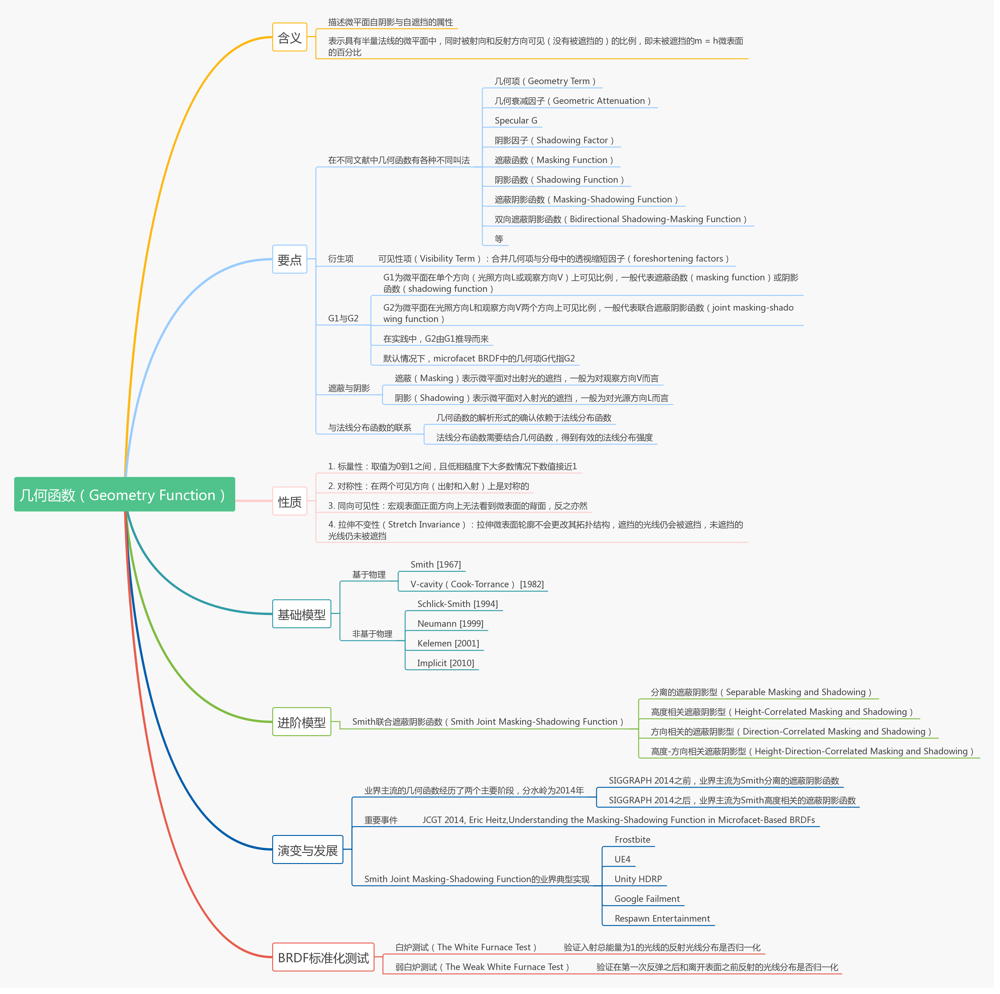


<br>
<br>

# 一、几何函数的定义与要点总结


<br>
<br>

## 1.1 几何函数的定义与主要属性


-   在基于物理的渲染中，几何函数（Geometry Function）是一个0到1之间的标量，描述了微平面自阴影的属性，表示了具有半矢量法线的微平面（microfacet）中，同时被入射方向和反射方向可见（没有被遮挡的）的比例，即未被遮挡的m= h微表面的百分比。几何函数（Geometry Function）即是对能顺利完成对光线的入射和出射交互的微平面概率进行建模的函数。

-   在microfacet BRDF中，单纯的法线分布函数得到数值不是有效的微表面的法线强度，需结合几何函数，才能得到有效入射和出射法线，得到能对microfacet BRDF产生贡献的强度。

-   在各种文献中，几何函数（Geometry Function）还有大量不同的别名。一些主要的常见叫法有：

    -   几何项（Geometry Term）

    -   Specular G

    -   几何衰减因子（Geometric Attenuation）

    -   阴影因子（Shadowing Factor）

    -   遮蔽函数（Masking Function）

    -   阴影函数（Shadowing Function）

    -   遮蔽阴影函数（Masking-Shadowing Function）

    -   双向遮蔽阴影函数（Bidirectional Shadowing-Masking Function）

-   其中，在部分游戏引擎和文献中，几何函数G(l,v,h)和分母中的校正因子4（n·l）（n·v）会进行并，作为可见性项（The Visibility Term），Vis项，简称V项，也经常是其代指：

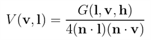


-   通常，除了近掠射角或非常粗糙的表面，几何函数对BRDF的形状影响相对较小，但对于BRDF保持能量守恒而言，几何函数至关重要。

-   几何函数取决于微表面的细节，并且很少有精确的表达式。很多情况下，各类文献会使用各种统计模型和简化假设推导出近似值。


<br>
<br>

## 1.2 几何函数的两种主要形式：G1和G2


几何函数具有两种主要形式：G1和G2，其中：

-   G1为微平面在单个方向（光照方向L或观察方向V）上可见比例，一般代表遮蔽函数（masking function）或阴影函数（shadowing function）

-   G2为微平面在光照方向L和观察方向V两个方向上可见比例，一般代表联合遮蔽阴影函数（joint masking-shadowing function）

-   在实践中，G2由G1推导而来

-   默认情况下，microfacet BRDF中使用的几何函数代指G2

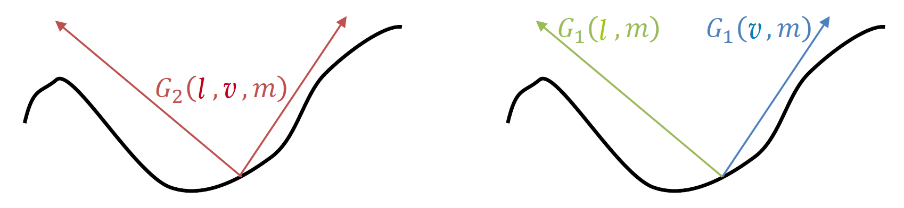

图 几何函数的两种主要形式：G1和G2。G1为微平面在单个方向（光照方向L或观察方向V）上可见比例。G2为微平面在光照方向L和观察方向V两个方向上可见比例(图片来自GDC 2017, PBR Diffuse Lighting for GGX+SmithMicrosurfaces, Earl Hammon )


<br>
<br>

## 1.3 几何函数与法线分布函数的联系


几何函数与法线分布函数作为Microfacet Specular BRDF中的重要两项，两者之间具有紧密的联系：

-   **几何函数的解析形式的确认依赖于法线分布函数。** 在微平面理论中，通过可见微平面的投影面积之和等于宏观表面的投影面积的恒等式，选定法线分布函数，并选定几何函数的模型，就可以唯一确认几何函数的准确形式。在选定几何函数的模型后（一般为Smith），几何函数的解析形式的确认则由对应的法线分布函数决定。

-   **法线分布函数需要结合几何函数，得到有效的法线分布强度。** 单纯的法线分布函数的输出值并不是能产生有效反射的法线强度，因为光线的入射和出射会被微平面部分遮挡，即并不是所有朝向m=h的微表面，能在给定光照方向L和观察方向V时可以顺利完成有效的反射。几何函数即是对能顺利完成入射和出射的微平面概率进行建模的函数。法线分布函数需要结合几何函数，得到最终对microfacet
    BRDF能产生贡献的有效法线分布强度。

<br>
<br>

##  1.4 业界对几何函数模型的选择


-   自2014年之后，游戏和电影业界主流的遮蔽函数为Smith高度相关遮蔽阴影函数（Smith height-correlated masking-shadowing function）以及其近似，因为其具有与不相关形式相似的成本和更高的精度：

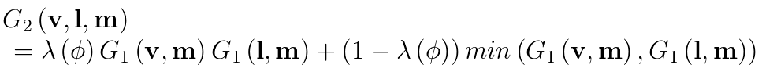


-   另外，如果追求性价比，可以选择部分游戏和电影制作中采用的隐式遮蔽函数（The Implicit Masking Function）：

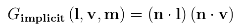

隐式遮蔽函数 （The Implicit Masking Function）可以和Specular的分母校正因子4（n·l）（n·v）相消为1，虽然不是严格基于物理，但具有非常好的性价比。


<br>
<br>

## 二、从微平面理论到遮蔽阴影函数


本节将从微平面理论讲起，引出几何函数，随后聊到业界对于众多几何函数模型的选择，

Smith遮蔽函数成为业界主流的原因，以及从Smith遮蔽函数拓展到Smith联合遮蔽-阴影函数，最后聊到业界主流Microfacet BRDF的缺陷，以及采用Image Work能量补偿的方式解决该缺陷的方案。

<br>
<br>

## 2.1 从微平面理论引出几何函数


-   微平面理论（microfacet theory）作为一种研究微观几何（microgeometry）对反射率影响的数学分析方法，基于将微观几何（microgeometry）建模为微平面（microfacets）的集合的思想。其最初由光学物理领域开发，用于研究统计表面上的散射[Beckmann Spizzichino 1963]。在图形社区中，我们使用它来推导基于物理的BRDF。

-   在微平面中，正确朝向（即m = h）的微平面法线m的统计分布由法线分布函数D（m）进行建模。若将D(m)在整个微平面法线上积分，会得到微表面的面积。但并非所有m = h的微平面都会对microfacet BRDF有所贡献：有些微平面会被光照方向或视图方向遮挡，这些被遮挡的光线在业界主流的微平面理论中被忽略不计。所以需要引入几何项G来对这种现象进行建模，得到最终对microfacet BRDF能产生贡献的法线分布。


图 仅m = h的表面点的朝向才会将光线l反射到视线v的方向，其他表面点对BRDF没有贡献（图片来自《Real-Time Rendering 4th》）

-   实际上，虽然阴影区域没有从l接收任何直射光，但它们确实接收（并因此反射）从其他表面区域反射的光（如右图所示）。Microfacet理论忽略了这些相互反射。

-   对此，可以引出阴影（Shadowing）和遮蔽（Masking）两种不同的光与微表面的交互行为：

    -   阴影（Shadowing）表示微平面对入射光的遮挡，一般为对光源方向L而言。

    -   遮蔽（masking）表示微平面对出射光的遮挡，一般为对观察方向V而言。

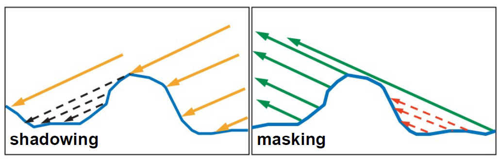

-   图 左图：光线被微表面从l的方向进行遮挡，右图：光线被微表面从v的方向进行遮挡。在这两种情况下，这些表面点对BRDF没有贡献。（图片来自Naty Hoffman, Recent Advances in Physically Based Shading, SIGGRAPH 2016）

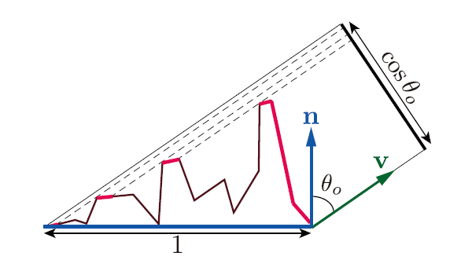

图 对可见微平面的投影区域（亮红色）进行积分，得到宏观表面在垂直于v的平面上的投影面积

-   从上篇文章可以得知，可见微平面的投影面积之和等于宏观表面的投影面积。我们可以通过定义遮蔽函数（masking function）G1(m,v)来对其进行数学表达，它给出了沿着视图向量v可见的具有法线m的微平面的比率。

-   G1(m, v)D(m)(v · m)+在球体上的积分然后给出投影到垂直于v的平面上的宏观表面的面积：

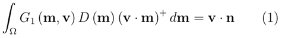 （1）


-   上式中，通过x+的表示方法表达将v · m限制为大于等于0。背面微平面不可见，因此在这种情况下不对其进行计算。乘积G1(m,v)D(m)则表示了可见法线的分布。

-   上式对G1(m,v)施加约束，但并不能唯一地确定它。有无数个函数满足给定微平面法线分布D(m)的约束。这是因为D(m)没有完全指定微表面（microsurface）。它仅告诉我们有多少百分比的微平面（microfacets）的法线指向了某些方向，而没有告诉我们这些法线是如何进行排列。而且对于固定的输出方向v，遮蔽函数（masking functions）是二维，存在无限多个函数满足等式（1）。

<br>
<br>

## 2.2 选择合适的微表面轮廓（microsurface profile）


-   为了确定唯一的G项，Heitz在[Heitz 2014]中引入了第二个约束：选择合适的微表面轮廓（microsurface profile），从而对G项进行具象化建模。

如下所示，轮廓的选择可对所得BRDF的形状产生强烈影响。

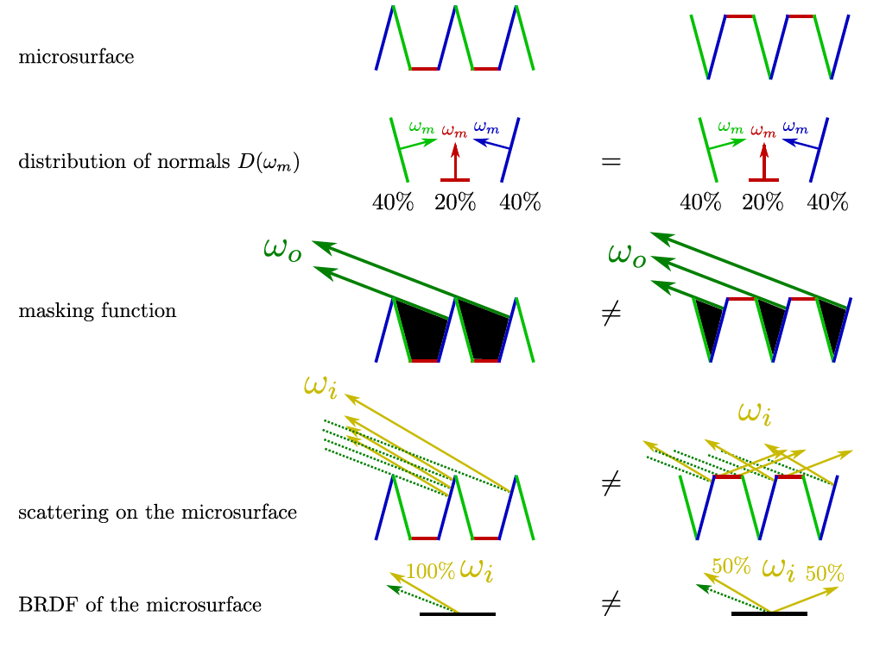

图 具有相同法线分布但具有不同轮廓（profiles）的微表面导致不同的BRDF

一旦选择好合适的微表面轮廓（microsurface profile），即选择了合适的微表面模型，加上等式（1）的约束，就可以完全确定遮蔽函数，用于BRDF中的实际使用。

业界提出的表面轮廓/模型，按照提出或归纳的时间，可以总结如下：

-   Smith [1967]

-   V-cavity（Cook-Torrance）[1982]

-   Schlick-Smith [1994]

-   Neumann [1999]

-   Kelemen [2001]

-   Implicit [2010]

Heitz在[Heitz 2014]中进行了证明，在上述几种模型中仅如下两种是基于物理的：

-   Smith遮蔽函数（Smith masking function）

-   V腔遮蔽函数（V-cavity masking function）

两者的微表面轮廓（microsurface profile）建模可以通过下面两幅图进行表达。


图 Smith模型和真世界连续微表面的对比。左图：具有大自相关距离的真实世界连续微表面。右图：Smith模型，其具有不相关的表面，即每个微平面与其邻域不相关。（图片来自[Heitz 2014]）

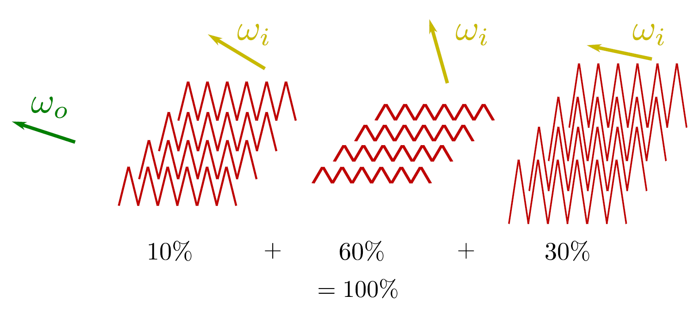

图 V腔散射模型（V-cavity scattering mode）。该模型不是对一个微表面上的散射进行建模，而是计算单独微表面上的散射并混合结果。（图片来自[Heitz 2014]）

Heitz还证明了Smith遮蔽函数是唯一既遵循公式（1），又具有法线遮蔽独立性（normal-masking independence）便利特性的函数。且Smith遮蔽函数具有比Cook-Torrance使用的V腔遮蔽函数（V-cavity masking function）更好地匹配真实世界的反射现象，这也是业界在两种基于物理的遮蔽函数中，更加青睐Smith遮蔽函数的原因。如下图所示。

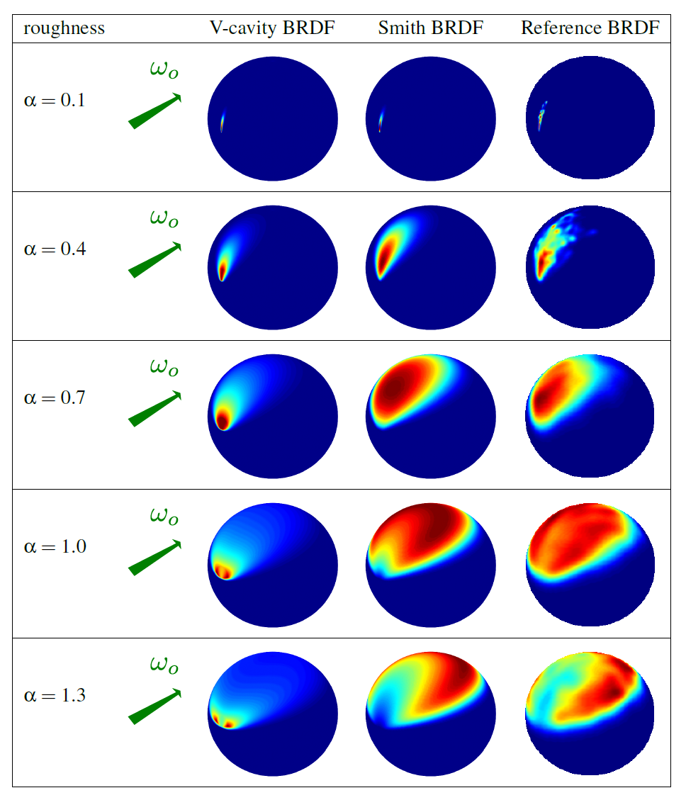

图 使用V-cavity和Smith遮蔽阴影函数的各向同性Beckmann分布产生的BRDF，以及Reference
BRDF的对比。其中，Smith遮蔽函数随着粗糙度的增加，分布向输出方向移动，更匹配Reference
BRDF。（图片来自[Heitz 2014]）


<br>
<br>

# 2.3 Smith遮蔽函数的性质


-   Smith遮蔽函数（Smith masking function）是现在业界所采用的主流遮蔽函数。Smith系列遮蔽函数被广泛认为比Cook-Torrance使用的V腔遮蔽函数（V-cavity masking function）函数更准确，并且考虑了法线分布的粗糙度和形状。

-   最初的Smith函数是为Beckmann NDF所设计，但Brown [Brown 1980]和后来的Bourlier等人 [Bourlier 2002]将Smith函数推广到计算几何函数以匹配任何NDF的方法中。

-   Smith遮蔽函数（Smith masking function），该函数最初是为高斯正态分布（Gaussian normal distributions）导出的，后来推广到任意NDF。

-   Smith G1函数的形式如下：

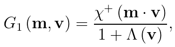

其中,χ+(x)表示正特征函数：

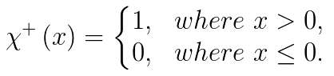


-   其中 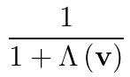是Smith遮蔽函数的广义形式 [Brown 1980; Walter 2007]。对于许多随机曲面，其具有闭合形式的解。因此，在法线/遮蔽独立（normal/masking independence）的假设下，Smith遮蔽函数是精确的。表示微表面斜率上的积分（integral over the slopes of the microsurface）

- 的表达式为：

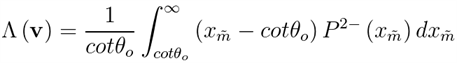

在上式中：

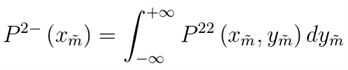是视图方向上斜率的1D分布。

- 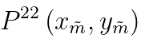为微表面的斜率分布（distribution of slopes of the microsurface）。

-   而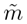为与法线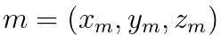相关的斜率：

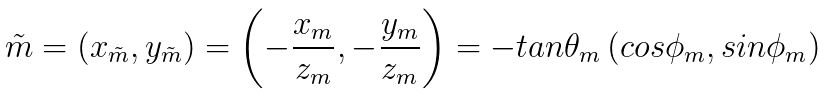


-   斜率的分布必然是标准化的：

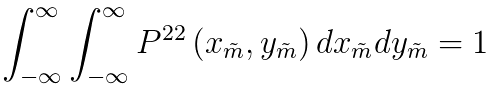


-   且斜率分布与法线分布的关系为：

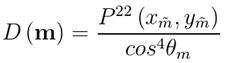


-   Smith遮蔽函数的每个法线分布函数会导出不同的Λ（lambda）函数。需要注意，仅具有形状不变性的法线分布函数（如GGX、Beckmann）可以导出具有解析形式的Λ函数，而且不具备形状不变性的函数（Blinn-Phong），则Λ不存在解析形式。

-   在[Walter 2007]和[Heitz 2014]中都有描述推导出给定NDF的Λ的过程。

-   Smith遮蔽函数是常见遮蔽函数中，唯一既满足能量守恒又具有法线遮蔽独立性（Normal/Masking Independence）便利特性的函数。

-   法线/遮蔽独立（Normal/Masking Independence）作为Smith遮蔽函数的一大特点，源自Smith微表面轮廓假设微曲面不是自相关的（autocorrelated），即在微表面的一个点处的高度（或法线）与任何相邻点处的高度（或法线）之间没有相关性。
    这意味着一组随机的微平面并不是连续的表面，微表面的高度和法线是独立的随机变量。 如下图所示。


图 微表面及其自相关函数。（左）具有大自相关距离的真实连续微表面（右）不相关型表面，其中每个微平面与其邻域不相关，如Smith模型（图片来自[Heitz
2014]）

-   Smith遮蔽函数（Smith masking function）对非随机表面与重复或结构化图案（例如布料（fabric））的相关性的影响可能非常显著。因此，对于布料之类的非随机表面或结构化图案，推荐使用专用模型，如专门的布料shading model。

-   需要注意的是，业界选择Smith遮蔽函数的原因其实并不是因为它是由法线分布参数化的物理上可信的近似。真正原因在于Smith公式是在所选择的微表面轮廓（即法线/遮蔽独立性）的假设下的精确遮蔽函数。

-   Smith遮蔽函数确实也有一些缺点。从理论角度来看，其假设是与实际表面的结构不一致的，甚至可能在物理上无法实现。从实际的角度来看，虽然它对于随机表面非常准确，但是对于在法线方向和遮蔽之间具有更强依赖性的表面，例如下图中所示的表面，其预期精度会降低，特别是如果表面具有一些重复结构（如多数面料）。然而，在找到更好的替代方案之前，Smith遮蔽函数目前依然是业界的最佳选择。

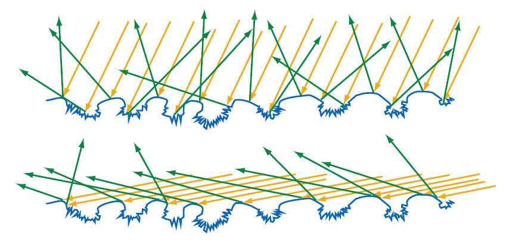

图 图中所示的微观几何体在高度和表面法线之间具有很强的相关性，其中凸起区域是平滑的而下部区域是粗糙的。
在图示的上半部分中，表面从接近宏观表面法线的角度照射。
在这个角度，许多入射光线可以触及粗糙的凹坑，并且许多光线在不同的方向上散射。
在图示下半部分中，表面从掠射角入射。阴影（Shadowing）阻挡了大部分凹坑，因此很少有光线触及到它们，所以大多数光线都从表面的光滑部分反射。在这种情况下，表面粗糙度的作用很大程度上取决于光照角度，这就是Smith遮蔽的函数的缺陷所在。（图片来自《Real-Time Rendering 4th》）


<br>
<br>

## 2.4 Smith联合遮蔽-阴影函数


-   除了G1之外，业界常常使用Eric Heitz在[Heitz 2014]中提出的Smith联合遮蔽阴影函数（Smith Joint Masking-Shadowing Function）G2(l, v, m)来代替遮蔽函数G1(m, v)。

-   该函数具有四种形式：

    -   分离的遮蔽阴影型（Separable Masking and Shadowing）

    -   高度相关的遮蔽阴影型（Height-Correlated Masking and Shadowing）

    -   方向相关的遮蔽阴影型（Direction-Correlated Masking and Shadowing）

    -   高度-方向相关遮蔽阴影型（Height-Direction-Correlated Masking and Shadowing）

下文将分别进行总结。

<br>


### 2.4.1 分离的遮蔽阴影函数（Separable Masking and Shadowing Function）

-   最简单和最广泛使用的遮蔽阴影函数的变体是Walter等人推广的可分离形式[Walter 2007]。
    在这种情况下，遮蔽（masking）和阴影（shadowing）是独立的，并且分别计算并相乘：

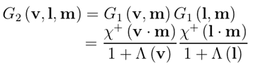


-   这种形式不模拟遮蔽和阴影之间的相关性，因此总会多估算阴影，因为一些相关性总是存在的。

<br>

### 2.4.2 高度相关的遮蔽阴影函数（Height-Correlated Masking and Shadowing Function）

-   更精确形式的遮蔽阴影函数模拟了由于微表面高度引起的遮蔽和阴影之间的相关性[Ross et al. 2005]。
    直观来说，微平面（microfacet）在微表面（microsurface）内升高得越多，对于出射方向未被遮蔽（unmasked）和入射方向未被掩蔽（unshadowed）的可见概率会同时增加。
    因此，遮蔽和阴影通过微平面的升高而相关。 这种相关性以联合遮蔽阴影函数（joint masking-shadowing function）的高度相关形式进行表达：

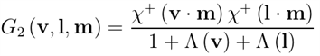

-   需要注意的是，当出射方向和入射方向彼此远离时，此形式是准确的，但是当方向接近时，此形式会估算出更多的阴影。

-   Heitz建议在实践中使用此版本的遮蔽阴影函数，因为它比可分离的遮蔽阴影函数更精确，却同时具有相同的计算复杂度。

<br>

### 2.4.3 方向相关的遮蔽阴影函数（Direction-Correlated Masking and Shadowing Function）

-   Ashikhmin等 [Ashikhmin
    2000]通过混合可分离的遮蔽阴影函数与两个方向完全相关的情形来表达方向相关：


-   其中λ（φ）是类似于Ginneken等人的经验因子。

-   作者没有找到函数Λ的Smith解析表达式，所以必须分别计算遮蔽和阴影。
    这就是为什么他们必须混合可分离的形式和方向相关的形式，并且无法将高度相关性结合到他们的模型中。

<br>

### 2.4.4 高度方向相关的遮蔽阴影函数（Height-Direction-Correlated Masking and Shadowing Function）

-   遮蔽和阴影之间的方向相关可以通过将方向相关因子λ纳入高度相关形式来进行建模：

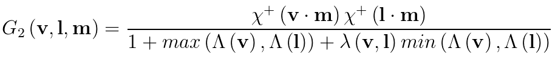


-   这里，当出射和入射方向平行且λ=
    0时，遮蔽和阴影完全相关。相关性随着方向之间的角度增加而减小，并且随着λ增加到1，遮蔽和阴影不再是方向相关，公式返回高度相关的形式。

-   Ginneken等人[Ginneken 1998]提出了一个经验因子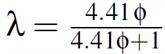，此因子取决于φ，即v和l之间的方位角，此因子与表面粗糙度无关。

-   Heitz等人在2014年[Heitz 2014]对这个问题进行了更深入的研究，并对λ（v，l）进行了解析近似，当D是Beckmann分布时，其结合了表面粗糙度。他们仅给出了各向同性Beckmann分布的结果，


<br>
<br>


## 2.5 多重散射微平面BRDF


-   通过包含G2函数，Microfacet BRDF能够考虑遮蔽（masking）和阴影（shadowing），但依然没有考虑微平面之间的互反射（interreflection），或多表面反射（multiple surface bounce）。 而缺少微平面互反射（interreflection）是业界主流Microfacet BRDF的共有的限制。


图 现有Microfacet建模未考虑图中蓝色部分的multiple surface bounce反射（图片来自Naty Hoffman, Recent Advances in Physically Based Shading, SIGGRAPH 2016）

-   即标准Microfacet BRDF模型的最大问题，是虽然它们能量守恒（即不会产生任何能量），但它们也不能在高粗糙度时维持能量。
    这是由于建模微平面模型时所做出的单散射假设，没有模拟微表面上的多次散射，即缺少微平面互反射（interreflection）。单散射的在高粗糙度时会有较大的能量损失，从而显得过暗。尤其对于高粗糙度的金属而言，如下图所示。

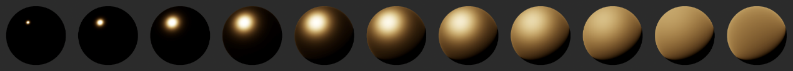

图 由于单次散射，反射随着粗糙度增加而变暗

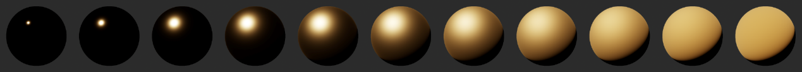

图 多散射则是能量守恒的

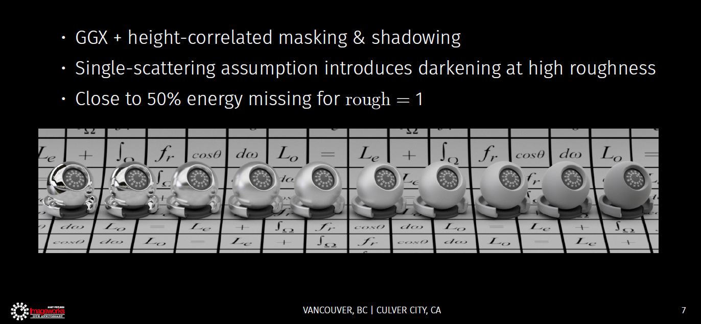

图 GGX + height-correlated masking & shadowing，在粗糙度1时会损失接近一半的入射能量（图片来自[Kulla 2017]）

-   对此Heitz在[Heitz 2016]中深入讨论了多重散射微平面BRDF（Multiple-scattering microfacet BRDF），但该文章仅介绍了多尺度BRDF的随机计算，并不适用于实时渲染。

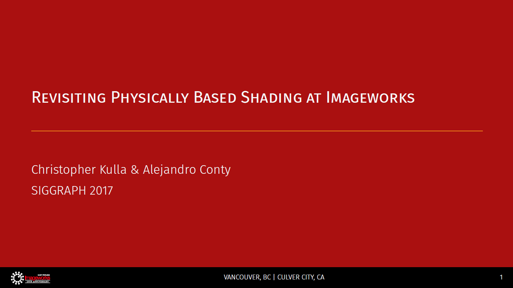

图 SIGGRAPH 2017, Revisiting Physically Based Shading at Imageworks

-   随后，Sony ImageWork的Kulla和Conty[Kulla 2017]在SIGGRPAPH 2017上中提出了一项新的技术方案，创建一个模拟多次反射表面反射的附加BRDF波瓣，作为能量补偿项（Energy Compensation Term）：

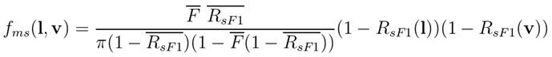


其中：

-   fsF1是F0设置为1的镜面BRDF项。

-   RsF1是fsF1的方向反照率（Directional albedo），取决于粗糙度α和仰角θ。它相对平滑，因此可以在数值上预计算，并存储在一个小的二维纹理中。32×32分辨率就已足够。

-   函数是半球上*R*sF1的余弦加权平均值。其仅依赖于α，因此可以存储在一维纹理中，或者可以将廉价的曲线拟合到数据中。

-  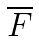是菲涅尔项的余弦加权平均值，如果使用原始Schlick近似，则可以表示为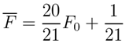

以下为有无Imagework基于能量补偿的多反射镜面反射项（multiple-bounce specular term）的渲染对比图。可以发现，具有能量补偿的渲染过程，可以很好的解决高粗糙度下的能量损失问题。

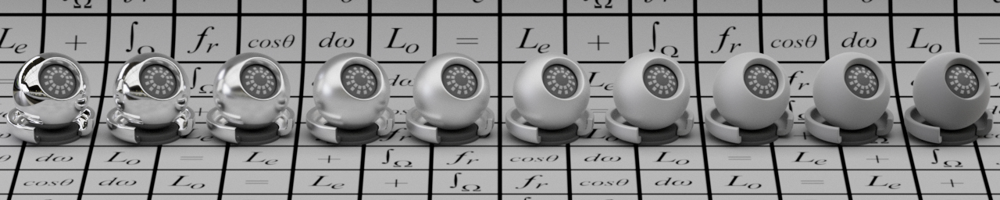

图 GGX单散射

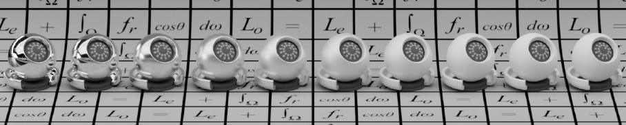

图 GGX单散射+能量补偿

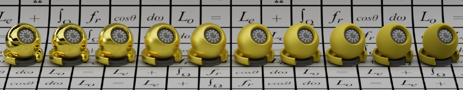

图 GGX单散射

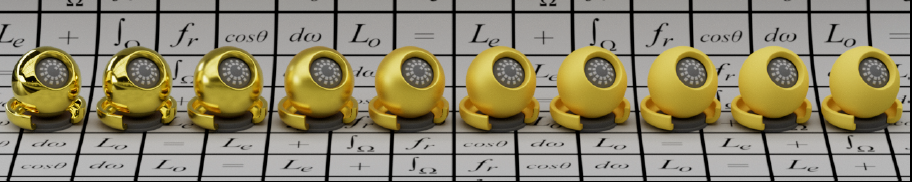

图 GGX单散射+能量补偿


<br>
<br>


# 三、几何函数的基本性质


几何函数的基本性质可以总结为如下四条：

-   标量性

-   对称性

-   同向可见性

-   拉伸不变性（Stretch Invariance）

下面分别进行说明。

<br>
<br>

## 3.1 标量性


-   几何函数是0和1之间的一个标量：

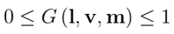


-   低粗糙度下几何函数大多情况下数值接近1，如下图所示。

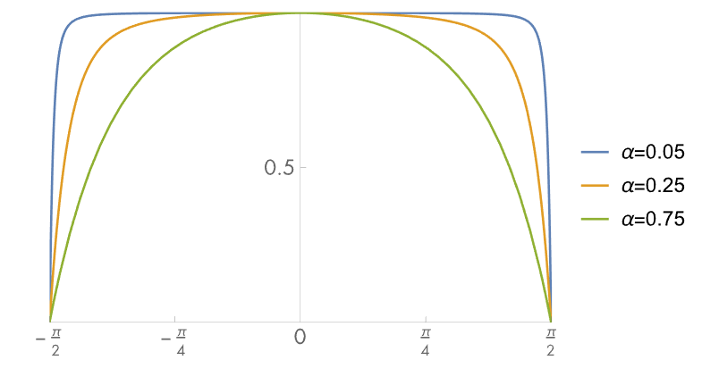

图 GGX对应的遮蔽阴影函数，增加表面粗糙度（更高的值）会使函数更快地降至零。（图片来自[Physically
Based Rendering 3rd]）

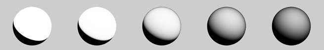

图 GGX-Smith几何项，从左到右的粗糙度为 0.0, 0.2, 0.5, 0.8, 1.0


<br>
<br>

## 3.2 对称性


几何函数在两个可见方向（出射和入射）上是对称的：

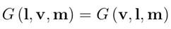


<br>
<br>


## 3.3 同向可见性

几何函数从宏观表面正面方向上无法看到微表面的背面，反之亦然：

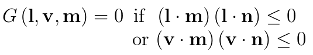


<br>
<br>


## 3.4 拉伸不变性（Stretch Invariance）

-   微表面几何轮廓具有拉伸不变性（Stretch Invariance）。拉伸微表面轮廓就像拉伸一张图片，即在一个维度上乘以常数因子，不会更改微表面轮廓的拓扑结构：拉伸后，遮挡的光线仍会被遮挡，未遮挡的光线仍未被遮挡。

-   当微表面轮廓中涉及的所有斜率同时缩放时，遮蔽概率对于配置拉伸是不变的。这包括微表面的斜率和与出射方向相关的斜率。它们都是通过拉伸因子的倒数来缩放的。因此，斜率宽度的分布也被反向拉伸因子拉伸。如下图。

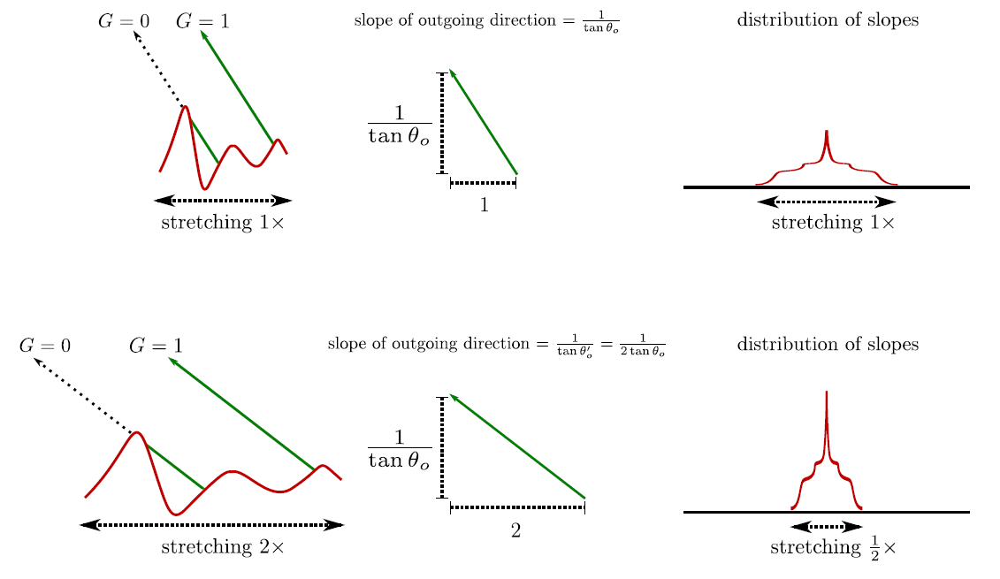

图 将1D的微表面配置拉伸2倍不会改变遮蔽概率，但是配置的所有斜率都会缩放1倍，包括微表面的斜率以及与出射方向相关的斜率（图片来自[Heitz 2014]）

<br>
<br>


# 四、从法线分布函数导出的Smith遮蔽函数


<br>
<br>


## 4.1 主流法线分布函数导出的Smith遮蔽函数

由上文可知，Smith G1函数的形式如下：


其中，χ+(x)表示正特征函数：


下面将总结主流各项同性法线分布函数对应的Λ函数的解析形式。


<br>


### 4.1.1 Beckmann法线分布的Λ函数

Beckmann法线分布函数具备形状不变性，其Smith遮蔽函数对应的Λ解析形式为：

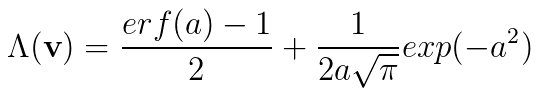


其中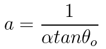


上式的计算成本很高，因为它包括误差函数erf，于是Walter 等人[Walter et al. 2007] 为其提出了精确的有理逼近，可以用于近似：


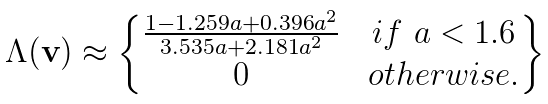


<br>

### 4.1.2 Blinn-Phong法线分布的Λ函数

Blinn-Phong NDF不具备形状不变的（shape-invariant），所以其Λ函数不存在解析形式。Walter等人建议使用贝克曼Λ函数结合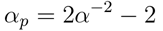参数进行等价。

<br>


### 4.1.3 GGX法线分布的Λ函数

GGX法线分布函数具备形状不变性，其Smith遮蔽函数对应的Λ解析形式相对简单，为：

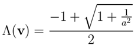


其中，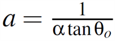


GGX分布和GGX –Smith遮蔽阴影函数的组合，是目前游戏和电影业界主流的方案。且业界一直致力于优化两者的组合。下面将对Smith GGX的演变和发展做一个总结。


<br>

<br>


## 4.2 Smith GGX的演变和发展


游戏和电影工业对GGX-Smith遮蔽函数的选用方面，可以总结为两个主要阶段：

-   SIGGRAPH 2014之前，Smith分离的遮蔽阴影函数

-   SIGGRAPH 2014之后，Smith相关的遮蔽阴影函数

而这两个阶段的演变，主要在于2014年Eric Heitz于JCGT 2014上发表了著名的paper 《Understanding the Masking-Shadowing Function in Microfacet-Based BRDFs》，以及其后续在SIGGPRAPH 2014上进行的同名的talk。

下面将以此为线索，对2012年至今，业界有代表性的Smith GGX选用的演变和发展做一个盘点。


<br>
<br>

### 4.2.1 SIGGRAPH 2012：Disney

Disney参考了 [Walter 2007]的近似方法，使用Smith GGX导出的G项，并将粗糙度参数进行重映射以减少光泽表面的极端增益，即将α 从[0,1]重映射到[0.5, 1]，α的值为(0.5 + roughness/2)\^2。从而使几何项的粗糙度变化更加平滑，更便于美术人员的使用。

以下为Disney 实现的Smith GGX的几何项的表达式：


<br>
<br>

### 4.2.2 SIGGRAPH 2013：UE4 

其中UE4在SIGGRAPH 2013上公布的方案为基于Schlick近似，将k映射为k=a/2,去匹配GGX
Smith方程，并采用了Disney对粗糙度的重映射：


<br>
<br>


### 4.2.3 SIGGRAPH 2014至今：业界转向Smith Joint Masking-Shadowing Function

-   在2014年，Heitz在JCGT 2014发表了著名的paper 《Understanding the  Masking-Shadowing Function in Microfacet-Based BRDFs》，以及后续在SIGGPRAPH 2014上进行了同名的talk，将游戏和电影业界对遮蔽阴影函数（The Smith Joint Masking-Shadowing Function）的理解上升到了一个新的层次。


图 SIGGPRAPH 2014，Understanding the Masking-Shadowing Function in Microfacet-Based BRDF

-   UE4 ，Frostbite 和Unity等引擎都受到Heitz的启发，为了得到更精确的几何遮挡关系，开始考虑入射阴影和出射遮蔽之间的相关性，并在后续更新中各自转向了Smith联合遮蔽阴影函数（The Smith Joint Masking-Shadowing Function）的高度相关遮蔽阴影形式（Height-Correlated Masking and Shadowing），并相应地都做了一些近似与优化。

下面将分别对其进行总结。


<br>
<br>

#### 4.2.3.1 Frostbite的GGX-Smith Joint近似方案

Frostbite的Lagarde[Lagarde 2014 ]观察到对GGX高度相关的Smith G2（height-correlated Smith G2）具有与镜面微平面BRDF的分母组合时抵消的项, 因此可以简化组合项为：


其中，


<br>
<br>

#### 4.2.3.2 UE4的GGX-Smith Correlated Joint 近似方案 

UE4采用的 GGX-Smith Correlated Joint Approximate为：


实现代码如下：

````
// Appoximation of joint Smith term for GGX
// [Heitz 2014, "Understanding the Masking-Shadowing Function in Microfacet-Based BRDFs"]
float Vis_SmithJointApprox( float a2, float NoV, float NoL )
{
    float a = sqrt(a2);// a2 = Pow4( Roughness )
    float Vis_SmithV = NoL * ( NoV * ( 1 - a ) + a );
    float Vis_SmithL = NoV * ( NoL * ( 1 - a ) + a );
    return 0.5 * rcp( Vis_SmithV + Vis_SmithL );
}

````

<br>

#### 4.2.3.3 Unity HDRP 的GGX-Smith Correlated Joint近似方案

Unity HDRP采用的GGX-Smith Correlated Joint Approximate为：


实现代码如下：

````
// Note: V = G / (4 * NdotL * NdotV)
// [Heitz 2014, "Understanding the Masking-Shadowing Function in Microfacet-Based BRDFs"]
float V_SmithJointGGX(float NdotL, float NdotV, float roughness, float partLambdaV)
{
    float a2 = Sq(roughness);

    // Original formulation:
    // lambda_v = (-1 + sqrt(a2 * (1 - NdotL2) / NdotL2 + 1)) * 0.5
    // lambda_l = (-1 + sqrt(a2 * (1 - NdotV2) / NdotV2 + 1)) * 0.5
    // G        = 1 / (1 + lambda_v + lambda_l);

    // Reorder code to be more optimal:
    float lambdaV = NdotL * partLambdaV;
    float lambdaL = NdotV * sqrt((-NdotL * a2 + NdotL) * NdotL + a2);

    // Simplify visibility term: (2.0 * NdotL * NdotV) /  ((4.0 * NdotL * NdotV) * (lambda_v + lambda_l))
    return 0.5 / (lambdaV + lambdaL);
}

float V_SmithJointGGX(float NdotL, float NdotV, float roughness)
{
    float partLambdaV = GetSmithJointGGXPartLambdaV(NdotV, roughness);
    return V_SmithJointGGX(NdotL, NdotV, roughness, partLambdaV);
}

float GetSmithJointGGXPartLambdaVApprox(float NdotV, float roughness)
{
    float a = roughness;
    return NdotV * (1 - a) + a;
}
````


<br>


#### 4.2.3.4 Google Failment渲染器 的GGX-Smith Joint近似方案

Google Failment渲染器采用的 GGX-Smith Correlated Joint Approximate为：


实现代码如下：
````
float V_SmithGGXCorrelated(float NoV, float NoL, float a)
{
    float a2 = a * a;
    float GGXL = NoV * sqrt((-NoL * a2 + NoL) * NoL + a2);
    float GGXV = NoL * sqrt((-NoV * a2 + NoV) * NoV + a2);
    return 0.5 / (GGXV + GGXL);
} 
````


<br>


#### 4.2.3.5 Respawn Entertainment的 GGX-Smith Joint近似方案

-   Hammon[Hammon 2017]在GDC 2017上提出，UE4在2013年提出的近似G1可以导出由高度相关的Vis项的高效近似：


其中，lerp表示线性插值算子， lerp(x, y, s) = x * (1 − s) + y * s


图 GDC 2017, PBR Diffuse Lighting for GGX+Smith Microsurfaces ,Earl


<br>
<br>

<br>


# 五、BRDF标准化测试：白炉测试与弱白炉测试


Eric Heitz在[Heitz 2014]中提出了白炉测试与弱白炉测试，作为BSDF和BRDF是否能量守恒的标准化测试方法。


图 GGX Furnace Test。可以看到在高粗糙度有能量损失。


图 GGX + Energy Compensation Furnace Test。可以看到基本可以保持能量守恒


<br>

<br>


## 5.1 白炉测试（The White Furnace Test）

-   白炉测试（The White Furnace Test）的思路为验证入射总能量为1的光线的反射光线分布是否归一化的测试。

-   可以将白炉测试理解为一束辉度（irrandiance）为1的光线从上往下照到菲涅尔反射项为1的材质表面，并测定反射光线总能量是否为1的过程。若反射光线总能量为1，则通过白炉测试，否则，便不通过白炉测试。


图 白炉测试：将光线投射到微表面上，并测试反射光线的总能量是否为1

-   在白炉测试中，菲涅尔反射项始终为1，则光线永远不会透射，即所有的入射光线都会被全部反射，则表示投射的光线将被散射一次或多次并最终离开表面。

-   白炉测试（The White Furnace Test）方程由下式给出：


其中，ρ即为待测试的BRDF。

-   白炉测试的一版代码实现可见：<https://github.com/knarkowicz/FurnaceTest>


图 不同microfacet材质的白炉试验。


<br>

<br>


## 5.2 弱白炉测试（The Weak White Furnace Test）


-   因为在2014年白炉测试被提出时，主流的BRDF模拟微表面上的单次反射，并不能多次散射，具有能量损失。所以业界主流的BRDF模型即使在“完美的反射表面（perfect reflector）”微表面上进行参数化时也不会积分到1，并且不满足白炉测试方程。对此，Eric Heitz在[Heitz 2014]中设计了另一个限制性较小的，用于测试常见的基于microfacet的BRDF是否标准化的测试：弱白炉测试（The
    Weak White Furnace Test）。

-   弱白炉测试（The Weak White Furnace Test）的主要思路为验证在第一次反弹之后和离开表面之前反射的光线分布是否归一化。对几何项而言，即没有入射的阴影（shadowing）项，只有出射的遮蔽（masking）项。可以通过用遮蔽（masking）函数替换遮蔽阴影（masking-shadowing）函数，即G2(l,v,h) = G1(v,h)来实现。

-   弱白炉测试方程（Weak White Furnace Test）由下式给出：


-   弱白炉测试对于漫反射微平面BRDF也同样适用，具体方案可见[Heitz 2014]。

-   [Heitz 2014]的附录中也有实现弱白炉测试的Matlab代码。

对微平面Specular BRDF的弱白炉测试的具体过程如下：


图 微平面Specular BRDF的弱白炉测试的具体过程


<br>

<br>

# 六、总结


正文到这里已经结束。不妨使用本文主要内容提炼出的思维导图作为全文的内容总结：


<br>

<br>

# Reference


[1] Akenine-Moller T, Haines E, Hoffman N. Real-Time Rendering 4th[M]. AK Peters CRC Press, 2018

[2] Pharr M, Jakob W, Humphreys G. Physically based rendering: From theory to implementation[M]. Morgan Kaufmann, 2016.

[3] Kulla C, Conty A. Revisiting physically based shading at Imageworks[J]. SIGGRAPH Course, Physically Based Shading, 2017.

[4] Hoffman N. Background: physics and math of shading[J]. Physically Based Shading in Theory and Practice, 2013

[5] Sébastien Lagarde , Physically Based Material Where Are We , SIGGRAPH 2017

[6] Heitz E. Understanding the masking-shadowing function in microfacet-based BRDFs[J]. Journal of Computer Graphics Techniques, 2014

[7] Walter, Bruce, Stephen R. Marschner, Hongsong Li, and Kenneth E. Torrance, "Microfacet Models for Refraction through Rough Surfaces," Rendering Techniques 2007, Eurographics Association, pp. 195-206, June 2007. 

[8] Burley, Brent, "Physically Based Shading at Disney," SIGGRAPH Practical Physically Based Shading in Film and Game Production course, Aug. 2012.


[9] https://github.com/EpicGames/UnrealEngine

[10] https://github.com/Unity-Technologies/ScriptableRenderPipeline

[11] https://google.github.io/filament/Filament.md.html

[12] 题图来自《Anthem》


